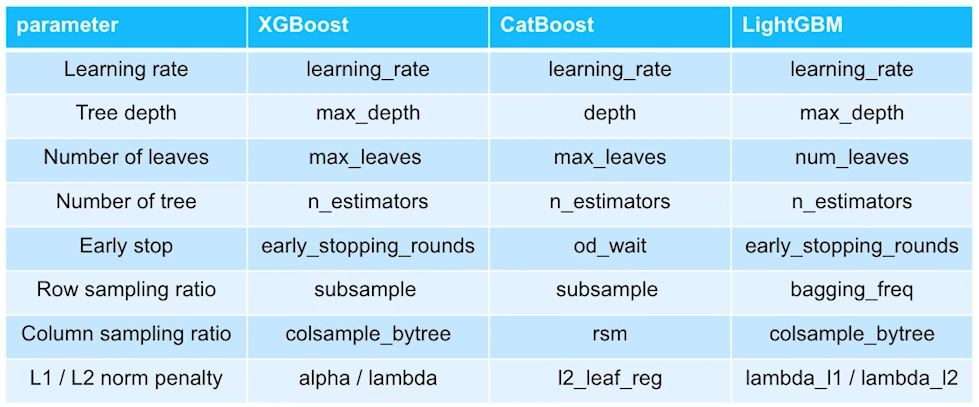

# P Stage ( 정형데이터 분류 )
#### 학습목표?
- 트리 모델 소개
	- What is tree model
		- 트리 모델의 기초 의사결정나무
			- 칼럼(feature) 값들을 어떠한 기준으로 group을 나누어 목적에 맞는 의사결정을 만드는 방법
			- 하나의 질문으로 yes or no로 decision을 내려서 분류
		- 트리모델의 발전
			- Decision Tree => Random Forest => AdaBoost => GBM => LightGBM, XGBoost, CatBoost
		- Bagging & Boosting
			- 여러 개의 Decision tree를 이용하여 모델 생성 
			- Bagging
				- 데이터 셋을 샘플링 하여 모델을 만들어 나가는 것이 특징
				- 샘플링한 데이터 셋을 하나로 하나의 Decision Tree가 생성
				- 생성한 Decision Tree의 Decision들을 취합(aggregation)하여 하나의 Decision 생성
				- Bagging = Bootstrap + Aggregation
					- Bootstrap: Data를 여러 번 sampling
					- Aggregation: 종합(Ensemble)
		- LightGBM, XGBoost, CatBoost
			- XGBoost, CatBoost: 균형적 구조
			- LightGBM: 비균형적 구조
	- Tree model with hyper-parameter
		- hyper-parameter 살펴보기
			- Learning rate
			- Tree depth, number of leaves
			- Column sampling ratio
			- Row sampling ratio\
			- 
#### 학습목표를 달성하기 위해 무엇을 어떻게 했는가?
- Data룰 Time series split 사용으로 성능을 높이려 적용해보았다.
#### 어떤 방식으로 모델을 개선했는가?
- Validation strategy를 time series split으로 성능을 높이려 시도를 하였으나 성능이 오르지 않았다. 
하지만, 재미있는 부분이 fold의 수를 더 늘릴 수록 이전 성능보다 더 좋은 결과가 나왔다.
#### 오늘 내가 한 행동의 결과로 어떤 지점을 달성하고, 어떠한 깨달음을 얻었는가?
- 아직 데이터 분석을 정확히 하지 못해 어려움이 있다. 우선은 기본 데이터를 통해 모델의 성능을 높이고, 전처리를 진행하려한다.
- 또한 Time series split에서 fold의 수를 늘리면 더 많은 시간적인 특징이 나와서 더 잘 예측을 하는 것이 아닌가라는 생각을 하게 되었다.
#### 오늘 나의 학습과 시도가 크게 성공적이지 않아서 아쉬운 것은 무엇인가?
- 데이터에 대한 해석이 명확하지 않은 것이 가장 아쉽다.
- 모델을 CatBoost로 바꿔봐야하나라는 생각도 하게 되었다.
#### 내일은 어떻게 다르게 시도해볼 것인가?
- 모델을 바꾼다면 어떻게 결과가 바뀔지 궁금하다.
> 어제와 비교해서, 오늘의 내가 새롭게 시도한 변화는 무엇이고, 어떤 효과가 있었는가?