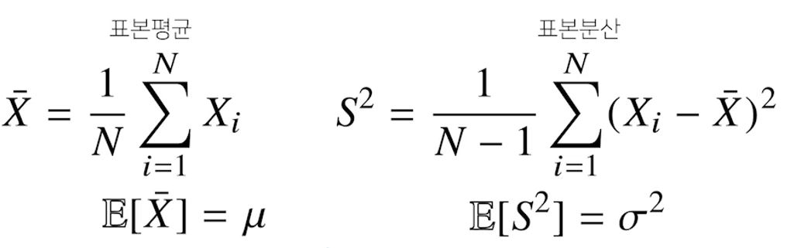
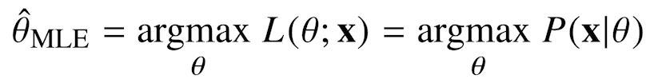
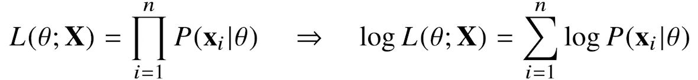
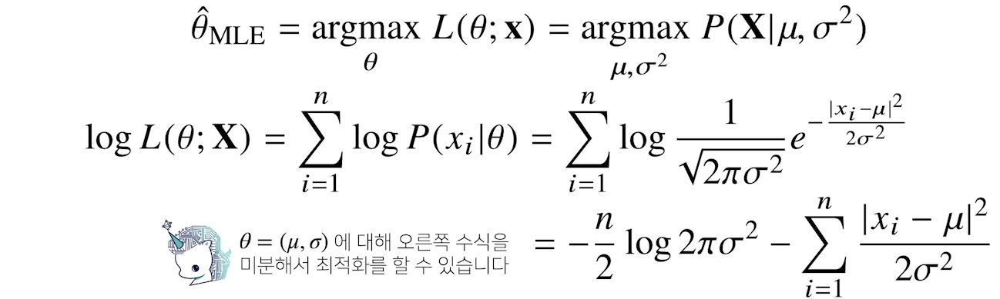
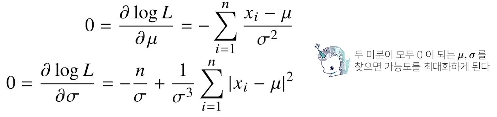
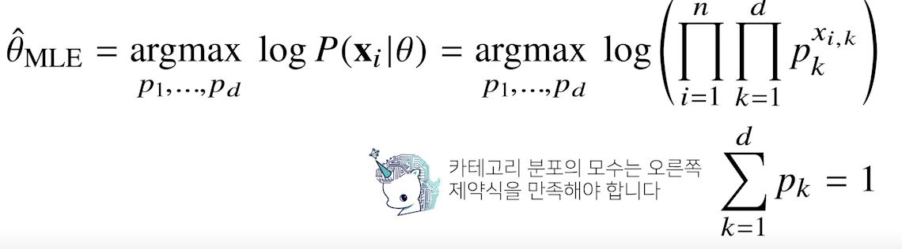

# [AI Math 7강] 통계학 맛보기
### 배운점
- 모순란 무엇인지 알게 되었다.
- 불편추정량과 평균, 분산, 표준편차에 대해서 알게 되었다.
- 최대 가능도 추정법과 로그 가능도 추정법을 알게 되었다.
---
#### 모수란?
- 통계적 모델링은 적절한 가정 위에서 확률분포를 추정(inference)하는 것이 목표이며, 기계학습과 통계학이 공통적으로 추구하는 목표입니다.
- 그러나 유한한 개수의 데이터만 관찰해서 모집단의 분포를 정확하게 알아낸다는 것은 불가능하므로, 근사적으로 확률분포를 추정할 수 밖에 없다.
> 예측 모형의 목적은 분포를 정확하게 맞추는 것보다는 데이터와 추정 방법의 불확실성을 고려해서 위험을 최소화하는 것이다.
- 데이터가 특정 확률분포를 따른다고 선험적으로(a priori) 가정한 후 그 분포를 결정하는 모수(parameter)를 추정하는 방법을 모수적(parametric)방법론이라 한다.
- 특정 확률분포를 가정하지 않고 데이터에 따라 모델의 구조 및 모수의 개수가 유연하게 바뀌면 비모수(nonparametric)방법론이라 부릅니다.(모수가 없는 것은 아님. 모수가 무한히 많거나, 데이터에 따라 바뀔 수 있는 것)
> 기계학습의 많은 방법론은 비모수 방법론에 속합니다.

#### 확률분포 가정하기: 예제
- 확률분포를 가정하는 방법: 우선 히스토그램을 통해 모양을 관찰
 	- 데이터가 2개의 값(0 또는 1)만 가지는 경우 -> 베르누이 분포
 	- 데이터가 n개의 이산적인 값을 가지는 경우 -> 카테고리 분포
 	- 데이터가 [0, 1]tkdldptj rkqtdmf rkwlsms ruddn -> 베타분포
 	- 데이터가 0이상의 값을 가지는 경우 -> 감마분포, 로그정규분포 등
 	- 데이터가 R 전체에서 값을 가지는 경우 -> 정규분포, 라플라스분포 등
 - 기계적으로 확률분포를 가정해서는 안 되며, 데이터를 생성하는 원리를 먼저 고려하는 것이 원칙이다.

> 각 분포마다 검정하는 방법들이 있으므로 모수를 추정한 후에는 반드시 검정을 해야 한다.

#### 데이터로 모수를 추정해보기
- 데이터의 확률분포를 가정했다면 모수를 추정해볼 수 있다.
- 정규분포의 모수는 평균과 분산으로 이를 추정하는 통계량(statistic)은 다음과 같다:

 
> 표본분산을 구할 때 N이 아니라 N-1로 나누는 이유는 불편(unbiased) 추정량을 구하기 위해서다.
> > 불편추정량은 자유도와 연결되어 있다. 
> > > 자유도는 독립변수의 개수를 의미한다. 
> > > 예를들어 x+y+z=3이라는 방정식이 있을 때, 독립변수가 3개인 것처럼 보이지만 실제로는 그렇지 않다.
> > > x와 y가 1과 0으로 결정되었다면, z는 2를 갖게 된다. 즉, z는 종속변수이다. 따라서 이 방정식의 독립변수는 2개이고 자유도는 2가 된다. 
> >
> > 불편추정량
> > > 편이라는 글자는 '편의'이며, 영어로는 bias이다. 즉, 편의(bias)가 없는 추정량이라는 뜻
> > > 모집단의 평균은 표본평균의 평균으로 추정하고, 모집단의 분산은 표본분산의 평균으로 추정하게 되는데 이렇게 평균으로 모수를 추정하게 되는 값들을 '추정량;이라고 부른다. 여기서 추정량은 표본평균과 표본분산인데 이 추정량과 실제 모수와의 차이가 편의 이다. 불편추정량, 즉 편의가 없는 추정량은 그 기댓값이 모수와 동일한 추정량이라는 뜻이다. 
> > 
> > 실제로 표본평균의 평균은 모집단의 평균과 같다. 하지만 표본분산은 n-1로 나누어야 모집단의 분산과 같다.

- 통계량의 확률분포를 표집분포(sampling distribution)라 부르며, 특히 표본평균의 표집분포(표본분포와는 다르다)는 N이 커질수록 정규분포를 따른다.
> 이를 중심극한정리(central limit theorem)이라 부르며, 모집단의 분포가 정규분포를 따르지 않아도 성립한다.
#### 최대가능도 추정법
- 표본평균이나 표본분산은 중요한 통계량이지만 확률분포마다 사용하는 모수가 다르므로 적절한 통계량이 달라지게 된다.
- 이론적으로 가장 가능성이 높은 모수를 추정하는 방법 중 하나는 최대 가능도 추정법(maximum likelihood estimation, MLE)이다. 
 
> 가능도(likelihood)함수는 모수를 따르는 분포가 x를 관찰할 가능성을 뜻하지만 확률로 해석하면 안된다.
- 데이터 집합 X가 독립적으로 추출되었을 경우 로그가능도를 최적화한다. 
 

#### 왜 로그가능도를 사용하나요?
- 로그가능도를 최적화하는 모수는 가능도를 최적화하는 MLE가 된다.
- 데이터의 숫자가 적으면 상관없지만 만일 데이터의 숫자가 수어 단위가 된다면 컴퓨터의 정확도로는 가능도를 계산하는 것은 불가능하다
- 데이터가 독립일 경우, 로그를 사용하면 가능도의 곱셈을 로그가능도의 덧셈으로 발꿀 수 있기 때문에 컴퓨터로 연산이 가능해진다
- 경사하강법으로 가능도를 최적화할 때 미분 연산을 사용하게 되는데, 로그가능도를 사용하면 연산량을 O(n**2)에서 O(n)으로 줄여준다.
- 대게의 손실함수의 경우 경사하강법을 사용하므로 음의 로그가능도(negative log-likelihood)를 최적화하게 된다.

#### 최대가능도 추정법 예제: 정규분포
- 정규분포를 따르는 확률변수 X로부터 독립적인 표본 {x1, ..., xn}을 얻었을 때 최대가능도 추정법을 이용하여 모수를 추정 
 
 

#### 최대가능도 추정법 예제: 카테고리 분포
- 카테고리 분포 Nultinoulli(x;p1,...,pd)를 따르는 확률변수 X로부터 독립적인 표본 {x1,...,xn}을 얻었을 때 최대가능도 추정법을 이용하여 모수를 추정하면? 
 
#### 딥러닝에서 최대가능도 추정법
- 최대가능도 추정법을 이용해서 기계학습 모델을 학습할 수 있다.
- 원핫 벡터로 표현한 정답레이블 y=(y1,...,yk)을 관찰데이터로 이용해 확률분포인 소프트맥스 벡터의 로그가능도를 최적화 할 수 있다.

#### 확률분포의 거리를 구해보자
- 기계학습에서 사용되는 손실함수들은 모델이 학습하는 확률분포와 데어터에서 관찰되는 확률분포의 거리를 통해 유도한다.
- 데이터 공간에 두 개의 확률분포 P(X), Q(X)가 있을 경우 두 확률분포 사이의 거리를 계산할 때 다음과 같은 함수들을 이용한다.
	- 총변동 거리(Total Variation Distance, TV)
	- 쿨백-라이블러 발산(Kullback-Leibler Divergence, KL)
	- 바슈타인 거리(Wasserstein Distance)

#### 쿨백-라이블러 발산
- 분류 문제에서 정답레이블을 P, 모델 예측을 Q라 두면 최대가능도 추정법은 쿨백-라이블러 발산을 최소화하는 것과 같다.

