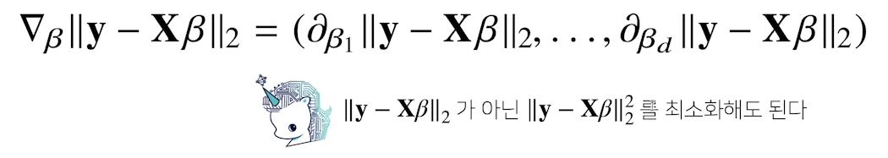

# [AI Math 4강] 경사하강법(매운맛)
### 배운점
- 경사하강법으로 선형회귀 계수 구하기, 하지만 어려움..
- 미분학습 필요
- SGD는 non-convex 목적식에서도 사용이 가능하다.
- 미니 배치를 잘 조정하면 out of memory 에러 메세지가 안 뜨고, 효율적으로 학습할 수 있게끔한다.
---
#### 선형회귀분석 복습
- `np.linalg.pinv`를 이용하면 데이터를 선형모델(linear model)로 해석하는 선형회귀식을 찾을 수 있다.
- 이번 강의에서는, 유사역행렬을 사용하지 않고, 경사하강법으로 L2-norm을 최소화 시키는 방법을 소개!!

#### 경사하강법으로 선형회귀 계수 구하기
- 선형회귀의 목적식은 ||y-Xβ||2이고 이를 최소화하는 β를 찾아야 하므로 다음과 같은 그레디언트 벡터를 구해야 한다.<br>

```python
Input: X, y, lr, T, Output: beta
--------------------------------
# norm: L2-노름을 계산하는 함수
# lr: 학습률, T: 학습횟수

for t in range(T):
	error - y - X @ beta
    grad = - transpose(X) @ error
    beta = beta - lr * grad
```
#### 경사하강법은 만능일까?
- 이론적으로 경사하강법은 미분가능하고 볼록(convex)한 함수에 대해선 적절한 학습률과 학습횟수를 선택했을 대 수렴이 보장되어 있다.
- 특히 선형회귀의 경우 목적식 ||y-Xβ||2은 회귀계수 β에 대해 볼록함수이기 때문에 알고리즘을 충분히 돌리면 수렴이 보장된다.
- 하지만 비선형회귀 문제의 경우 목적식이 볼록하지 않을 수 있으므로 수렴이 항상 보장되지는 않다.
- 딥러닝을 사용하는 경우 목적식은 대부분 볼록함수가 아니다.

#### 확률적 경사하강법
- 확률적 경사하강법(stochastic gradient descent)은 모든 데이터를 사용해서 업데이트하는 대신 데이터 한개 또는 일부(미니배치) 활용하여 업데이트 한다.
- 볼록이 아닌(non-convex)목적식은 SGD를 통해 최적화할 수 있다.
- SGD는 데이터의 일부를 가지고 패러미터를 업데이트하기 때문에 연산자원을 좀 더 효율적으로 활용하는데 도움이 된다.
- 
#### 확률적 경사하강법의 원리: 미니배치 연산
- 경사하강법은 전체 데이터를 가지고 목적식의 그레디어트 벡터를 계산
- SGD는 미니배치를 가지고 그레디언트 벡터를 계산
- SGD는 non-convex 한 목적식에서도 사용가능하므로 경사하강법보다 머신러닝 학습에 더 효율적이다.


