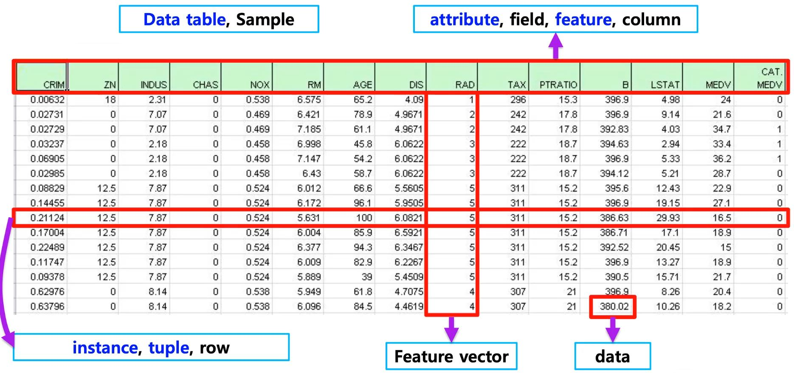
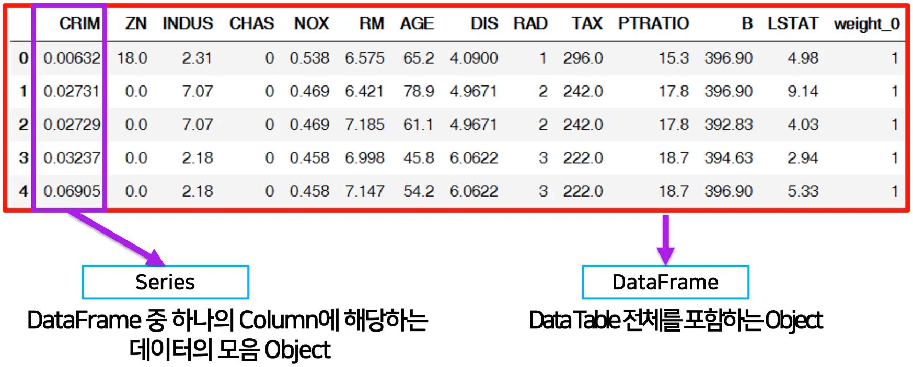

# [AI Math 5강] pandas 1
## Pandas Part 1 - 1
### 배운점
- pandas 란 무엇인가?
- dataframe indexing 및 handling 에 대해 다뤄보고, 코드로 만들어 볼 수 있었다.
---
#### Pandas
- 구조화된 데이터의 처리를 지원하는 Python 라이브러리 / Python 계의 엑셀!
- Panel data -> pandas
- 고성능 array 계산 라이브러리인 numpy와 통합하여, 강력한 "스프레드시트" 처리 기능을 제공
- 인덱싱, 연산용 함수, 전처리 함수 등을 제공함
- 데이터 처리 및 통계 분석을 위해 사용
- Tabular data 를 주로 다룰 예정<br>
<br>
- `conda install pandas`
#### 기본
- series
	- DataFrame 중 하나의 Column에 해당하는 데이터의 모음 Object
- DataFrame
	- Data Table 전체를 포함하는 Object<br>

<br>
#### Data Frame
- Series를 모아서 만든 Data Table = 기본 2차원

##### dataframe indexing
- loc: index location (인덱스 이름) 
> `a.loc[:5] # 0~4 까지의 인덱스를 추출하는게 아니라, 인덱스 이름이 5까지 출력`
- iloc - index position (인덱스 숫자)
> `a.iloc[:3] # 3개의 인덱스와 그 속성을 를 출력

##### dataframe handling
- column에 새로운 데이터 할당
```python
새로운 데이터 할당
df.debt = df.age>40 # dataframe의 age속성 값이 조건에 만족하면 True반환, 아니면 False(boolean)
```
- dataframe transpose
> `df.T`
- 값 출력
> `df.values`

- csv 변환
> `df.to_csv()`

- column 삭제
> `del df["debt"] # debt series가 삭제됨`

## Pandas Part 1 - 2
### 배운점
- exel file을 읽고 이를 handling 하기 위해서는 xlrd를 설치해야한다.<br>
`conda install --y xlrd`
- DataFrame handling에 대해서 알 수 있었다.
	- selection & drop
	- `inplace = True`에 대해서 기억을 해야한다.
- dataframe operation에 대해 알 수 있었다.

---
### Selection & drop
#### Selection with column names
- 한개의 column 선택 시


> `df["account"].head(3)`
- 1개 이상의 column 선택 시

> `df[["account',"street","state"]].head(3)`
- basic selection
> `df[["name","street"]][:2] # Column과 index number`
- loc selection
> `df.loc[[211829,320563],["name","street"]] # Column과 index name`
- iloc selection
> `df.iloc[:2,:2] # Column number와 index number`

#### drop
- index number로 drop
> ```python
> df.drop(1) # 1 번 index 삭제, 기존 dataframe 보존
> df.drop(1, inplace = True) # 1 번 index 삭제, 기존 dataframe update
> ```

#### dataframe operation
- series operation
  - `s1.add(s2)` 이나  `s1 + s2`를 사용하면 두 dataframe이 합쳐짐.
  - 겹치는 index가 없을 경우 NaN값으로 반환.
  - `df1.add(df2, fill_value = 0) # Nan이 나올 상황에서 fill_value =0을 사용하면 Nan은 0으로 바뀐다.`

#### apply
- map과 달리, series 전체(column)에 해당 함수를 적용
- 입력 값이 series 데이터로 입력 받아 handling 가능

```python
df_info = df[["earn","height","age"]]
f = lambda x:x.max() - x.min()
df_info.apply(f)
```
> earn 318047.708444 <br>
> height 19.870000 <br>
> age 73.000000 <br>
> dtype: float64 <br>
> !!각 column 별로 결과값 반환!! <br>

#### descrive
- Numeric type 데이터의 요약 정보를 보여줌
``` python
df.describe()
```
#### unique
- series data의 유일한 값을 list 로 반환함.
##### sort_values
- column 값을 기준으로 데이터를 sorting
```python
df.sort_values(["age","earn"], ascending=True).head(10)
```