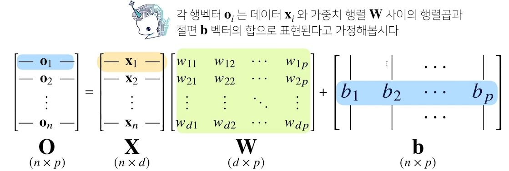
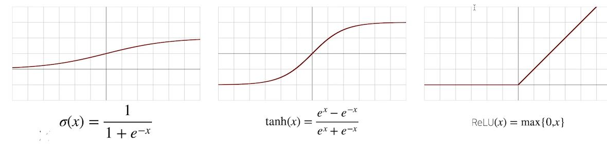
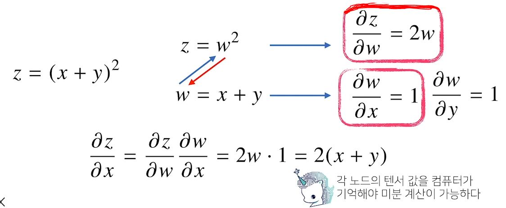

# [AI Math 5강] 딥러닝 학습방법 이해하기
## 배운점
- Softmax란 어떤 것인가에 대해 생각 할 수 있었다.
- 활성함수라는 것은 어던 것이 있는지 알 수 있었다.
- 다층 퍼셉트론에 대해서 알 수 있었다.
- Backporopagation에 대해서 알게 되었다.

---
### 딥러닝 학습법 이해하기
#### 복습
- 지난 시간까지 데이터를 선형모델로 해석하는 방법을 배웠다.
- 이번 챕터부터는 비선형모델인 신경망(neural network)을 배운다.

 

- 분류 문제에서는 `softmax(o) = softmax(Wx + b)`

#### Softmax 연산
- 소프트맥스(softmax)함수는 모델의 출력을 확률로 해석할 수 있게 변환해주는 연산입니다.
- 분류 문제를 풀 때 선형모델과 소프트맥스 함수를 결합하여 예측합니다.
- 학습에서는 softmax에서는 필요, inference 단계에서는 사용하지 않는다.(바로 one-hot)
- 신경망은 선형모델과 활성함수(activation function)를 합성한 함수입니다.

#### 활성함수란?
- 활성함수(activation function)는 R 위에 정의된 비선형(nonlinear)함수로서 딥러닝에서 매우 중요한 개념입니다.
- 활성함수를 쓰지 않으면 딥러닝은 선형모형과 차이가 없습니다.
- 시그모이드(sigmoid)함수나 tanh 함수는 전통적으로 많이 쓰이던 활성함수지만 딥러닝에선 ReLU 함수를 많이 쓰고있다. 

 

#### 신경망을 수식으로 분해해보자
- 신경망은 선형모델과 활성함수(activation function)를 합성한 함수입니다.
- 다층(multi-layer)퍼셉트론(MLP)은 신경망이 여러층 합성된 함수입니다.

#### 왜 층을 여러개 쌓나요?
- 이론적으로는 2층 신경망으로도 임의의 연속함수를 근사할 수 있다.
- 그러나 층이 깊을수록 목적함수를 근사하는데 필요한 뉴런(노드)의 숫자가 훨씬 빨리 줄어들어 좀 더 효율적으로 학습이 가능하다.

※ 층이 얇으면 필요한 뉴런의 숫자가 기하급수적으로 늘어나서 넓은(wide) 신경망이 되어야 한다.

#### 딥러닝 학습원리: 역전파 알고리즘
- 딥러닝은 역전파backpropagation) 알고리즘을 이용하여 각 층에 사용된 파라미터를 학습한다.
- 각 층 패러미터의 그레디언트 벡트는 윗층부터 역순으로 계산하게 된다.

#### 역전파 알고리즘 원리 이해하기
- 역전파 알고리즘은 합성함수 미분법인 연쇄법칙(chain-rule)기반 자동미분(auto-differentiation)을 사용합니다.

 

