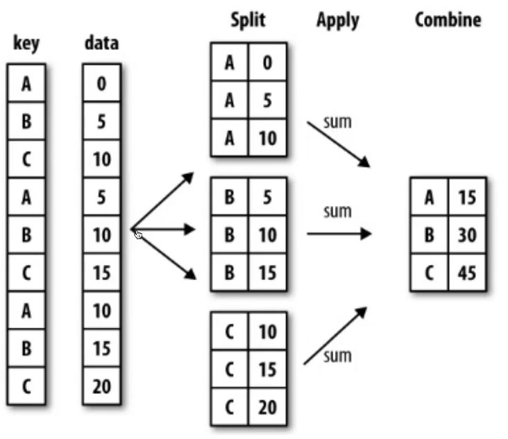
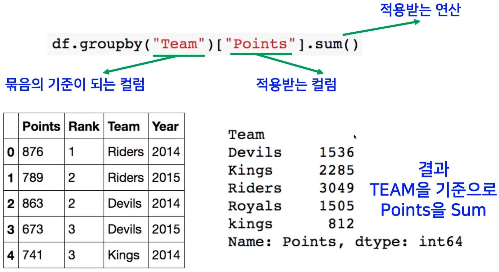
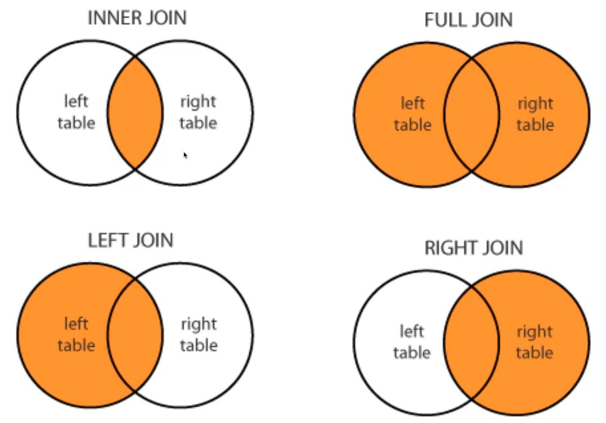

# [AI Math 6강] pandas 2
## pandas part 2-1
### 배운점
- spli -> apply -> combine으로 진행되는 groupby를 학습 하였다.
	- 이 과정에서는 hierachical index 개념이 존재하는데, swaplevel을 통해 종속관계(?)를 수정할 수도 있고, 계산을 할 수도 있다.
- Split된 상태를 추출하는 groupby를 배웠다.
	- group이 된 상태를 말하며, 처음 배운 group에서 combine 하기 전이다.
	- Aggregation, filtering, transfromation으로 3가지를 배웠다.
---
### Groupby 1
- SQL groupby 명령어와 같음
- split -> apply -> combine
- 과정을 거쳐 연산함<br>

<br>

<br>

- 한 개 이상의 column을 묶을 수 있음
```python
df.groupby(["Team","Year"])["Points"].sum() # Team:1단계, Year:2단계
```
#### Hierarchical index
- Groupby 명령의 결과물도 결국은 dataframe
- 두 개의 column으로 groupby를 할 경우, index가 두개 생성

#### unstack()
- Group으로 묶여진 데이터를 matrix 형태로 전환해줌
> `h_index.unstack()`

#### swaplevel()
- Index level을 변경할 수 있음
> `h_index.swaplevel()`

#### operations
- index level을 기준으로 기본 연산 수행 가능
> `h_index.sum(level=0)`<br>
> `h_index.sum(level=1)`
### Groupby 2
- Groupby에 의해 Split된 상태를 추출 가능함(group이 되어있는 상태)
> `grouped = df.groupby("Team")`
- 특정 key값을 가진 그룹의 정보만 추출 가능
> `grouped.get_group("Devils")`
- 추출된 group 정보에는 세 가지 유형의 apply가 가능함
- 주의: column 별로 뽑아주는 것, 예를들어, `grouped.agg(max)`를 호출 한다고 가정했을 때, 가장 큰 인덱스 전체를 뽑는 것이 아니라, column 별로 큰 값을 뽑는 것이다.<br>
	
	- Aggregation: 요약된 통계정보를 추출해 줌
	> grouped.agg(sum)<br>

	- 특정 컬럼에 여러개의 function을 Apply 할 수 도 있음
	> `grouped['Points'].agg)[np.sum, np.mean, np.std])`<br>

	- Transformation: 해당 정보를 변환해줌
		- Aggregation과 달리 key값 별로 요약된 정보가 아님<br>
		- 개별 데이터의 변환을 지원함<br>
	> ```python
	> score = lambda x: (x,max())
	> grouped.transform(score)
	> ```
	> 단 max나 min처럼 Series 데이터에 적용되는 데이터들은 key값을 기준으로 Grouped 된 데이터에 적용.

	- Filtration: 특정 정보를 제거 하여 보여주는 필터링 기능
		- 특정 조건으로 데이터를 검색할 때 사용
		- filter안에는 boolean 조건이 존재해야함
		- `len(x)`는 grouped된 dataframe 개수
	> `df.groupby('Team').filter(lambda x: len(x) >= 3)`

## pandas part 2-2
### 배운점
- `!wget <주소>`: 데이터를 다운 받을 수 있는 명령어
- Pivot table & Crosstab의 기술을 확인하였다.
- Merge와 Concat의 차이를 알게 되었고, join methos 사용 방식을 익혔다.
---
### Pivot table & Crosstab
#### Pivot table
- Index 축은 groupby와 동일함
- Column에 추가로 labeling 값을 추가하여,<br> Value에 numeric type 값을 aggregation 하는 형태

#### Crosstab
- 두 칼럼에 교차 빈도, 비율, 덧셈 등을 구할 때 사용
- Pivot table의 특수한 형태
- User-Item Rating Matrix 등을 만들 때 사용가능함.

#### Merge
- SQL에서 많이 사용하는 Merge와 같은 기능
- 두 개의 데이터를 하나로 합침
```python
두 dataframe의 column 이름이 같을 때
pd.merge(df_a, df_b, on='subject_id') # df_a: 데이터프레임 1, df_b: 데이터프레임 2, on: 기준 column

두 dataframe의 column 이름이 다를 때
pd.merge(df_a, df_b, left_on='subject_id', right_on='subject_id') # df_a: 데이터프레임 1, df_b: 데이터프레임 2, left_on: df_a column 명, right_on: df_b column 명
```
#### join method
<br>

- inner join: 둘 다의 기준으로 가지고 있는 경우 출력. `how = inner`
- left join: 왼쪽을 기준으로 가지고 있는 경우 출력, 왼쪽은 있으나 오른족에 없으면 Nan. `how = left`
- right join: 오른쪽을 기준으로 가지고 있는 경우 출력, 오른쪽은 있으나 왼족에 없으면 Nan. `how = right`
- full join: 같은 것은 붙이고 아닌 것은 각각 보는 것.`how = outer`

#### concat
- 같은 형태의 데이터를 붙이는 연산 작업
```python
아래로 붙일 때
df_new = pd.concat([df_a, df_b]) # df_a 아래에 df_b concat
--------------------------------------------------------
df_a.append(df_b) # 같은 의미로 사용
```
```python
오른쪽으로 붙일 때
df_new = pd.concat([df_a, df_b], axis=1) # df_a 오른쪽에 df_b concat
```
### persistence
#### Database connection
- Data loading시 dㅠ connection 기능을 제공함

#### XLS persistence
- Dataframe의 엑셀 추출 코드
- XLS 엔진으로 openpyxls 또는 XlsxWrite 사용