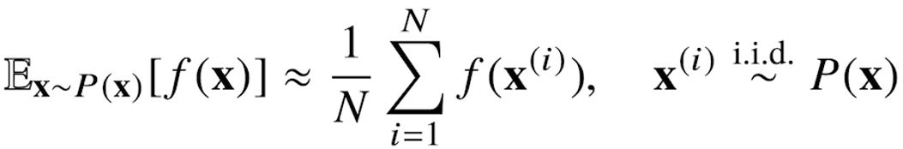

# [AI Math 6강] 확률론 맛보기
### 배운점
- 확률변수, 확률현상, 결합분포, 조건부확률분호, 이산확률변수, 연속확률변수에 대해 알 수 있었다.
- 조건부기대값은 E||y-f(x)||2을 최소화하는 함수 f(x)와 일치한다.
- 기대값과 몬테카를로 샘플링에 대해 알 수 있었다.
---
### 딥러닝에서 확률론이 왜 필요한가?
- 딥러닝은 확률론 기반의 기계학습 이론에 바탕을 두고 있다.
- 기계학습에서 사용되는 손실함수(loss function)들의 작동원리는 데이터 공간을 통계적으로 해석해서 유도하게 된다.
- 예측이 틀릴 위험을 최소화하도록 데이터를 학습하는 원리는 통계적 기계학습의 기본 원리이다.
- 회귀 분석에서 손실함수로 사용되는 L2-norm은 예측 오차의 분산을 가장 최소화하는 방향으로 학습하도록 유도한다.
- 분류 문제에서 사용되는 교차엔트로피(cross-entropy)는 모델 예측의 불확실성을 최소화하는 방향으로 학습하도록 유도한다.
- 분산 및 불확실성을 최소화하기 위해서는 측정하는 방법을 알아야 한다.

#### 확률분포는 데이터의 초상화 (지도학습 기반)
- 데이터공간을 X*Y 라 표기하고 D는 데이터공간에서 데이터를 추출하는 분포이다.
- 데이터는 확률 변수로 `(x,y)~D`라 표기
> 확률변수(random variable)란, 확률현상에 기인해 결과값이 확률적으로 정해지는 변수를 의미한다.
> >확률현상이란,어떤 클래스가 있는지는 알지만, 어떠한 사건으로 어떤 클래스가 나올지 모르는 것. ex) 동전 던지기
- 결합분포 P(X * y)는 D를 모델링합니다.
- P(X)는 입력 x에 대한 주변확률분포로 y에 대한 정보를 주진 않습니다.
> 주변확률분포: 두 개의 변수로 이루어진 결합확률분포를 통해 하나의 변수로만 이루어진 확률함수를 구하려고 하는 것.
- 조건부확률분포 P(X|y)는 데이터 공간에서 입력 X와 출력 y사이의 관계를 모델링한다.
> P(X|y)는 특정 클래스가 주어진 조건에서 데이터의 확률분포를 보여준다.

#### 이산확률변수 vs 연속확률변수
- 확률변수는 확률분포 D에 따라 이산형(discrete)과 연속형(continuous) 확률변수로 구분하게 된다.
> 데이터공간 X * Y 에 의해 결정되는 것으로 오해를 하지만 D에 의해 결정된다.
- 이산형 확률변수는 확률변수가 가질 수 있는 경우의 수를 모두 고려하여 확률을 더해서 모델링한다.
> P(X=x)는 확률변수가 x 값을 가질 확률로 해석할 수 있다.<= 확률질량함수
- 연속형 확률변수는 데이터 공간에 정의된 확률변수의 밀도(density) 위에서의 적분을 통해 모델링 한다
> 밀도는 누적확률분포의 변화율을 모델링하며 확률로 해석하면 안된다.

#### 조건부확률과 기계학습
- 조건부확률 P(y|X)는 입력변수 X에 대해 정답이 y일 확률을 의미한다.
> 연속확률분포의 경우 P(y|X)는 확률이 아니고 밀도로 해석한다는 것을 주의하자
- 로지스틱 회귀에서 사용했던 선형모델과 소프트맥스 함수의 결합은 데이터에서 추출된 패턴을 기반으로 확률을 해석하는데 사용된다.
- 분류 문제에서 softmax는 데이터 X로부터 추출된 특징패턴 ∮(x)과 가중치 행렬 W을 통해 조건부확률 P(y|x)을 계산한다.
> `P(y|∮(x))`이라 써도 된다.

- 회귀 문제의 경우 조건부 기대값 E[y|x]을 추정한다.
> 조건부기대값은 E||y-f(x)||2을 최소화하는 함수 f(x)와 일치한다.
- 딥러닝은 다층신경망을 사용하여 데이터로부터 특징패턴 ∮을 추출한다.
> 특징패턴을 학습하기 위해 어떤 손실함수를 사용할지는 기계학습 문제와 모델에 의해 결정된다.

#### 기대값이 뭔가요?
- 확률분포가 주어지면 데이터를 분석하는 데 사용 가능한 여러 종류의 통계적 범함수(statistical functional)를 계산 할 수 있다.
- 기대값(expectation)은 데이터를 대표하는 통계량이면서 동시에 확률분포를 통해 다른 통계적 범함수를 계산하는데 사용된다.
> 연속확률분포의 경우엔 적분을, 이산확률분포의 경우엔 급수를 사용한다. 

- 기대값을 이용해 분산, 첨도, 공분산 등 여러 통계량을 계산할 수 있다.
#### 몬테카를로 샘플링
- 기계학습의 많은 문제들은 확률분포를 명시적으로 모르 때가 대부분이다.
- 확률분포를 모를 때 데이터를 이용하여 기대값을 계산하려면 몬테카를로(Monte Carlo) 샘플링 방법을 사용해야한다.
> 몬테카를로는 이산형이든 연속형이든 상관없이 성립한다. 

- 몬테카를로 샘플링은 독립추출만 보장된다면 대수의 법칙에 의해 수렴성을 보장한다.
