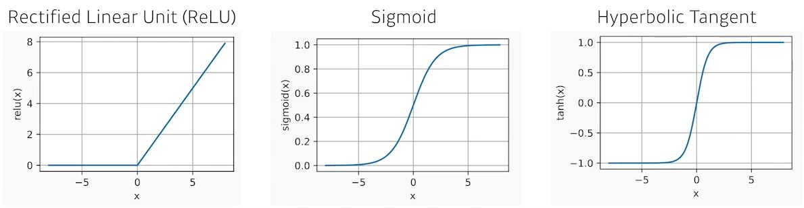
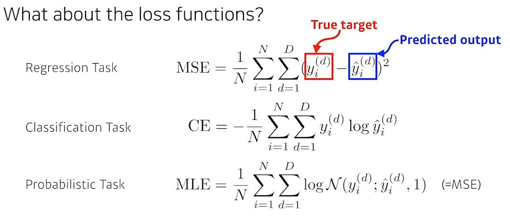

# [DLBasic] 뉴럴 네트워크 - MLP
#### Linear Neural Networks
 
- 편미분을 이용하여 update.
- stepsize가 중요
- 물론 다차원의 input과 output을 다룬다.

#### Beyond Linear Neural Network
- Activation functions

 
#### Multi-layer perceptron
- Loss

 

## 공부한 부분
- Neural Network의 전반적인 내용에 대해 학습