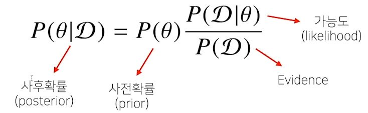
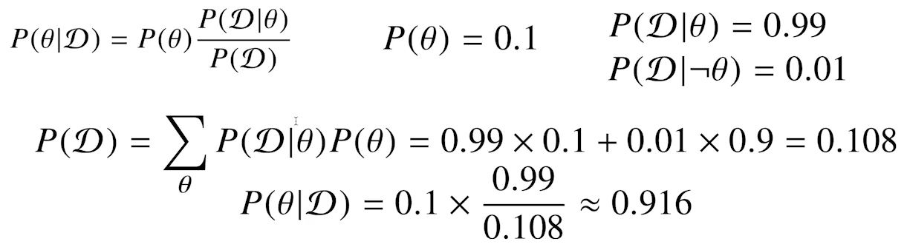
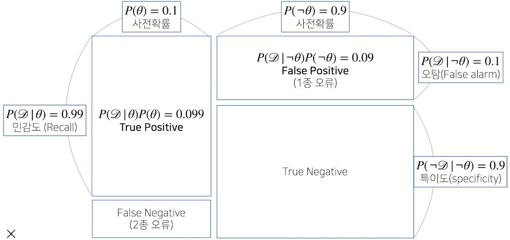
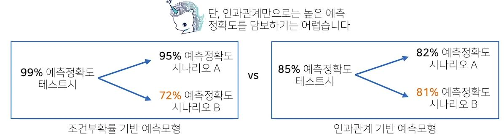
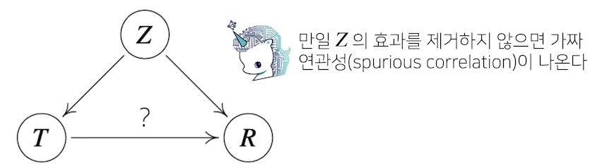

# [AI Math 8강] 베이즈 통계학 맛보기
#### 조건부 확률이란?
- 베이즈 통계학을 이해하기 위해선 조건부확률의 개념을 이해해야한다.
> P(A∩B) = P(B)*P(A|B) 
> 조건부확률 P(A|B)는 사건 B가 일어난 상황에서 사건 A가 발생할 확률을 의미한다.
- 베이즈 정리는 조건부확률을 이용하여 정보를 갱신하는 방법을 알려준다.
> P(B|A) = P(A∩B) / P(A) = P(B) * P(A|B) / P(A) 
> A라는 새로운 정보가 주어졌을 때 P(B)로부터 P(B|A)를 계산하는 방법을 제공한다.

#### 베이즈 정리: 예제
  
- COVID-99의 발병률이 10%로 알려져있다. COVID-99에 실제로 걸렸을 때 검진될 확률은 99, 실제로 걸리지 않았을 때 오검진될 확률이 1%라 할 때, 어떤 사람이 질병에 걸렸다고 검진결과가 나왔을 때 정말로 COVID-99에 감염되었을 확률은? 

  

  

- 베이즈 정리를 통한 정보의 갱신
	- 베이즈 정리를 통해 새로운 데이터가 들어왔을 때 앞서 계산한 사후확률을 사전확률로 사용하여 갱신된 사후확률을 계산 할 수 있다.

#### 조건부 확률 -> 인과관계?
- 조건부 확률은 유용한 통계적 해석을 제공하지만 인과관계(causality)를 추론할 때 함부로 사용해서는 안된다.
> 데이터가 많아져도 조건부 확률만 가지고 인과관계를 추론하는 것은 불가능하다.
- 인과관계는 데이터 분포의 변화에 강건한 예측모형을 만들 때 필요하다. 

  
 - 인과관계를 알아내기 위해서는 중첩요인(confounding factor)의 효과를 제거하고 원인에 해당하는 변수만의 인과관계를 계산해야 합니다. 

  

---
## 공부한 부분
- 베이즈 공식에 대해서 알게 되었는데, 아직 가능도(likelihood)에 대한 기본 개념이 부족한 것 같아서 유튜브에 있는 이활석 님의 강의를 보고 개념을 정리했다.
>참고: https://www.youtube.com/watch?v=o_peo6U7IRM

- 조건부 확률은 인과관계라는 잘못된 개념을 정확하게 방향을 잡아 주셔서 강의를 통해 보다 더 잘 알게 되었다.