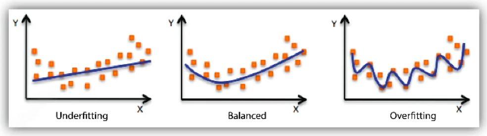
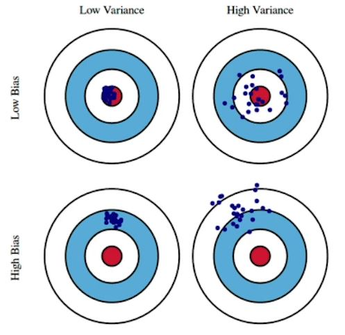
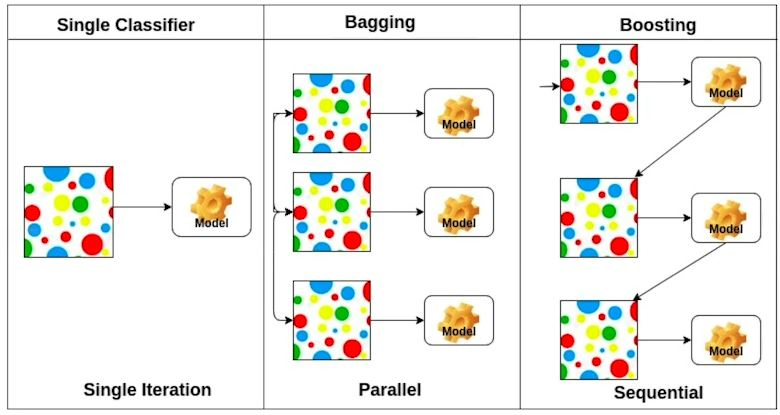

# [DLBasic] Optimization
### Important Concepts in Optimization
- Generalization
- Under-fitting vs. over-fitting
- Cross validation
- Bias-variance tradeoff
- Bootstrapping
- Bagging and boosting

#### Generalization
- 일반화 성능을 높이는 것!
- 일반화란??
	- 학습 데이터와 테스트 데이터와의 차이

#### Under-fitting vs. over-fitting
 

#### Cross validation(K-fold validation)
- 학습데이터를 k개로 나누고 학습은 k-1개로 학습.
- 나머지 1개로 validation.
- validation을 다른 것을 사용하고, 나머지는 다시 학습.
- 반복!!
- 테스트 데이터는 어떤 식으로든 사용해서는 안된다.

#### Bias-variance tradeoff

- variance: 엽력이 있을 때, 일관된 출력을 내는가?
#### Bootstrapping
- 학습 데이터가 고정되어 있을 때, sampling을 통해 여러 개의 모델을 만든 후
- 그 것들에 입력을 주었을 때, 일관된 값을 내는지 확인

#### Bagging and boosting
- Bagging
	- boostrapping을 통해 여러 모델로 결과를 얻고 결과를 냄(voting or averageing)

- Boosting
	- weak learner들을 sequential 하게 만들어서 하나의 struck learner로 만든다. 

 

#### Practical Gradient Descent Methods
 
- stochastic gradient descent
	- single sample
- mini-batch gradient descent
	- subset of data
- batch gradient descent
	- whole data

#### Batch-size Matters
- large batch size
	- sharp minimizer
- small batch size (GOOD!!): in the paper
	- flat minimizer: generalization performance가 좋다.

## Gradient Descent Methods
- Stochastic gradient descent
	- learning rate 잡기가 어렵다.
- Momentum
	- learning rate를 잡기 어려우니 관성(?)을 이용해보자!
	- learning rate가 마구잡이로 바뀌어도 어느정도 잘 학습이 된다.
- Nesterov accelerated gradient
	- local minima에 더 빨리 도달 할 수 있다.
- Adagrad
	- sum of gradient squares를 역수로 놓기 때문에 처음에는 경사하강이 많이 일어나게 함
	- 하지만, 뒤로 갈 수록 분모 값이 커져 변화량이 줄게 됨
- Adadelta
	- no learning rate(잘 사용되지 않음)
- RMSprop
- Adam
	- gradient 크기가 변함에 따라서 adaptive하게 learning rate을 바꾸는 것과 이전에 해당하는 gradient 정보에 해 momentum을 잘 합친 것

## Regularization
- Early stopping
	- 학습을 중간에 validation을 활용해서 먼저 멈춘다.
- Parameter norm penalty
	- Neural network의 parameter가 너무 커지지 않게 하는 것
- Data augmentation
- Noise robustness
	- 입력 데이터에 noise를 준다.
- Label smoothing
	- Mixup
	- CutMix
- Dropout
- Batch normalization
	- 적용하고자 하는 layer의 statistic을 정규화하는 것.