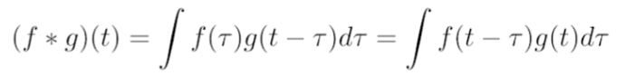
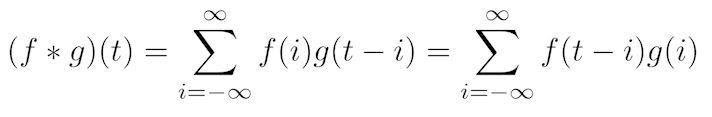
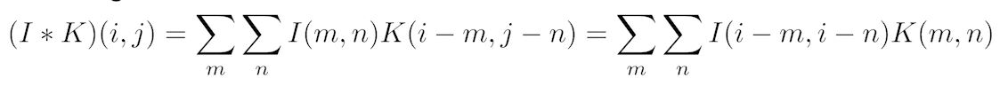
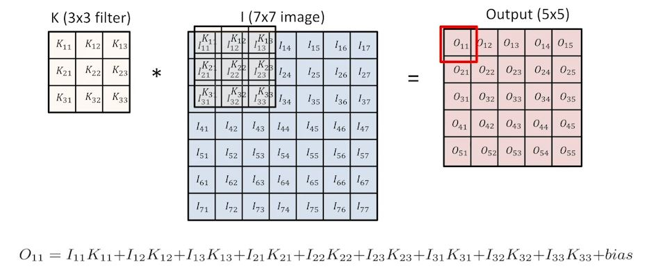
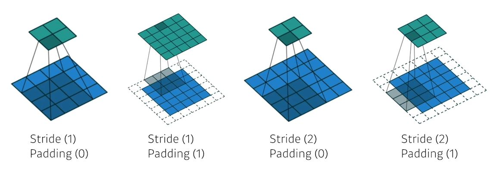
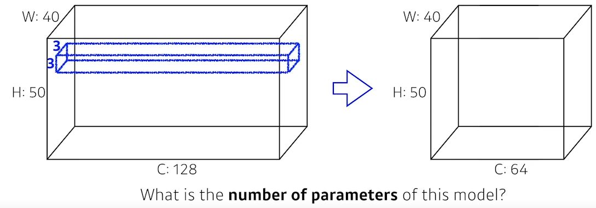
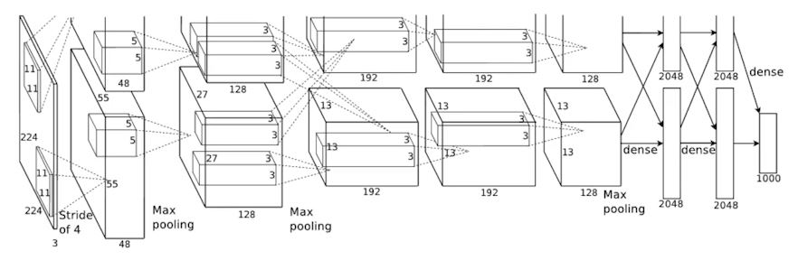
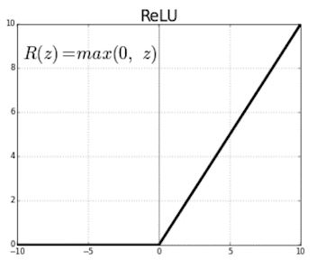
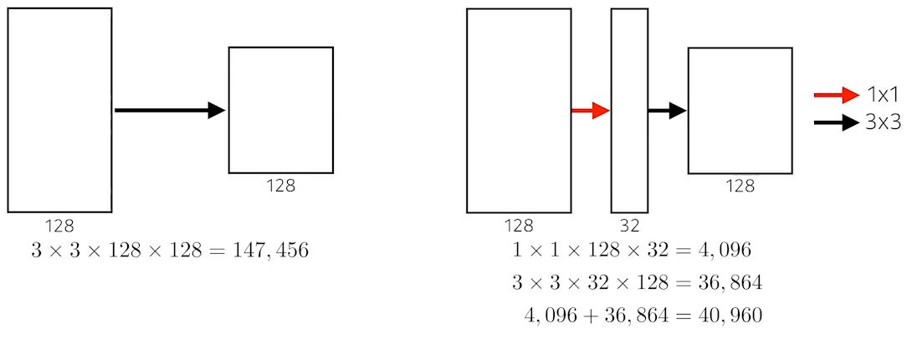
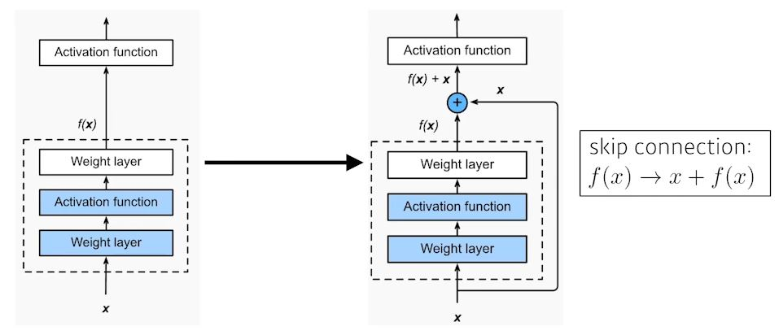

# [DLBasic] CNN-Convolution은 무엇인가??
### Convolution
#### Continuous convolution
 
#### Discrete convolution
 
#### 2D image convolution
 

#### Convolution
 
- blur도 될 수 있고
- emboss가 될 수 있고
- outline이 될 수도 있다.
> 공부한 내용!!! 
> convolution을 적용을 하게 되면, 커널의 channel과 input channel을 맞춰줘야 한다. 
> 하지만 이 과정을 지나게 되면, 하나의 channel의 output만 존재하게 된다. 
> 그렇기 때문에 커널(KH, KW, C)의 개수는 n개로 만들어주고, 
> 그렇게 되면 output은 (H-KH+1, W-KW+1,N)이 된다.

#### Convolutional Neural Networks
- CNN은 Convolution layer, pooling layer와 Fully connected layer로 구성되어 있다.
	- Convolution and Pooling: feature extraction
	- Fully connected layer: decision making(e.g., classification)
		- 최근에는 없어지는 추세: 학습시키고 싶은 parameter의 개수를 줄이기 위해...

#### stride
- stride = 1이라는 것은 모든 픽셀마다 한 픽셀에 거쳐서 이동하면서 convolution을 진행한다는 의미.
- stride = 2는 픽셀을 이동할 때, 2칸 씩 이동한다는 의미.
> stride가 커질수록? 
> output의 사이즈는 작아진다.
#### padding
- padding = 0에서 stride = 1이라고 했을 때, 출력 이미지의 크기는 작아진다.
- 즉, boundary information이 버려진다.
- zero padding: 입력 이미지에 0을 채운다.

 

#### Convolution Arithmetic
- Padding (1), Stride (1), 3 x 3 Kernel

 

- output의 1개의 channel 계산: filter의 size(3x3) * channel(128) * 64 = 73,728

> 잘 못 가졌던 개념!! 
> parameter의 계산을 연산량으로 생각하고 있었기 때문에 커널 크기와 padding, stride도 고려하려 하였다. 
> 하지만, parameter의 계산은 filter의 parameter의 계산!! 
> 따라서 filter size, channel, output channel을 고려!! 
> 연산량과 헷갈리면 안된다.
- fully connected layer의 parameter 개수?
	- input(H x W) * input channel(C) * ouput
	- 그래서!!! 많이 사용하지 않는다. 너무 많다...

#### 1 x 1 Convolution
- Why?
	- Dimension reduction
	- 깊이는 깊어지면서 parameter의 개수를 줄인다.
	- e.b., bottleneck architecture.

# [DLBasic] Modern CNN - 1 x 1 convolution의 중요성
### AlexNet
##### ILSVRC
- ImageNet Large-Scale Visual Recognition Challenge
	- classification / detection / localization / segmentation
	- 1,000 different categories
	- Over 1 million images
	- Training set: 456,567 images 

 
- 5 convolutional layers + 3 dense layers
- Key ideas
	- activation function: ReLU activation
	- GPU implementation (2 GPUs)
	- Local response normalization, Overlapping pooling
	- Data augmentation
	- Dropout
- ReLU Activation
	- vanishing gradient problem을 극복 할 수 있다.

 

### VGGNet
- 3 x 3 convolution
- 1 x 1 convolution
- Dropout (p=0.5)
- VGG 16, VGG 19
##### Why 3 x 3 convolution???
- Receptive field
	- 하나의 convolutional filter를 찍었을 때, 고려되는 input의 영역
- 3 x 3 convolution 2번의 receptive field == 5 x 5 convolution 1번의 receptive field
- BUT, parameter의 개수는 3 x 3 convolution 2번일 때 더 효율적이다.

### GoogLeNet
- Network in network(NIN) 구조
- Inception block
	- parameter의 개수가 줄어든다.

 

### ResNet
- Skip connection

 

### DenseNet
- DenseNet uses concatenation instead of addithion.

### Summary
- Key takeaways
	- VGG: repeated 3x3 blocks
	- GoogLeNet: 1x1 convolution
	- ResNet: skip-connection
	- DenseNet: concatenation

# [DLBasic] Computer Vision Applications
### Semantic Segmentation
- pixel 마다 label(?)을 줘서 입력 이미지에서 객체를 나누는 것.
##### Fully convolutional Network
- Dense layer를 없애고 convolution layer로 교체.
- convolutionalization: parameter의 개수는 동일.
#### Deconvolution (conv transpose)
- conv: 30x30 -> 15x15
- deconv: 15x15 -> 30x30
### Detection
> 객체가 있을 만한 곳에 b-box를 여러 개 뽑고 분류.
- SPPNet
- Fast R-CNN
- Faster R-CNN
	- Faster R-CNN: Region Proposal Network + Fast R-CNN
	- Region Proposal Network: 이미지 안에서 객체가 있을거다라는 것만 찾아줌.
#### YOLO
- one stage detection
- RPN없이 한 번에 detection을 사용.