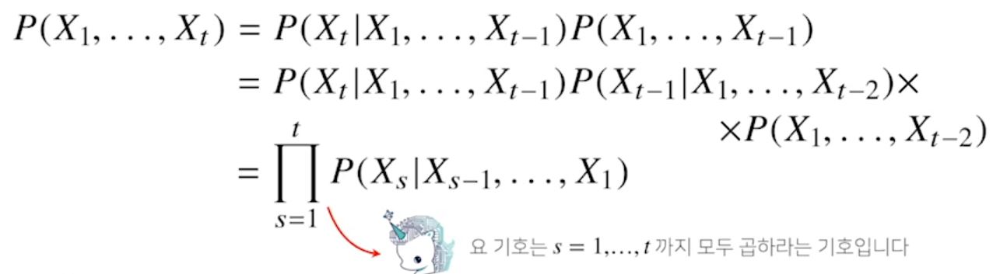
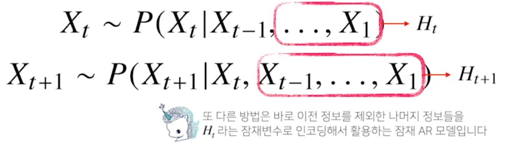
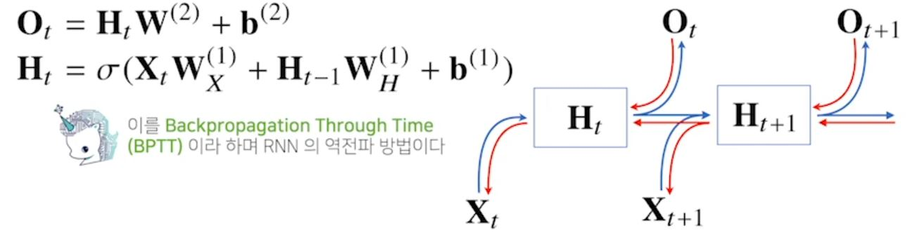
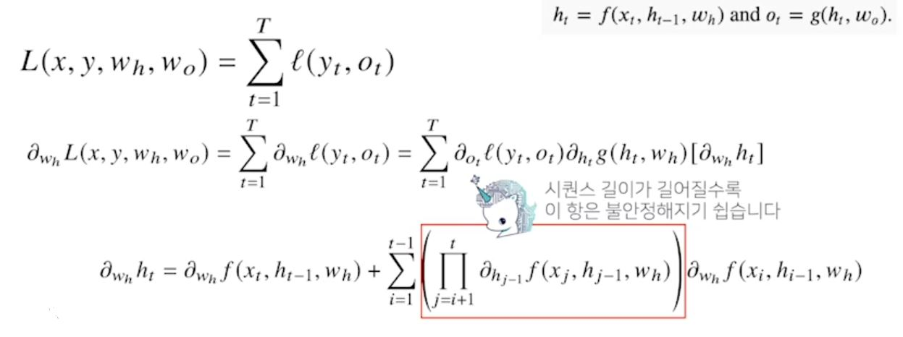

# [AI Math 10강] RNN 첫걸음
#### 시퀀스 데이터 이해하기
- 소리, 문자열, 주가 등의 데이터를 시퀀스(sequence) 데이터로 분류한다.
> 시계열(time-series) 데이터는 시간 순서에 따라 나열된 데이터로 시퀀스 데이터에 속한다.
- 시퀀스 데이터는 독립동등분포(i.i.d.) 가정을 잘 위배하기 때문에 순서를 바꾸거나 과거 정보에 손실이 발생하면 데이터의 확률분포도 바뀌게 된다.
> 과거 정보 또는 앞뒤 맥락 없이 미래를 예측하거나 문장을 완성하는 건 불가능하다.

#### 시퀀스 데이터를 어떻게 다루나요??
- 이전 시퀀스의 정보를 가지고 앞으로 발생할 데이터의 확률분포를 다루기 위해 조건부 확률을 이용할 수 있다.

 

- 시퀀스 데이터를 다루기 위해선 길이가 가변적인 데이터를 다룰 수 있는 모델이 필요하다.

 

#### Recurrent Neural Network을 이해하기
- 가장 기본적인 RNN모형은 MLP와 유사한 모양이다.

 

- RNN은 이전 순서의 잠재변수와 현재의 입력을 활용하여 모델링한다.
- RNN의 역전파는 잠재변수의 연결그래프에 따라 순차적으로 계산한다.

 

#### BPTT를 좀 더 살펴보자
- BPTT를 통해 RNN의 가중치 행렬의 미분을 계산해보면 아래와 같이 미분의 곱으로 이루어진 항이 계산된다.

 

#### 기울기 소실의 해결책?
- 시퀀스 길이가 길어지는 경우 BPTT를 통한 역전파 알고리즘의 계산이 불안정해지므로 길이를 끊는 것이 필요하다.
- 이런 문제들 때문에 Vanilla RNN은 길이가 긴 시퀀스를 처리하는데 문제가 있다.

#### 공부한 점
- RNN의 기본적인 모형과 Backpropagation이 어떻게 진행하는지에 대해 기본적으로 알게되었다.