# [DLBasic] Sequential Models - RNN
### Sequential Model
- 시퀀스 데이터의 문제점
	- 입력의 크기가 정해져있지 않다.
- Autoregressive model
	- 과거에서 몇 개의 기간만 고려하겠다.
- Markov model

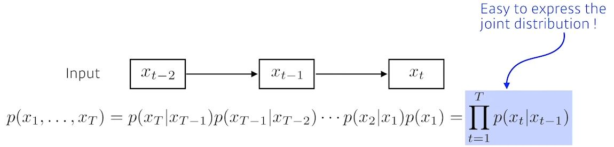 
- Latent autoregressive model

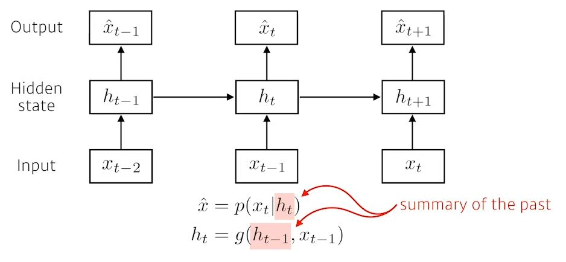 
- 과거를 다 볼 수 없으니 hidden state로 과거 전체를 요약한다.

#### Recurrent neural network

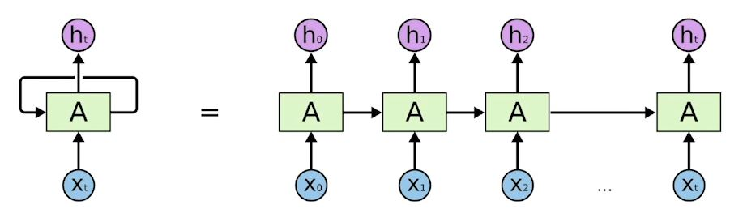 
- Short-term dependencies
	- 먼 과거의 정보는 현재 거의 남아있지 않다.
	- Long-term dependencies

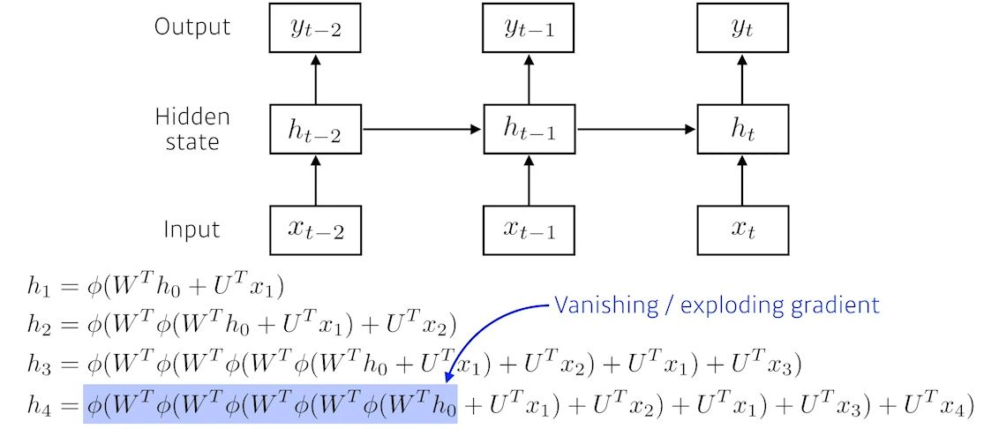 

#### LSTM

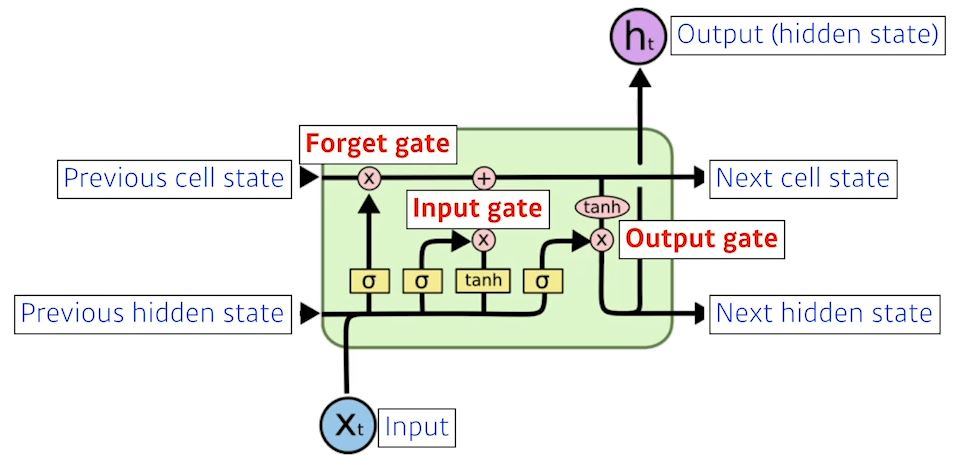 

- x: 입력(input)
- Previous cell state: 내부에서만 흘러간다. 0부터 t까지 t+1개의 정보를 다 취합해준다.(input)
- Previous hidden state: t+1에서의 previous hidden state로 들어간다.(input)
- Next hidden state: t+1번째 인덱스로 out
- Next cell state: t+1번째 인덱스로 out
- Forget gate: 어떤 정보를 버릴지
- Input gate: 어떤 정보를 올릴지
- update cell: 버릴건 버리고 올릴 것은 올려서 합치는 것.
- Output gate: 어떤 값을 밖으로 내보낼지
- ht: output(hidden state), 다음 번 단어의 분포를 찾겠다, 다음 번 단어의 확률을 뽑겠다.

#### GRU(Gated Recurrent Unit)
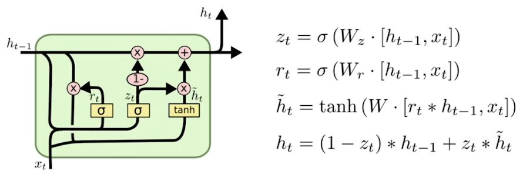 
- reset gate와 update gate만 존재한다.
- cell state가 없고 hidden state만 있다.

# [DLBasic] Sequential Models - Transformer
- What makes sequential modeling a hard problem to handle
	- Trimmed sequence: 길이가 달라질 수 있거나
	- Omitted sequence: 중간에 빠지거나
	- Permuted sequence: 순서가 바뀐경우

#### Transformer
- 재귀적인 모형이 없다.
- sequence를 다루지만, attention의 구조를 활용했다.

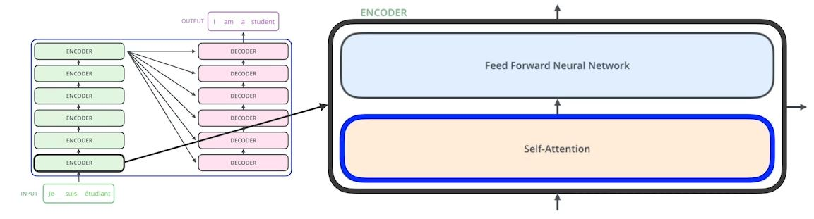 

- feed forward network: MLP와 비슷
1. 3개의 벡터가 들어온다. 
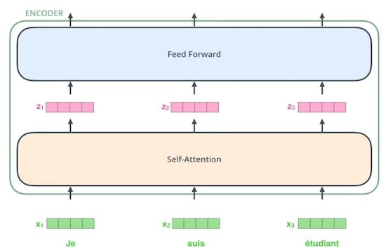 

2. 1개의 단어를 만들 때, n-1개의 벡터를 같이 고려 
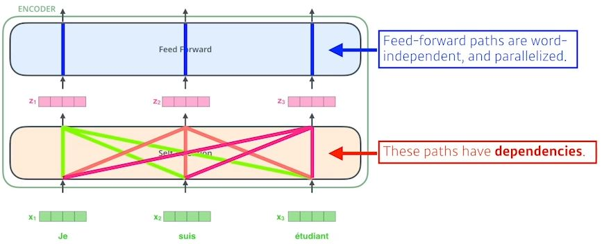 

- self-attention
	- 하나의 단어를 설명할 때 다른 어떤 것과 고려를 해야한다. 

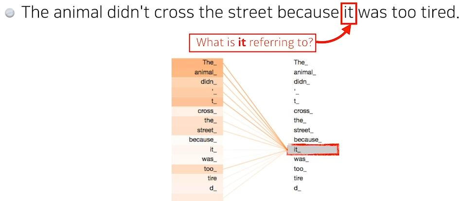 
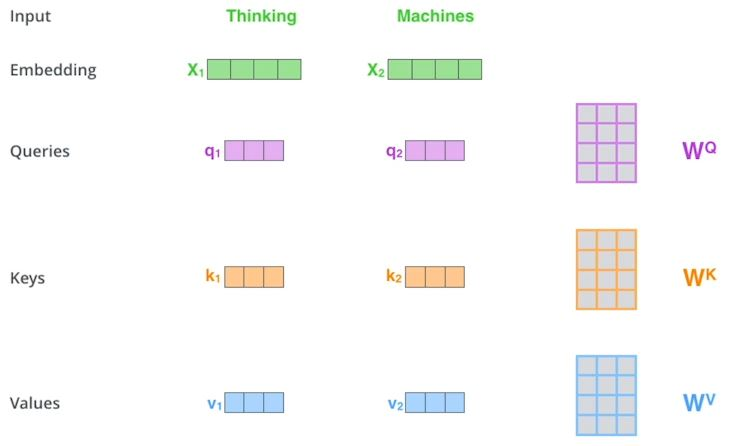 
- 1개의 단어에 3개의 벡터를 만드는데, 이 것을 3개의 신경망을 만든다고 생각해도 된다.
	- Queries
	- Keys
	- Values
- score vetor: 원하는 단어의 score 벡터를 계산할 때, 내가 인코딩을 하고자하는 벡터의 query 벡터와 나머지 모든 단어의 key 벡터를 구하고 내적을 구한다. 그리고, normalize한다. 마지막으로 value 벡터와 weighted sum!!

 
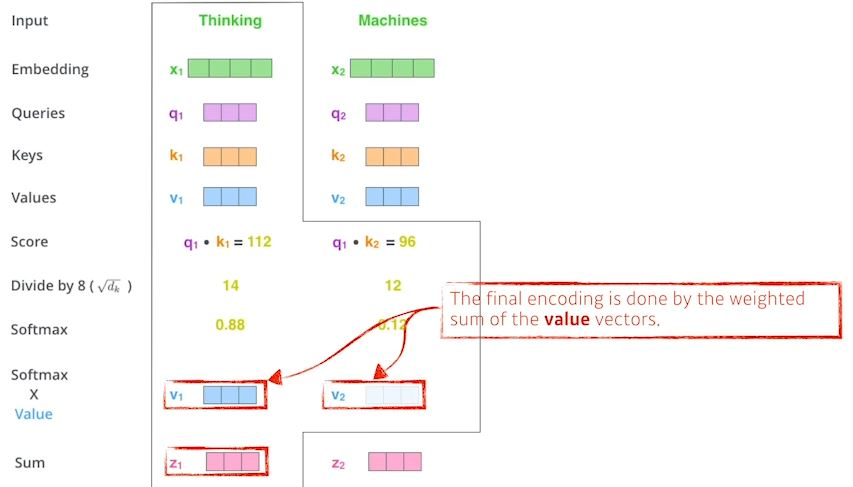 
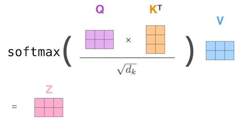 

- query 벡터와 key 벡터의 차원은 같아야한다. value 벡터는 달라도 된다.

#### Multi headed attention
- Attention을 여러번 사용하겠다는 것.
- 디코더에서 self-attention layer는 softmax 단계 이전에 이후 위치를 마스킹하여 수행되는 출력 시퀀스의 이전 위치에만 집중할 수 있다.
- encoder-decoder attention layer: 아래 계층에서는 query matrix를 만들고 encoder stack에서key와 value를 가져오는 것을 제외하고는 muti-headed self attention과 동일하게 작동한다.

