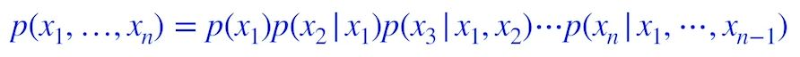
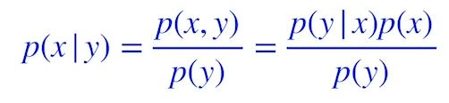
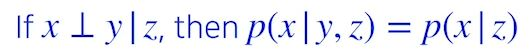
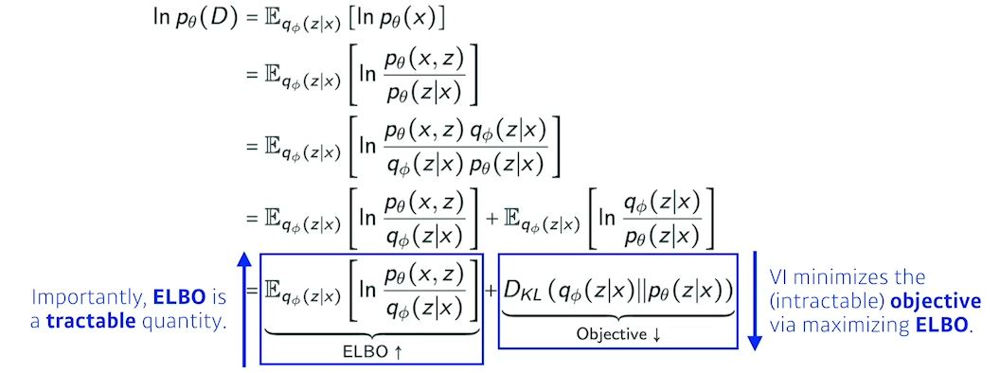
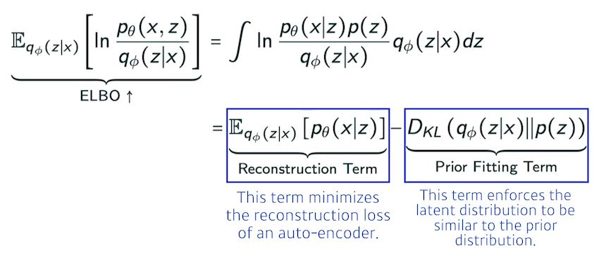
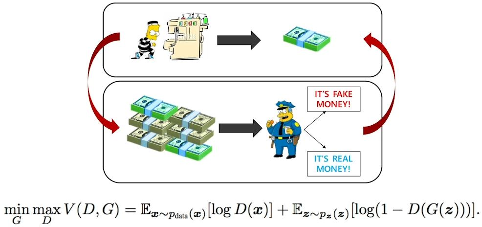

# [DLBasic] Generative Models 1
## Generative Models part 1
#### Learning a Generative Model
- Suppose we are given images of dogs.
- We want to learn a probability distribution p(x) such that
	- Generation: if we sample x_new~p(x), x_new should look like a dog(sampling).
	- Density estimation: p(x) should be high if x looks like a dog, and low otherwise(anomaly detection)
		- Also known as, explicit models: 입력이 주어졌을 때, 확률이 나오는 것
		- implicit models: 단순 generative model.
    - Unsupervised representation learning: We should be able to learn what these images have in common, e.g., ears, tail, etc (feature learning).
- Then, how can we represent p(x)???

#### Basic Discrete Distributions
- Bernoulli distribution: (biased) coin flip, 0 또는 1.
	- D = {Heads, Tails}
	- Specify P(X=Heads) = P. Then P(X=Tails) = 1-P.
	- Write: X ~ Ber(p)
	- 이항분포
- Categorical distribution: (biased) m-sided dice, 주사위.
	- D = {1, .. , m}
	- Specity P(Y=i) = Pi, Such that ∑p_i = 1.
	- Write: Y ~ Cat(p1, --- , pm)
##### Example
- Modeling an RGBB joint distribution (of a single pixel)
	- (r, g, b) ~ p(R, G, B)
	- Number of cases? 256 x 256 x 256
	- how many parameters do we need to specify? 255 x 255 x 255

#### Structure Through Independence
- What if X1, ..., Xn are independent, then
	- p(x1, ..., xn) = p(x1)p(x2)...p(xn)
- How many possible states? 2^n
- How many parameters to specify p(x1, ..., xn)? n
- 2^n entries can be described by just n numbers! But this independence assumption is too strong to model useful distributions.

#### Conditional Independence
- Three important rules
- Chain rule

 
- Bayes' rule

 
- Conditional independence

 

#### Auto-regressive Model
- Suppose we have 28 x 28 binary pixels.
- Our goal is to lear p(x) = p(x1, ..., x784) over ∈ {0,1}^784.
- How can we parametrize p(x)?
	 - Let's use the chain rule to factor the joint distribution.
	 - p(x1:784) = p(x1)p(x2|p1)p(x3|x1:2)...
	 - This is called an autoregressive model.: 옆의 pixel도 고려.
	 - Note that we need an ordering of all random variables.: 옆 pixel도 고려하니까 순서 필요.

#### NADE: Neural Autoregressive Density Estimator
- NADE is an explicit model that can compute the density of the given inputs.
- How can we compute the density of the given image?
	- Suppose we have a binary image with 784 binary pixels, {x1,x2,...,x784}.
	- Then, the joint probability is computed by
		- p(x1, ..., x784) = p(x1)p(2|x1_...p)x784|x1:783)
	- In case of modeling continuous random variables, a mixture of Gaussian can be used.
	
#### 공부한 점
- generative model은 implicit model만 있는 것이 아니라 explicit model도 있다.
- Auto-regressive model에 대해 알아보는 시간이었다.
- conditional independence에 대해 알아보았다.
---
# [DLBasic] Generative Models 2
## Generative Models 2
### Variational Auto-encoder
- Variational inference(VI)
	- The goal of VI is to optimize the variational distribution that best matches the posterior distribution.
		- Posterior distribution
		- Variational distribution
	- In particular, we want to find the variational distribution that minimizes the KL divergence between the true posterior
- How??

 
- ELBO

 

- Key limitation:
	- It is an intractable model (hard t oevaluate likelihood).
	- The prior fitting term must be differentiable, hence it is hard to use diverse latent prior distributions.
	- In most cases, we use an isotropic Gaussian.
## GAN
 

- A two player minimax game between generator and discriminator 

- 종류
	- DCGAN
	- Info-GAN
	- Text2Image
	- CycleGAN
	- Star-GAN
	- Progressive-GAN
