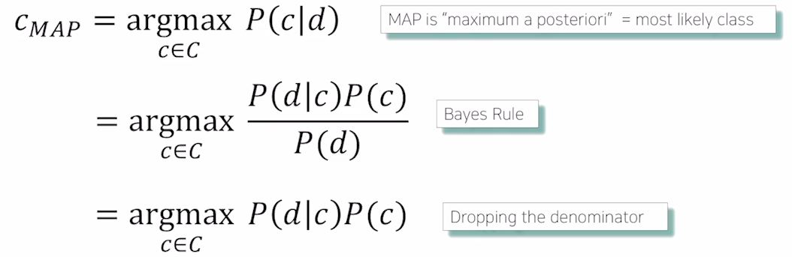

# (1강) Intro to NLP, Bag-of-Words

### Intro to Natural Language Processing(NLP)

- 자연어 처리 종류
	- NLU(Natural Language Understanding): 글을 이해하는
	- NLG(Natural Language Generating): 상황에 따라 적절히 생성하는

- Natural language processing
	- Low-level parsing: Tokenization, stemming.
	- Word and phrase level: Named entity recognition(NER), part-of-speech(POS) tagging,  noun-phrase chunking, dependency parsing, coreference resolution.
	- Sentence level: Sentiment analysis, machine traslation.
	- Multi-sentence and paragraph level: Entailment prediction, question answering, dialog systems, summarization. 

- Text mining
	- Extract useful information and insights from text and document data
	- Document clustering (e.g., topic modeling)
	- Highly related to computational social science

- Information retrieval
	- Highly related to computational social science

### Bag-of-Words
- Step 1. unique words가 포함된 vocabulary 만들기
	- Example sentences: "John really really loves this movie", "Jane really likes this song"
	- Vocabulary: {"John", "really", "loves", "this", "movie", "Jane", "likes", "song"}

- Step 2. Encoding unique words to one-hot vectors
	- Vocabulary: {"John", "really", "loves", "this", "movie", "Jane", "likes", "song"}
	- John: [1 0 0 0 0 0 0 0]
	- really: [0 1 0 0 0 0 0 0]
	- ...
	- song: [0 0 0 0 0 0 0 1]

- sentence/document를 one-hot vectors의 합으로 표현할 수 있다.
	- "John really really loves this movie": [1 2 1 1 1 0 0 0] (bag of words)

### NaiveBayes Classifier
 
- 한 단어가 없을 때, 아예 0으로 되기 때문에 다른 단어가 밀접한 관련이 있더라도 의미가 없어짐.
- 그에 따라, 다양한 regularization기법들이 추가된다.

# (2강) Word Embedding
### word embedding이란?
- 단어를 특정한 공간에서의 한 점으로 나타내는 것
- 비슷한 의미이면, short distance. ex) cat, kitty ...
- 다른 의미이면, far distance. ex) cat, hamburger ...

#### Word2Vec
- 같은 문장에서 나타난 인접한 단어들 간에 그 의미가 비슷할 것이라는 가정.
- sliding window 방식.
- Word2Vec improve performances in most areas of NLP
	- Word similarity
	- Machine translation
	- Part-of-speech (PoS) tagging
	- Named entity recognition (NER)
	- Sentiment analysis
	- Clustering
	- Semantic lexicon building