# (3강) Recurrent Neural Network and Language Modeling
### Basics of Recurrent Neural Networks (RNNs)
- Basic structure

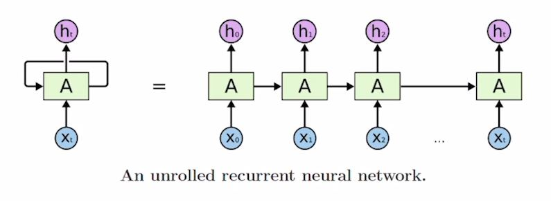

- Inputs and outputs of RNNs (rolled version)
	- We usually want to predict a vector at some time steps

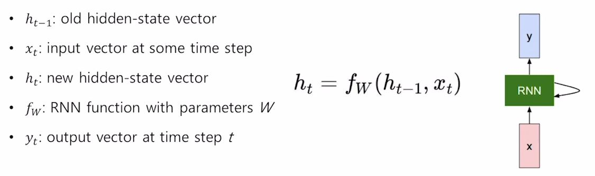

- W는 모든 time step에서 동일한 값을 가진다.
### How to calculate the hidden state of RNNs
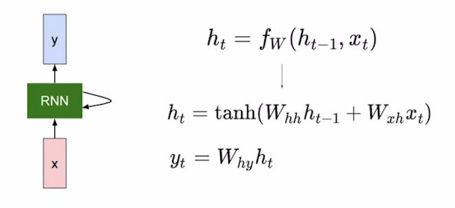

- hidden state의 차원 수는 hyper parameter이다.

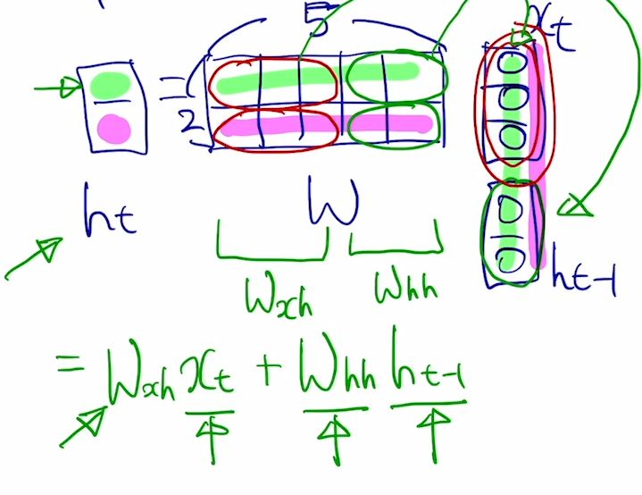

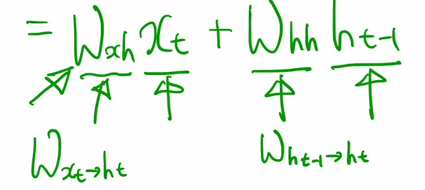

### Type of RNNs
#### One to one
- 예를들어, 사람의 키, 몸무게, 나이가 주어졌을 때, 저혈압인지 고혈압인지로 구분하는 것.
- sequence data나 time step으로 이루어 지지 않음.
#### One to many
- 입력이 하나의 time step으로 이루어지고, 출력은 여러 개의 time step으로 이루어짐.
- image captioning
- 예를 들어, 입력은 이미지이고, 출력은 이미지를 설명하는 문장.
- 즉, 각각의 입력 time step에서는 0으로 채워진 tensor를 준다.
#### many to one
- 입력 sequence를 주되, 마지막은 하나의 출력을 준다.
- Sentiment classification.(감정 분석)
- 예를 들어, input은 i love movie일 때, output은 positive인지 negative인지를 출력
#### many to many(입력을 한 번에 받고 출력)
- 입력과 출력이 모두 sequence 형태.
- Machine Translation
- 예를 들어, i go home이 주어지면, 한글로 나는 집에 간다로 출력.
- 주어진 입력을 한 번에 받은 후, 예측 단어를 한 번에 출력.
#### many to many(입력을 받으면서 출력)
- 입력을 읽고 나서 출력하는게 아닌, 입력을 받으면서 출력을 함.
- Video classification on frame level.

### Character-level Language Model
- Example of training sequence "hello"
	- many to many
	- Vocabulary: [h, e, l, o]
	- ex: h->[1, 0, 0, 0] ...
	- 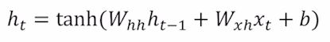
	- h0 = [0,0,0]

### Backpropagation through time (BPTT)
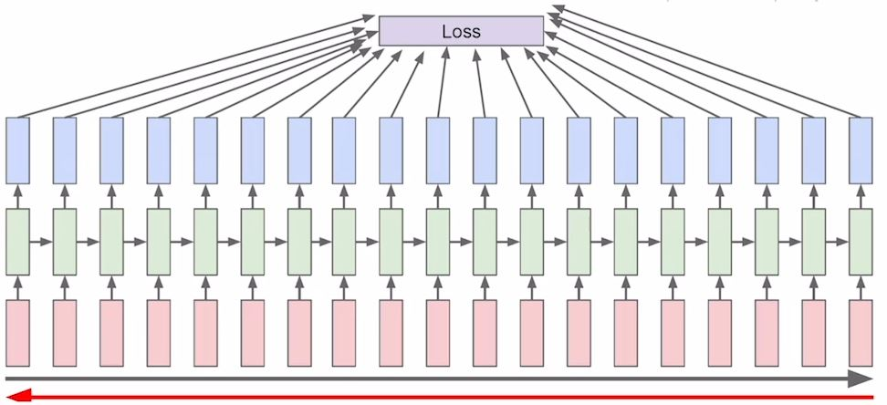

- GPU가 감당하지 못한 수 있기 때문에 중간 중간 잘라서 학습을 진행한다.

#### Searching for Interpretable Cells
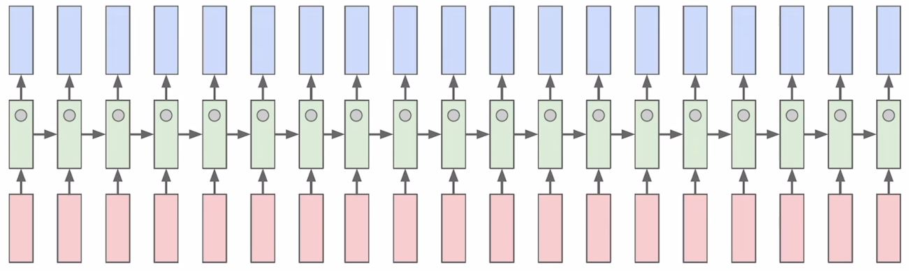

- 어떻게 학습을 하는가?
	- 필요한 정보는 ht이다.
	- hidden state의 차원 1개를 고정함으로써 분석을 할 수 있다.

#### Vanishing/Exploding Gradient Problem in RNN
- Whh에서 같은 수가 계속적으로 곱해지면서 등비수열 같은 형태를 취함으로  기하급수적으로 증가하거나 기하급수적으로 작아 질 수 있다.

# Long Short-Term Memory(LSTM) and Gated Recurrent Unit(GRU)
- original RNN보다 더 긴 문장을 더 효율적으로 학습할 수 있고, gradient vanishing/exploding  문제를 어느정도 해결 할 수 있다.
- 이전 original RNN: h_t = f_w(x_t, h_t-1)
- LSTM: {c_t, h_t} = LSTM(x_t, c_t-1, h_t-1)
- Cell state vector: hidden state vector 보다 좀 더 완전된 정보를 가지고 있다.

#### LSTM
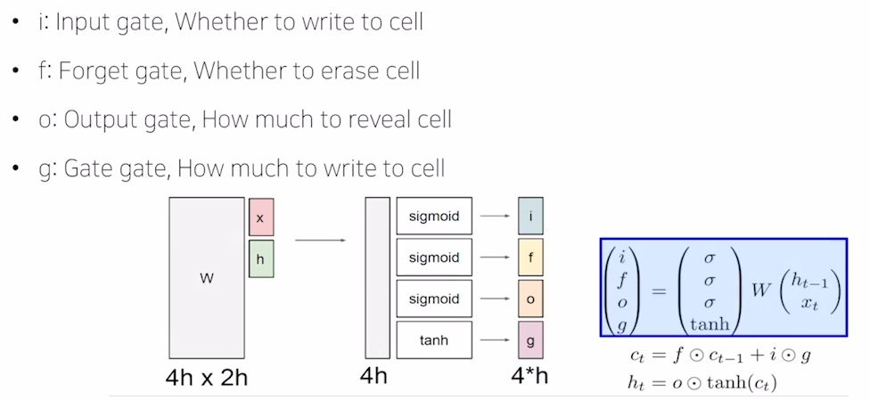

- c_t는 기억해야 할 모든 정보를 가지고 있다고 볼 수 있다.
- 하지만, h_t는 현재 x_t에서의 예측값에 직접적인 영향을 준다. c_t의 많은 정보에서 필요한  정보만 필터링 한다고 볼 수 있다.

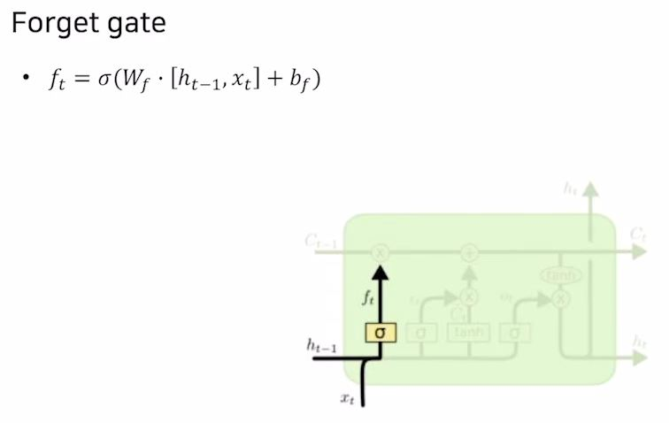

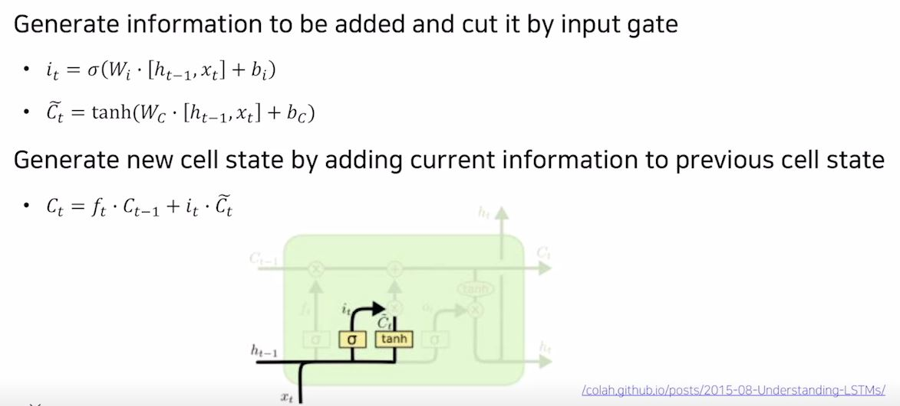

# Gated Recurrent Unit (GRU)
- GRU
	- LSTM 모델을 보다 경량화해서 적은 메모리 요구량과 빠른 계산시간이 가능하도록 만든 모델이다.
- What is GRU?

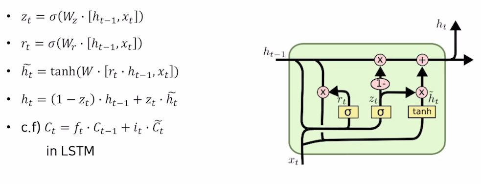

- h_t는 LSTM에서의 c_t와 비슷한 역할을 한다.

#### Backpropagation in LSTM? GRU?
- gradient flow에 방해를 받지 않는다.
	- gate들 때문에...

#### Summary on RNN/LSTM/GRU
- RNN: 다양한 길이의 sequence에 유연하다.
- Vanilla RNN: 구조가 간단하나, 많이 사용되지 않는다.
- LSTM or GRU: gradient에서 생기는 문제도 피하고 긴 sequence 데이터에 잘 동작한다.
