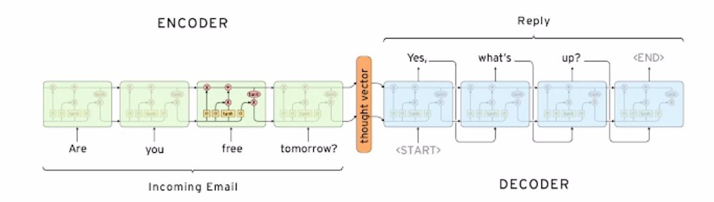
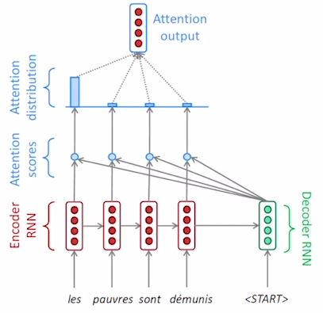
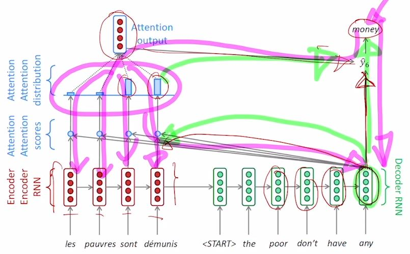
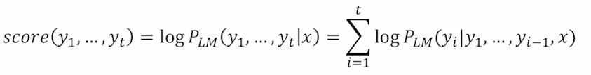
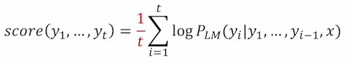
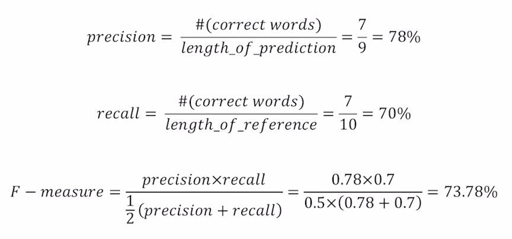
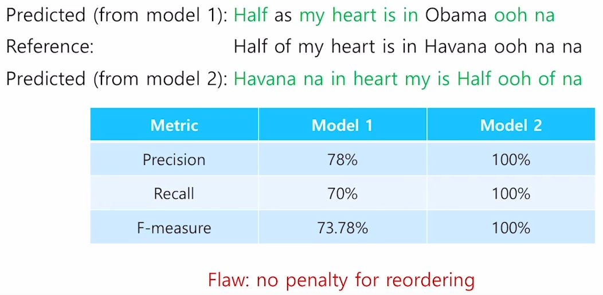

# (5강) Sequence to Sequence with Attention

### Seq2Seq with attention
#### Seq2Seq model
- many to many model: 입력을 모두 다 읽은 후, 출력을 한번에 생성

- encoder: LSTM model
- encoder의 마지막 단어까지 읽은 후, 마지막 time step 단어의 hidden state vector는  decoder RNN의 1번째 time step 입력의 hidden state vector 역할을 한다.
- word 별로 문장을 생성하는 단계에서는 1 번째 단어로 넣는 것은 < SoS > token이다.
- 끝나는 시점은 < EoS > token이다.
- hidden state vector의 dimension은 항상 정해져있다
- "i go home"이란 단어를 번역할 때, i라는 단어가 encoder의 마지막 부분에서 정보가 사라질 수 있다. 
- 따라서, 입력을 "home go i"라는 형식으로 뒤집어서 주어지는 방법도 있다.
- **Attention**을 사용한다면...
	- 입력의 각 time step마다 h_t가 생성이 되고,
	- decoder에서 단어를 생성할 때, 필요한 encoder에서의 h_t를 선별적으로 사용한다.
	- 
	- attention score = decoder(h_t)와 각각의 encoder(h_[:-1])의 내적
	- attention distribution(attention vector) = attention score의 softmax
	- attention output(context vector) = attention vector와 각각의 h_[:-1]의 가중평균
	- decoder의 output은 context vector와 decoder(h_t)의 concat.
	- decoder(h_t)의 역할
	    -  output layer의 입력
		-  encoder에서 어떤 hidden state vector를 중점적으로 봐야 할지 결정, attention의 입력
	- decoder backpropagation
		- 
	- teacher forcing
		- 학습 때는, decoder의 입력은 groud truth.(teacher forcing)
		- inference 때는, decoder의 입력은 이전 step에서의 output.
		- 학습은 빠르고, 용이한 장점
		- 테스트 때는 성능이 잘 안 좋을 수 있다는 단점
	- teacher forcing은 초반에 쓰고, 나중에는 안 쓰는 방식으로 학습하는 방식이 존재함.
	- Attention score 구하기
		- dot
		- generalized dot product
		- concatenate: multi layer neural network

# (6강) Beam Search and BLEU
#### Greedy decoding
- 각각의 time step에서 가장 높은 확률을 가지는 단어 하나 만을 택해서 decoding을 진행.
- < END > token을 선택 했을 때 종료
#### Exhaustive search
- 모든 확률들을 곱해서 계산
- O(V^t)의 복잡도를 가진다.
#### Beam search
- Greeddy와 Exhaustive search의 중간.
- k개의 가지수를 고려.
- log를 붙여 덧셈으로 변환
- 모든 경우를 따지는 것은 아니지만 더 효율적으로 계산 할 수 있다.
- beam size(k)는 각각 k개 만큼 확률값이 높은 것을 뽑고, 비교해서 큰 값 k개를 뽑고 다시 k개로 다음 값을 뽑아가며 채택한다.
- 어떠한 가정에서 < END >가 나오면 해당 생산물은 종료 후 저장하고, 나머지 생산물에서는 계속 진행한다.
- 먼저 정한 timestep T 만큼만 decoding 하거나, 임시 저장공간이 정해진 n 개만큼 정해진 경우 종료.

- Finishing up
	- 
	- 문제점: 각각의 hypotheses word와 sequence의 길이는 서로 다르기 때문에,  길이가 짧으면 joint probability가 높아지고, 길면 더 낮아진다.
	- 길이에 의해 normalize.
	- 

#### BLEU score
- Precision and Recall
- 
- precision: 위치에 상관없이 ground truth와 겹치는 단어 / 예측한 문장의 길이
	- 예측된 결과가 노출되었을 때, 실질적으로 느끼는 정확도.
- recall: 위치에 상관없이 ground truth와 겹치는 단어 / reference의 길이
	- 예측된 결과에서 얼마나 정답을 맞췄는지
- 문제점
	- 
	- 정확한 문법이 아님에도 불구하고, 100%의 결과가 나옴.

- BLEU(BiLingual Evaluation Understudy) score
	- 단어 개별적인 정확도가 아닌, N개의 연속된 단어로 봤을 때, 문법적으로 얼마나 맞췄는지도 확인하는 것.
	- precision만 고려.
	- brevity penalty
		- 만약 10단어의 단어를 예측할 때, 10단어 보다 짧은 길이(7단어)의 문장을 생성한경우 7/10

