# [Graph 1강] 그래프란 무엇이고 왜 중요할까?
### 1. 그래프란 무엇이고 왜 중요할까?
#### 그래프란 무엇일까?
- 그래프는 정점 집합과 간선 집합으로 이루어진 수학적 구조이다.
	-  하나의 간선은 두 개의 정점을 연결한다.
	-  모든 정점 쌍이 반드시 간선으로 직접 연결되는 것은 아니다.
	-  그래프는 네트워크(Network)로도 불린다.
	-  정점(Vertex)은 노드(Node)로 간선은 엣지(Edge) 혹은 링크(Link)로도 불린다.
#### 그래프가 왜 중요할까?
- 우리 주변에는 많은 복잡계(complex System)가 있다.
	 - 사회는 70억 인구로 구성된 복잡계이다.
	 - 통신 시스템은 전자 장치로 구성된 복잡계이다.
	 - 그 밖에도, 정보와 지식, 뇌, 신체  역시 복잡계로 생각할수 있다.
	 - 이런 복잡계가 가진 공통적인 특성은?
	 	- 구성 요소 간의 복잡한 상호작용이다.
	 - 이런 복잡계의 표현 방법은?
	 	- 그래프(Graph)!!!: 그래프는 복잡계를 효과적으로 표현하고 분석하기 위한 언어다.
	 	- 복잡계는 구성 요소들 간의 상호작용으로 이루어 진다.<br> 상호작용을 표현하기 위한 수단으로 그래프가 널리 사용된다.
	 	- 복잡계를 이해하고, 복잡계에 대한 정확한 예측을 하기 위해서는 <br> 복잡계 이면에 있는 그래프에 대한 이해가 반드시 필요하다.
	 	- 그래프를 공부함으로써 복잡계가 등장하는 수많은 분야에 활용할 수 있다.<br> 전산학, 물리학, 생물학, 화학, 사회과학 등이 그 예시이다.
	 	
### 2. 그래프 관련 인공지능 문제
#### 그래프 관련 인공지능 문제
- 정점 분류(Node Classification) 문제
	- 트위터에서 공유(Retweet)관계를 분석하여, 각 사용자의 정치적 성향을 알 수 있을까?
	- 단백질의 상호작용을 분석하여 단백질의 역할을 알아낼 수 있을까?
- 연결 예측(Link Prediction) 문제
	- 페이스북 소셜 네트워크는 어덯게 진화할까?
- 추천(Recommendation) 문제
	- 각자에게 필요한 물건은 무엇일까? 어떤 물건을 구매해야 만족도가 높을까?
- 군집 분석(Community Detection) 문제
	- 연결 관계로부터 사회적 무리(Social Circle)을 찾아낼 수 있을까?
- 랭킹(Ranking) 및 정보검색(Information Retrieval) 문제
	- 웹(Web)이라는 거대한 그래프로부터 어떻게 중요한 웹페이지를 찾아낼 수 있을까?
- 정보 전파(Information Cascading) 및 바이럴 마케팅(Viral Marketing) 문제
	- 정보는 네트워크를 통해 어떻게 전달될까? 어덯게 정보 전달을 최대화 할 수 있을까?
#### 배우는 것
- 정점 분류, 연결 예측, 추천, 군집 분석, 랭킹, 정보 검색, 정보 전파, 바이럴 마케팅 등
- 그래프 신경망(GNN) 등 최첨단 기술 일부 소개
### 3. 그래프 관련 필수 기초 개념
#### 그래프의 유형 및 분류
- 방향이 없는 그래프(Undirected Graph) vs 방향이 있는 그래프(Directed Graph)
- 간선에 방향이 없는 그래프
	- 협업 관계 그래프
	- 페이스북 친구 그래프
- 간선에 방향이 있는 그래프
	- 인용 그래프
	- 트위터 팔로우 그래프
- 가중치가 없는 그래프(Unweighted Graph) vs 가중치가 있는 그래프(Weighted Graph)
 - 간선에 가중치가 없는 그래프
 	- 웹 그래프
 	- 페이스북 친구 그래프
- 간선에 가중치가 있는 그래프
	- 전화 그래프
	- 유사도 그래프
- 동종 그래프(Unpartite Graph) vs 이종 그래프(Bipartite Graph)
- 동종 그래프는 단일 종류의 정점을 가진다.
	- 웹 그래프 페이스북 친구 그래프
- 이종 그래프는 두 종류의 정점을 가진다
  - 다른 종류의 점점사이에만 간선이 연결된다.
  - 전자 상서래 구매내역(사용자, 상품)
  - 영화 출연 그래프(배우, 영화)
#### 그래프 관련 필수 기초 개념
- 보통 정점들의 집합을 V, 간선들의 집합을 E, 그래프를 G = (V, E)로 적는다.
- 정점의 이웃(Neighbor)은 그 정점과 연결된 다른 정점을 의미한다.


- 방향성이 있는 그래프에서는 나가는 이웃과 들어오는 이웃을 구분한다.


### 4. (실습) 그래프의 표현 및 저장
#### 파이썬 라이브러리 NetworkX 소개
- NewtworkX
	- 그래프를 생성, 변경, 시각화 할 수 있다.
	- 그래프의 구조와 변화를 분석할 수 있다.
	- 자세한 정보
		- http://network.org/documentation/stable/index.html
	- Snap.py라는 파이썬 라이브러리도 많이 사용
		- http://snap.stanford.edu/snappy/

1. 실습에 필요한 라이브러리 불러오기
```python
# 실습에 필요한 library를 임포트
import networkx as nx					# NetworkX
import numpy as np						# 성형대수를 위한 라이브러리
import matplotlib.pyplot as plt			# 그림을 그리기 위한 라이브러리리
```
2. 그래프 초기화
``` python
pring("##### Graph Init #####")
G = nx.Graph()			# 방향성이 없는 그래프 초기화
DiGraph = nx.DiGraph()	# 방향성이 있는 그래프 초기화
```
> '##### Graph Init #####'

3. 정점을 추가하고, 정점의 수를 세고, 목록을 반환
``` python
print("##### Add Node to Graph #####")
print("# Add node 1")
G.add_node(1)													# 정점 1 추가
print("Num of nodes in G : " + str(G.number_of_nodes())) 		# 정점의 수 반환
print("Grapg : " + str(G.nodes) + "\n")							# 정점의 목록 반환
```
> '##### Add Node to Graph #####'<br>
> `# Add node 1'<br>
> Num of nodes in G : 1<br>
> Graph : [1]
4. 더 많은 정점 추가해 보기
``` python
print("# Add vertex 2 ~ 10") 					# 정점 2 ~ 10 추가
for i in range(1, 11):
	G.add_node(i)
print("Num of nodes in G : " + str(G.number_of_nodes()))
print("Graph : " + str(G.nodes) + "\n")
```
> '# Add vertex 2 ~ 10'<br>
> Num of nodes in G : 10<br>
> Graph : [1, 2, 3, 4, 5, 6, 7, 8, 9, 10]

5. 간선을 추가하고, 목록을 반환
``` python
print("##### Add Edge to Graph #####")
print("# Add edge (1, 2)")
G.add_edge(1, 2)							# 정점 1과 2 사이에 간선 추가
print("Graph : " + str(G.deges) + "\n")		# 간선의 목록을 반환
```
> '##### Add Edge to Graph #####'<br>
> '# Add edge (1, 2)'<br>
> Graph : [(1, 2)]
6. 더 많은 간선을 추가
```python
print(# Add edge (1, i) for i = 2 ~ 10")
for i in range (2, 11):
	G.add_dege(1, i)
print("Graph : " + str(G.edges) + " \n")
```
> '# Add edge (1, i) for i  = 2~ 10'<br>
> Graph : [(1,2), (1,3), (1,4), (1,5), (1,6), (1,7), (1,8), (1,9), (1,10)]

7. 만들어진 그래프 시각화
```python
# 그래프를 시각화
# 정점의 위치 결정
pos = nx.spring_layout(G)
# 정점의 색과 크기를 지정하여 출력
im = nx.draw_networkx_nodes(G, pos, node_color="red", node_size=100)
# 간선 출력
nx.draw_networkx_edges(G, pos)
# 각 정점이 라벨을 출력
nx.draw_networkx_labels(G, pos, font_size=10, font_color="black")
plt.show()
```
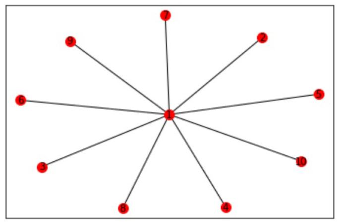

#### 그래프의 표현 및 저장
- 간선 리스트(Edge List): 그래프를 간선들의 리스트로 저장
	- 각 간선은 해당 간선이 연결하는 두 정점들의 순서쌍(Pair)으로 저장된다.
	- 방향성이 있는 경우에는 (출발점, 도착점) 순서로 저장된다.


- 인접 리스트(Adfacent list)
	- 방향성이 없는 경우
	- 각 정점의 이웃들을 리스트로 저장

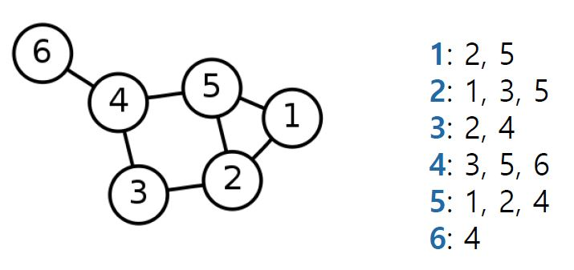<br>
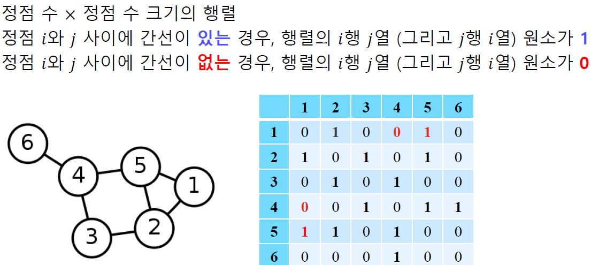
- 인접 리스트(Adjacent list)
	- 방향성이 있는 경우
	- 각 정점의 나가는 이웃들과 들어오는 이웃들을 각각 리스트로 저장

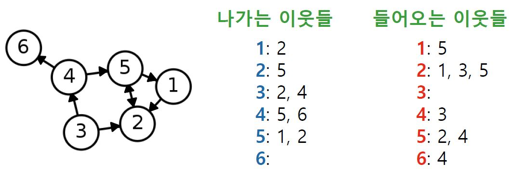<br>
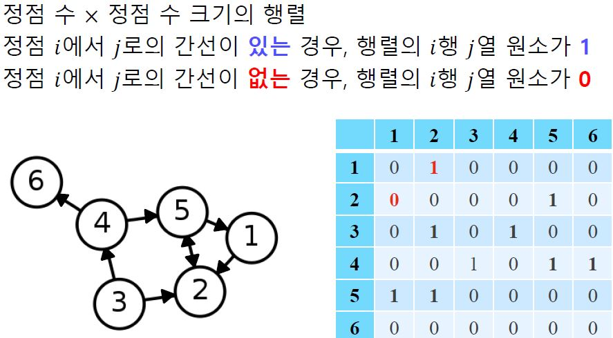

```python
# 그래프를 인접 리스트로 저장
nx.to_dict_of_lists(G)

# 그래프를 간선 리스트로 저장
nx.to_edgelist(G)

# 그래프를 인접 행렬 (일반 행렬)로 저장
nx.to_numpy_array(G)

# 그래프를 인접 행렬(희소 행렬)로 저장
nx.to_scipy_sparse_matrix(G)
```
- 일반 행렬은 전체 원소를 저장하므로 정점 수의 제곱에 비례하는 저장 공간을 사용
- 희소 행렬은 0이 아닌 원소만을 저장하므로 간선의 수에 비례하는 저장 공간을 사용

# [Graph 2강] 실제 그래프는 어떻게 생겼을까?
### 1. 실제 그래프 vs 랜덤 그래프
#### 실제 그래프(Real Graph)
- 다양한 복잡계로부터 얻어진 그래프를 의미
	- 소셜 네트워크, 전자상거래 구매 내역, 인터넷, 웹, 뇌, 단백질 상호작용, 지식 그래프 등
	- 본 설명에서는 MSN 메신저 그래프를 실제 그래프의 예시로 사용
		- MSN 메신저 그래프
		- 1억 8천만 정점(사용자)
		- 13억 간선(메시지를 주고받은 관계)
#### 랜덤 그래프(Random Graph)
- 확률적 과정을 통해 생성한 그래프를 의미
	- 본 설명에서는 에르되스와 레니가 제안한 랜덤 그래프 모델을 사용
	- 에르되스-레니 랜덤 그래프
		- 임의의 두 정점 사이에 간선이 존재하는지 여부는 동일한 확률 분포에 의해 결정된다.
		- 에르되스-레니 랜덤그래프 G(n, p)는
			- **n**개의 정점을 가진다.
			- 임의의 두 개의 정점 사이에 간선이 존재할 확률은 **p**이다.
			- 정점 간의 연결은 서록 **독립적(Independent)** 이다.<br>
			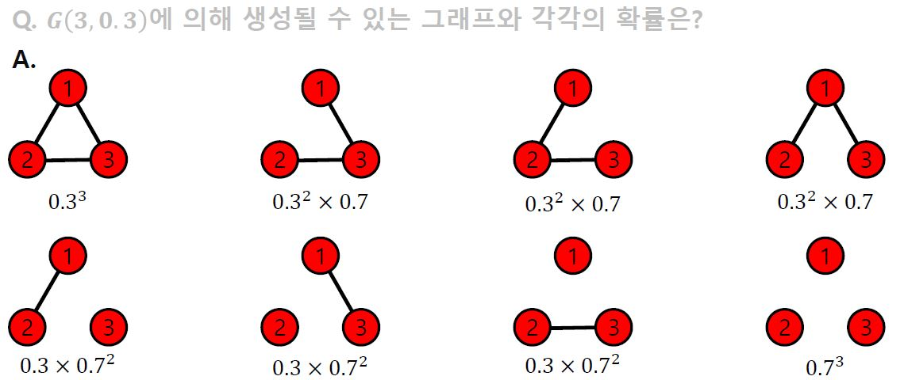

### 2. 작은 세상 효과
#### 필수 개념: 경로, 거리 및 지름
- 정점 u와 v의 사이의 경로(Path)는 아래 조건을 만족하는 정점들의 순열(Sequence)이다.
	- u에서 시작해서 v에서 끝나야 한다.
	- 순열에서 연속된 정점은 간선으로 연결되어 있어야 한다.<br>
	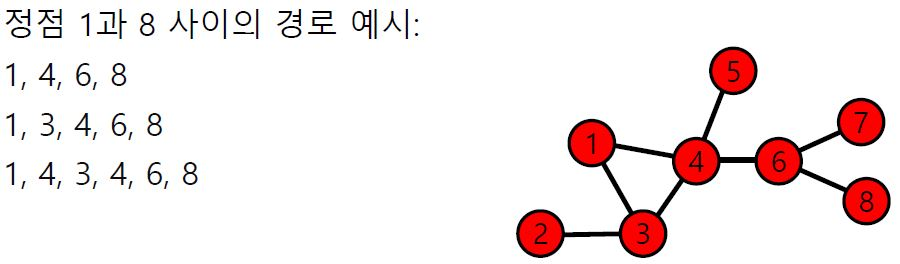<br>
    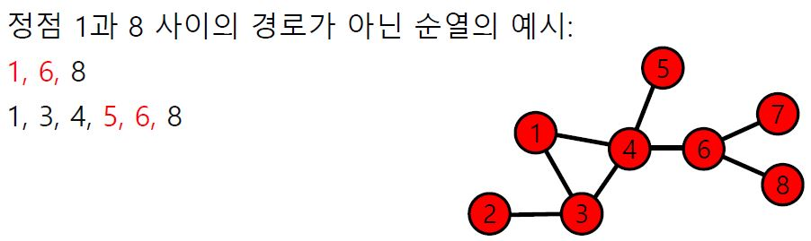
    - 경로의 길이는 해당 경로 상에 놓이는 간선의 수로 정의된다.
    	- ex) 경로 1, 4, 6, 8의 길이는 3이다
- 정점 u와 v 사이의 거리(Distance)는 v와 v 사이의 치단 경로의 길이이다.
	- ex) 정점 1과 8 사이의 최단 경로(Shortest Path)는 1, 4, 6, 8 이다.<br>
	해당 경로의 길이는 3이다.<br>
	따라서, 정점 1과 8 사이의 거리는 3이다.
- 그래프의 지름(Diameter)은 정점 간 거리의 최댓값이다.
	- ex) 예시 그래프에서의 지름은 4이다.<br> 이는 정점 2와 8 사이의 최단 경로의 거이롸 같다.

#### 작은 세상 효과
- 임의의 두 사람을 골랐을 때, 몇 단계의 지인을 거쳐 연결되어 있을까?
- 여섯 단계 분리(Six Degrees of Separatation)실험
	- 사회학자 스탠리 밀그램(Stanley Milgram)에 의해 1960년대에 수행된 실험.
	- 오마하 (네브라스카 주)와 위치타 (켄사스 주)에서 500명의 사람을 뽑는다.
	- 그들에게 보스턴에 있는 한 사람에게 편지를 전달하게끔 하였다.
	- 단, 지인을 통해서만 전달하게끔 하였다.<br>
	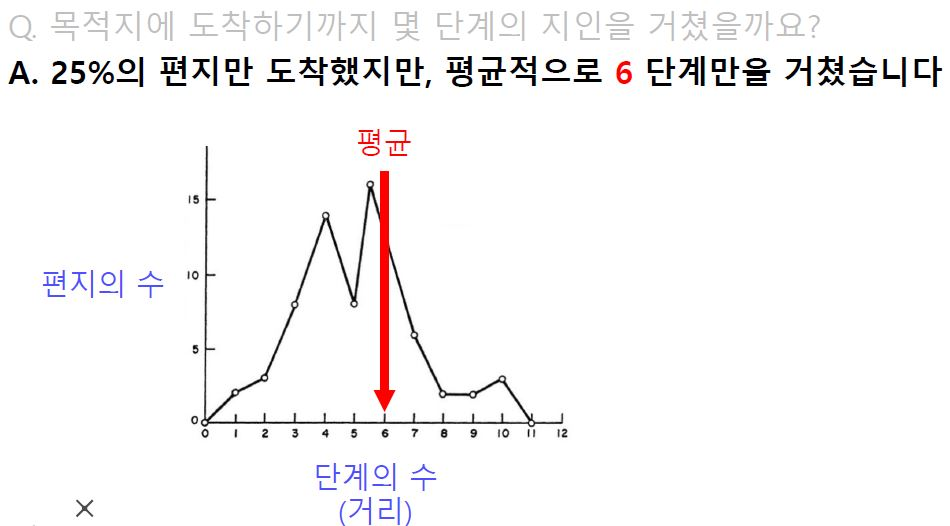<br>
    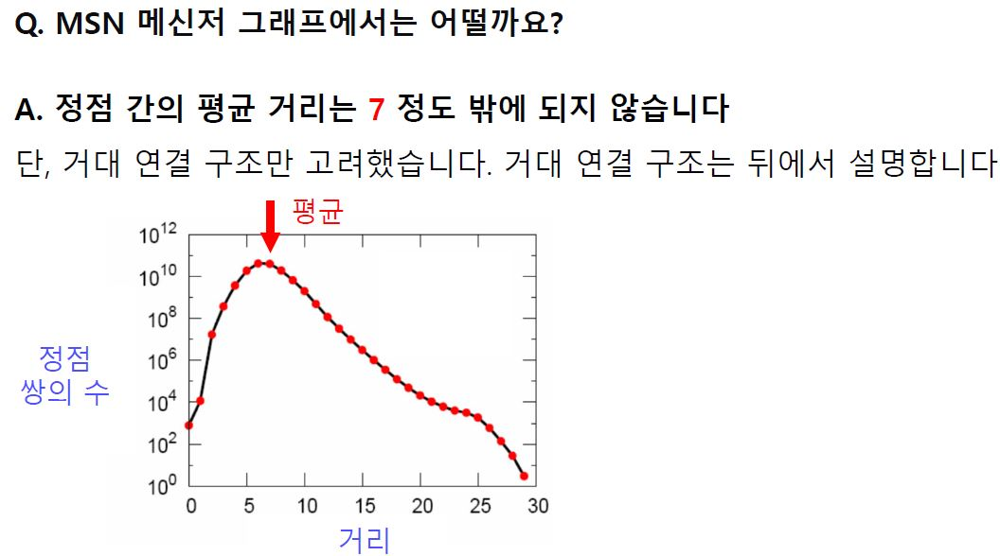<br>
- 이러한 현상을 작은 세상 효과(Small-world Effect)라고 부른다.
- 작은 세상 효과는 높은 확률로 랜덤 그래프에도 존재한다.
	- ex) 모든 사람이 100명의 지인이 있다고 가정해보면<br>
다섯 단계를 거지면 최대 100억(= 100^5)명의 사람과 연결 될 수 있다.
	- 단, 실제로는 지인의 중복 때문에 100억 명보다는 적은 사람일 것이다.<br>
하지만 여전히 많은 사람과 연결될 가능성이 높다.
- 하지만 모든 그래프에서 작은 세상 효과가 존재하는 것은 아니다.
	- 체인(Chain), 사이클(Cycle), 격자(Grid) 그래프에서는 작은 세상 효과가 존재하지 않는다.<br>
    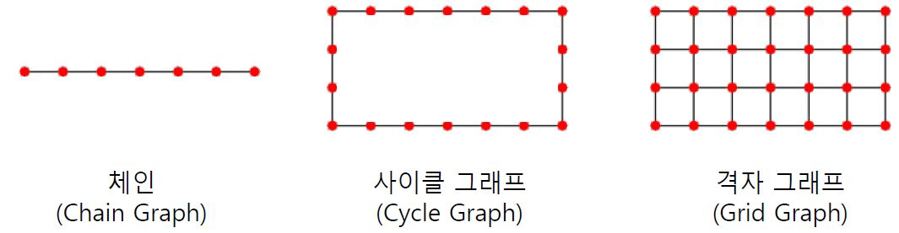<br>

### 3. 연결성의 두터운-꼬리 분포
#### 필수 개념: 연결성
- 정점의 연결성(Degree)은 그 정점과 연결된 간선의 수를 의미합니다.

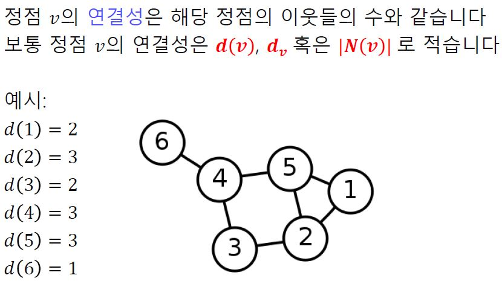<br>

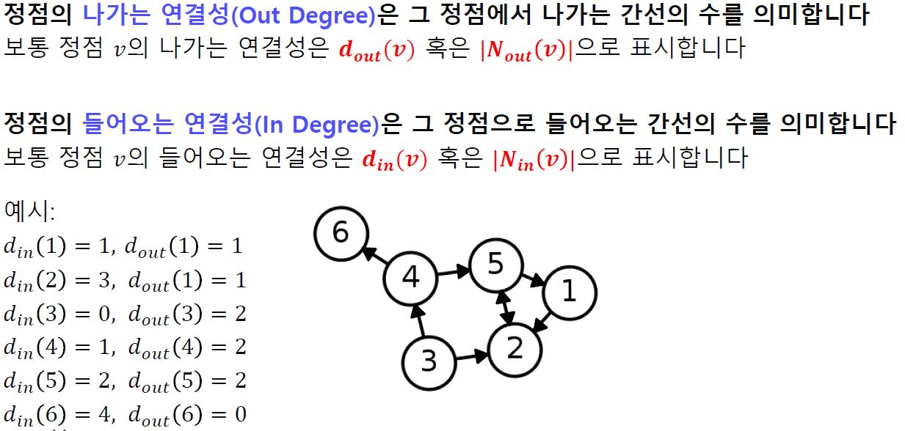<br>
#### 연결성의 두터운 꼬리 분포
- 실제 그래프의 연결성 분포는 두터운 꼬리(Heavy Tail)를 갖는다.
	- 즉, 연결성이 매우 높은 허브(Hub) 정점이 존재함을 의미한다.
- 랜덤 그래프의 연결성 분포는 높은 확률로 정규 분포와 유사하다.
	- 이 경우, 연결성이 매우 높은 허브(Hub) 정점이 존재할 가능성은 0에 가깝다.
	- 정규 분포와 유사한 예시로는 키의 분포가 있다.
	- 키가 10미터를 넘는 극단적인 예외는 존재하지 않는다.
- 예시

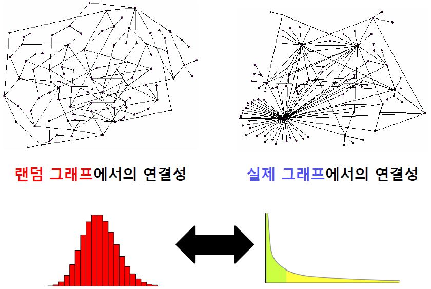
### 4. 거대 연결 요소
#### 필수 개념: 연결 요소
- 연결 요소(Connected Component)는 다음 조건들을 만족하는 정점들의 집합을 의미
	- 연결 요소에 속하는 정점들은 경로로 연결될 수 있다.
	- 첫 번째 조건을 만족하면서 정점을 추가할 수 없다.
- 예시

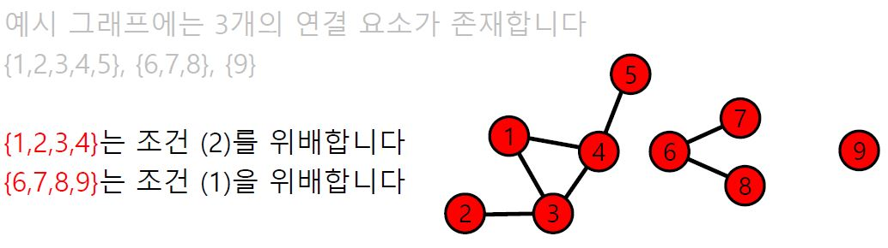

#### 거대 연결 요소
- 실제 그래프에는 거대 연결 요소(Giant connected component)가 존재한다.<br> 거대 연결 요소는 대다수의 정점을 포함한다.
- MSN 메신저 그래프에는 99.9%의 정점이 하나의 거대 연결 요소에 포함된다.

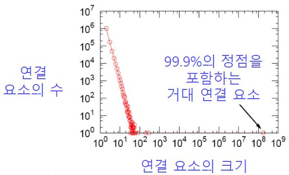

- 랜덤 그래프에도 높은 확률로 거대 연결 요소(Giant Connected Component)가 존재한다.
- 단, 정점들의 평균 연결성이 1보다 충분히 커야한다.<br> 자세한 이유는 Random Graph Theory를 참고

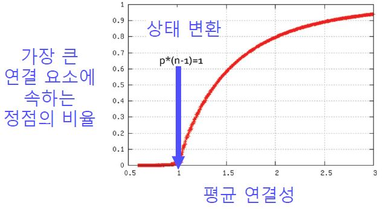
### 5. 군집 구조
#### 필수 개념: 군집 구조 및 군집 계수
- 군집(Community)이란 다음 조건들을 만족하는 정점들의 집합이다.
	- 집합에 속하는 정점 사이에는 많은 간선이 존재한다.
	- 집합에 속하는 정점과 그렇지 않은 정점 사이에는 적은 수의 간선이 존재한다.
	
#### 필수 개념: 지역적군집 계수(Local Clustering Coefficient)는<br> 한 정점에서 군집의 형성 정도를 측정
- 정점 i의 지역적 군집 계수는 정점 i의 이웃 쌍 중 간선으로 직접 연결된 것의 비율을 의미한다.
- 정점 i의 지역적 군집 계수를 c_i로 표현한다.
- 예시
	- 이웃쌍: (2,3), (2,4), (2,5), (3,4), (3,5), (4,5)
	- 이웃 쌍이 간선으로 직접 연결: (2,3), (2,4), (3,5)

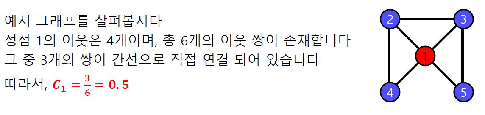

- 참고로 연결성이 0인 정점에서는 지역적 군집 계수가 정의되지 않는다.
- 지역적 군집 계수가 군집이랑 어떻게 연결되는 것인가???
	- 정점 i의 지역적 군집 계수가 매우 높다고 해보자.
	- 즉, 정점 i의 이웃들도 높은 확률로 서로 간선으로 직접 연결되어 있다.
	- 정점 i와 그 이웃들은 높은 확률로 군집을 형성한다.
#### 필수 개념: 전역 군집 계수(Global Clustering Coefficient)는<br> 전체 그래프에서 군집의 형성 정도를 측정
- 그래프 G의 전역 군집 계수는 각 정점에서의 지역적 군집 계수의 평균이다.<br> 단, 지역적 군집 계수가 정의되지 않는 정점은 제외.

#### 높은 군집 계수
- 실제 그래프에서는 군집 계수가 높습니다. 즉 많은 군집이 존재한다.
- 동질성(Homophily): 서로 유사한 정점끼리 간선으로 연결될 가능성이 높다.<br>같은 동네에 사는 같은 나이의 아이들이 친구가 되는 경우가 그 예시이다.
- 전이성(Transitivity): 공통 이웃이 있는 경우, 공통 이웃이 매개 역할을 해줄 수 있다.<br> 친구를 서로에게 소개해주는 경우가 그 예시이다.
- 반면 랜덤 그래프에서는 지역적 혹은 전역 군집 계수가 높지 않다.
### 6. 실습: 군집 계수 및 지름 분석
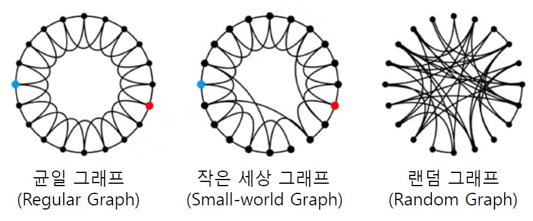

- 작은 세상 그래프는 균일 그래프의 일부 간선을 임의로 선택한 간선으로 대체한 그래프이다.
1. 파일에 저장된 균일 그래프를 읽어온다.
```python
regular_graph = nx.Graph()
data = osp.abspath(osp.join(os.getcwd(), 'drive/MyDrive/data/simple/regular.txt')) # 간선 리스트 형태, 균일 그래프
f = open(data)
for line in f:
	v1, v2 = map(int, line.split())
    regular_graph.add_edge(v1, v2)
```
2. 파일에 저장된 작은 세상 그래프와 랜덤 그래프도 읽어서 불러온다.
```python
small_world_graph = nx.Graph()
random_graph = nx.Graph()

data = osp.abspath(osp.join(os.getcwd(), 'drive/MyDrive/data/simple/small_world.txt'))
f = open(data)
for line in f:
	v1, v2 = map(int, line.split())
    small_world_graph.add_edge(v1, v2)
    
data = osp.abspath(osp.join(os.getcwd(), 'drive/MyDrive/data/simple/random.txt'))
f = open(data)
for line in f:
	v1, v2 = map(int, line.split())
    random_graph.add_edge(v1, v2)
```
3. 주어진 그래프의 전역 군집 계수를 계산하는 함수를 정의
```python
def getGraphAverageClusteringCoefficient(Graph):
	ccs = []
    for v in Graph.nodes:
    	num_connected_pairs = 0
        for neighbor1 in Graph.neighbors(v):
        	for neighbor2 in Graph.neighbors(v):
            	if neighbor1 <= neighbor2:
                	continue
                if Graph.has_edge(neighbor1, neighbor2)
                	num_connected_pairs = num_connected_pairs + 1
		cc = num_connected_pairs / (Graph.degree(v) * (Graph.degree(v) -1) / 2)
        ccs.append(cc)
    return sum(ccs) / len(ccs)
```
4. 지름 계산
- 주어진 그래프의 지름을 계산하는 함수를 정의.
```python
def getGraphDiameter(Graph):
	diameter = 0
    for v in Graph.nodes:
    	length = nx.single_source_shortest_path_length(Graph, v)
        max_length = max(length.values())
        if max_length > diameter:
        	diameter = max_length
	return diameter
```
5. 비교 분석
- 정의한 함수를 이용하여, 세 가지의 그래프를 비교.
```python
print("1. Graph Diameter")
print("regular graph : " + str(getGraphDiameter(regular_graph)))
print("small world graph : " + str(getGraphDiameter(small_world_graph)))
print("random graph : " + str(getGraphDiameter(random_graph)) + "\n")

print("2. Average Clustering Coefficient")
print("regular graph : " + str(getGraphAverageClusteringCoefficient(regular_graph)))
print("small world graph : " + str(getGraphAverageClusteringCoefficient(small_world_graph)))
print("random graph : " + str(getGraphAverageClusteringCoefficient(random_graph)) + "\n")
```
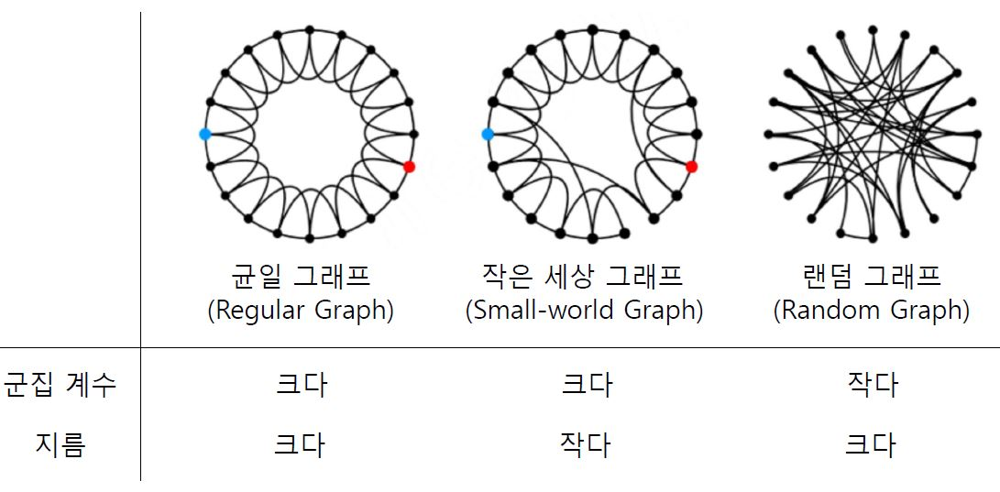


