# [Graph 3강] 검색 엔진에서는 그래프를 어떻게 활용할까?
### 페이지랭크의 정의
#### 페이지랭크의 정의: 투표 관점
- 페이지랭크의 핵심 아이디어는 투표이다.
- 즉, 투표를 통해 사용자 키워드와 관련성이 높고 신뢰할 수 있는 웹페이지를 찾는다.
	- 투표의 주체는 바로 웹페이지이다.
	- 웹페이지는 하이퍼링크를 통해 투표한다.
	- 사용자 키워드를 포함한 웹페이지들을 고려하고, 웹페이지 u가 v로의 하이퍼링크를 포함한다면?
		- u의 작성자가 판단하기에 v가 관련성이 높고 신뢰할 수 있다는 것을 의미한다.
		- 즉, u가 v에게 투표했다고 생각할 수 있다. 들어오는 간선이 많을 수록 신뢰할 수 있다는 뜻
	- 간선의 수를 세는 것만으로 충분할까?
		- NO, 악용될 수지가 있다.
	- 그렇기 때문에, 페이지 랭크에서는 **가중 투표**를 한다.
		- 즉, 관련성이 높고 신뢰할 수 있는 웹사이트의 투표를 더 중요하게 간주한다.<br> 반면, 그렇지 않은 웹사이트들의 투표는 덜 중요하게 간주한다.<br> 악용이 없는 경우에도 사용할 수 있는 합리적인 투표방법이다.
		- 관련성과 신뢰성은 투표를 통해 측정하려는 것이었는데, 이 것은 출력을 입력으로 사용하자는 것이다.
			- 재귀(Recursion), 즉 연립방정식 풀이를 통해 가능하다.
		- 측정하려는 웹페이지의 관련성 및 신뢰도를 **페이지 랭크 점수**라고 부른다.
			- 각 웹페이지는 각각의 나가는 이웃에게<br>
(자신의 페이지 랭크 점수 / 나가는 이웃의 수 ) 만큼의 가중치로 투표를 한다.
		- 각 웹페이지의 페이지랭크 점수는 받은 투표의 가중치 합으로 정의된다.
		- 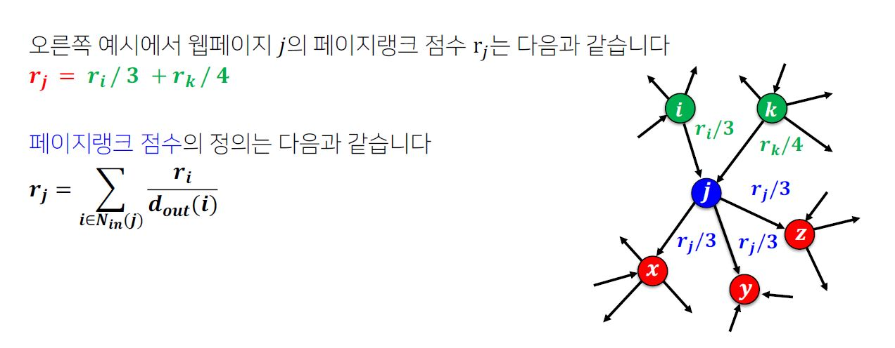<br>

#### 페이지랭크의 정의: 임의 보행 관점
- 페이지랭크는 임의 보행(Random Walk)의 관점에서도 정의할 수 있다.
	- 임의 보행을 통해 웹을 서핑하는 웹서퍼를 가정해보자.
	- 즉, 웹서퍼는 현재 웹페이지에 있는 하이퍼링크 중 하나를<br> 균일한 확률로 클릭하는 방식으로 웹을 서핑한다.
	- 웹서퍼가 t번째 방문한 웹페이지가 웹페이지 i일 확률을 p_i(t)라고 하자.<br> 그러면 p(t)는 길이가 웹페이지 수와 같은 확률분포 벡터가 된다.
	- 웹서퍼가 이 과정을 무한히 반복하고 나면, 즉 t가 무한히 커지면,<br> 확률 분포sms p(t)는 수렴하게 된다.
	- 다시말해 p(t)=p(t+1)=p이 성립하게 된다.<br> 수렴한 확률 분포 p는 정상 분포(Stationary Distribution)이라고 부른다.<br> 이러한 수식이 된다.
	- 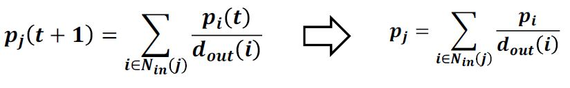

- 투표 관점에서 정의한 페이지 랭크 점수는 임의 보행 관점에서의 정상 분포와 동일하다.

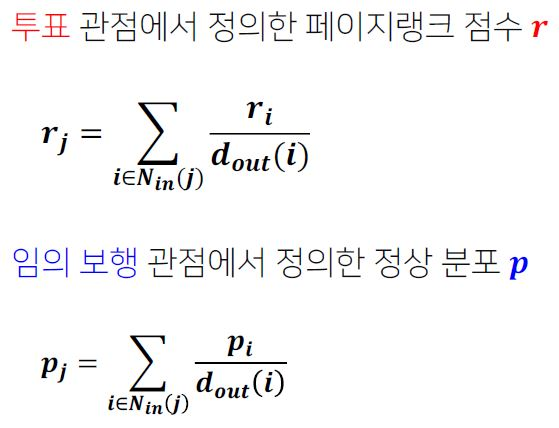

### 페이지랭크의 계산
#### 페이지랭크의 계산: 반복곱
- 페이지랭크 점수의 계산에는 반복곱(Power Iteration)을 사용한다.
- 반복곱은 3 단계로 구성된다.
	- 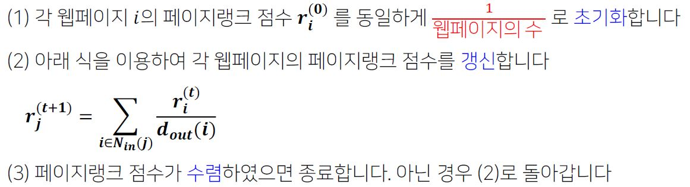
- 예시
	- 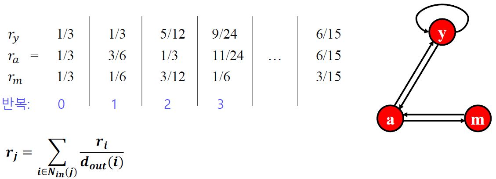
#### 문제점
- 앞서 예시에서는 반복곱이 잘 동작하는 것을 알았다. 하지만
- Q1. 반복곱이 항상 수렴하는 것을 보장할 수 있는가?
	- 항상 수렴하는 것은 아니다.
	- 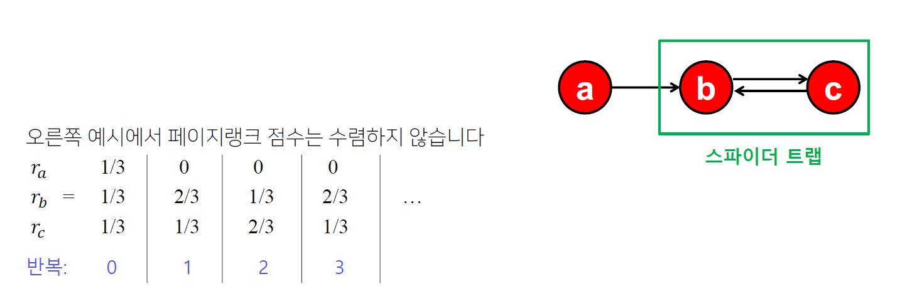
	- 들어오는 간선은 있지만 나가는 간선은 없는 정점 집합인 스파이더 트랙(Spider Trap)에 의한 문제
- Q2. 반복곱이 "합리적인"점수로 수렴하는 것을 보장할 수 있는가?
	- 항상 보장하는 것은 아니다.
	- 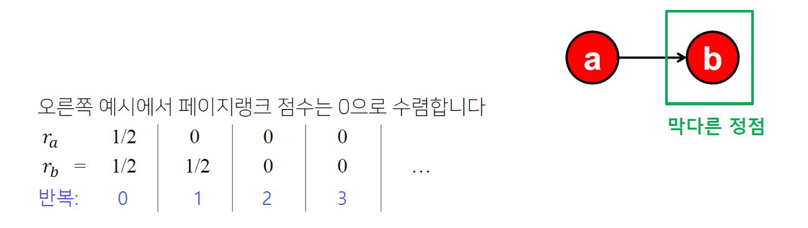
	- 들어오는 간선은 있지만 나가는 간선은 없는 막다른 정점(Dead End)에 의한 문제
#### 해결책
- 문제 해결을 위해 순간이동((Teleport)을 도입한다.

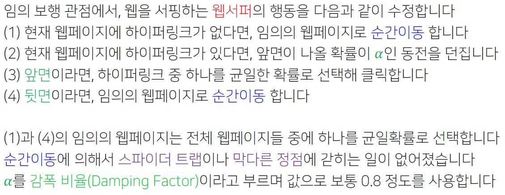
- 순간이동 도입은 페이지랭크 점수 계산을 다음과 같이 바꾼다.

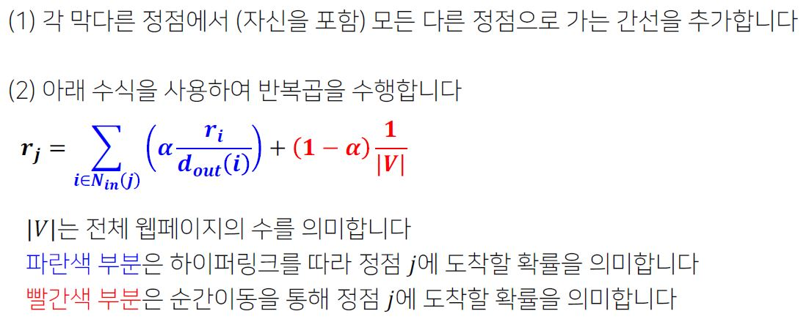

### 실습
1. 라이브러리 읽어온다.
```python
import networkx as nx
import numpy as np
import matplotlib.pyplot as plt
import os
import os.path as osp
import sys
```
2.  파일에 저장된 데이터를 읽어온다.
```python
# 실습에 필요한 데이터셋을 읽어서 저장
print("##### Read Graphs #####")
path_v2n = osp.abspath(osp.join(os.getcwd(), 'drive/MyDrive/data/wiki/vetex2name.txt'))
path_edges = osp.abspath(osp.join(os.getcwd(), 'drive/MyDrive/data/wiki/edges.txt'))
path_keyword = osp.abspath(osp.join(os.getcwd(), 'drive/MyDrive/data/wiki/keyword.txt'))
path_k2v = osp.abspath(osp.join(os.getcwd(), 'drive/MyDrive/data/wiki/k2v.txt'))

G = nx.DiGraph()
f = open(path_edges)
for line in f:
	v1, v2 = map(int, line.split())
    G.add_edge(v1, v2)
```
```python
print("##### Read keyword #####")
keywords = {}
f = open(path_keyword)
for line in f:
	num, k = line.split(" ||| " )
    k = k.rstrip()
    num = int(num)
    keywords[k] = num
```
```python
print("##### Read keyword to vertex #####")
k2v = {}
f = open(path_k2v)
for line in f:
	k, v = line.split(" ||| ")
    k = int(k)
    v = v.rstrip()
    v = v.split()
    v = list(map(int, v))
    k2v[k] = v
```
``` python
print("##### Read vertex to name #####")
v2n = {}
f = open(path_v2n)
for line in f:
	v, n = line.split(" ||| ")
    v - int(v)
    n = n.rstrip()
    v2n[v] = n
```
3. 검색 1단계: 부분 그래프 구성
- 주어진 검색어가 포함된 문서들로 구성된 부분그래프(Subgraph)를 구성한다.
```python
# 검색어로 사용할키워드를 입력으로 받아서, 그 키워드를 포함한
# 문서들로 이루어진 부분 그래프(subgraph) H를 추출한다.

print("##### Mapping Subgraphs for each keyword #####")
search = "걸스데이"
print("Search : %s" % search)
key = keywords[search]
sub_vertices = k2v[key]

H = G.subgraph(sub_vertices)

print(len(H.nodes))
```
4. 검색 2단계: 페이지랭크 점수 측정
- 구성된 부분 그래프(Subgraph)에서 페이지랭크를 수행하여 문서 별 점수를 계산합니다.
- 문서들을 페이지랭크 점수 역순으로 정렬하여 출력합니다.
```python
# subgraph H에 대해서 pagerank 알고리즘을 시행합니다.
print("##### PageRank Algorithm #####")
pr = nx.pagerank(H, alpha = 0.9)
res = [key for (key, value) in sorted(pr.items(), key = lambda x:x[1], reverse=True)]
for item in res:
	print(v2n[item])
```

# [Graph 4강] 그래프를 바이럴 마케팅에 어떻게 활용할까?
#### 그래프를 통한 정보의 전파
- 온라인 소셜 네트워크를 통해 다양한 정보가 전파된다.
#### 그래프를 통한 행동의 전파
- 온라인 소셜 네트워크를 통해 다양한 행동도 전파된다.
	- 아이스 버킷 챌린지, 펭귄 문제 등이 대표적 예시
#### 그래프를 통한 고장의 전파
- 컴퓨터 네트워크에서의 일부 장비의 고장이 전파되어 전체 네트워크를 마비시킬 수 있다.
	- 일부 장비의 고장이, 다른 장비의 과부화로 이어지기 때문이다.
#### 그래프를 통한 질병의 전파
- 사회라는 거대한 소셜 네트워크를 통한 질병의 전파도 빠뜨릴 수 없다.
- 전파 과정은 다양할 뿐 아니라 매우 복잡하다.<br>이를 체계적으로 이해하고 대처하기 위해서는 수학적 모형화가 필요하다.
- 본 설명에서는 전파 과정을 위한 수 많은 모형 중 두 가지를 소개한다.
### 의사결정 기반의 전파 모형
#### 언제 의사결정 기반의 전파 모형을 사용할까?
- 주변 사람들의 의사결정을 고려하여 각자 의사결정을 내리는 경우에 의사결정 기반의 전파 모형을 사용.
- 본 설명에서는 가장 간단한 형태의 의사결정 기반의 전파 모형인<br> 선형 임계치 모형(Linear Threshold Model)을 소개.
#### 선형 임계치 모형
- 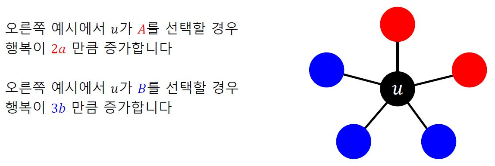
- 만약, 2a > 3b라면 u는 A를 택할 것이다.
- 반면, 2a < 3b라면 u는 B를 택할 것이다.
- 편의상 2a=3b 라면 u는 B를 택한다고한다.
- 일반화
	- 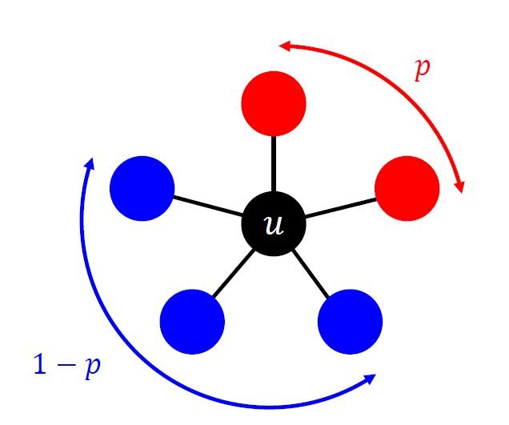
	- p 비율의 이웃이 A를 선택했다고 해본다.
	- 즉, 1-p 비율의 이웃이 B를 선택했다.
	- 언제 A를 선택해야 할까?
		- ap > b(1-p) 일 때이다.
	- 정리하면 p > b / (a+b)일 때이다. 이를 편의상 임계치 q라고 한다.
- 이 모형을 선형 임계치 모형이라한다.
- 각 정점은 이웃 중 A를 선택한 비율이 임계치 q를 넘었을 때만 A를 선택
- 이 모형은 전부 B를 사용하는 상황을 가정한다.<br> 그리고 처음 A를 사용하는 얼리어답터들을 가정한다.<br>시드 집합(Seed Set)이라고 불리는 얼리 어답터들은 항상 A를 고수한다고 가정한다.

### 확률적 전파 모형
#### 언제 확률적 전파 모형을 사용할까?
- 코로나의 전파 과정을 수학적으로 추상화
- 의사결정 기반 모형은 적합하지 않는다. 누구도 코로나에 걸리기로 '의사결정'을 내리는 사람은 없다.
- 코로나의 전파는 확률적 과정이기 때문에 확률적 전파 모형을 고려해야한다.
- 본 설명에서는 가장 간단한 형태의<br>독립 전파 모형(Independent Cascade Model)을 소개.
#### 독립적 전파 모형
- 방향성이 있고 가중치가 있는 그래프를 가정
- 각 간선 (u, v)의 가중치 p_uv는 u가 감염되었을 때(그리고 v가 감염되지 않았을 때)<br> u가 v를 감염시킬 확률에 해당한다.
- 즉, 각 정점 u가 감염될 때마다, 각 이웃 v는 p_uv확률로 전염된다.

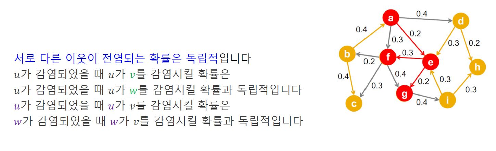

- 모형은 최초 감염자들로부터 시작한다.
- 이전 모형과 마찬가지로 첫 감염자들을 시드 집합(Seed Set)이라고 부른다.
- 더 이상 새로운 감염자가 없으면 종료
- 감염자는 계속 감염 상태로 남아있는 것을 가정
- 감염자의 회복을 가정하는 SIS, SIR 등의 다른 전파 모형도 있다.

### 바이럴 마케팅과 전파 최대화 문제
#### 바이럴 마케팅이란?
- 바이럴 마케팅은 소비자들로 하여금 상품에 대한 긍정적인 입소문을 내게하는 기법
- 효과적이기 위해서는 소문의 시작점이 중요!!!
	- 시작점이 어디인지에 따라서 입소문이 전파되는 범위가 영향을 받기 때문
	- 소셜 인플루언서(Social Influencer)들이 높은 광고비를 받는 이유
#### 시드 집합의 중요성
- 대표적인 소셜 인플루언서에는 영국 윌리엄 왕자의 부인 케이트 미들턴이 있다.
- '미들턴 효과'라는 말이 생겨날 정도.
- 앞서 소개한 전파 모형들에서도 시드 집합이 전파 크기에 많은 영향을 미친다.
#### 전파 최대화 문제
- 시드 집합을 우리가 선택할 수 있다면, 누구를 선택해야하는가?
	- 그래프, 전파 모형, 그리고 시드 집합의 크기가 주어졌을 때
	- 전파를 최대화하는 시드 집합을 찾는 문제를
	- 전파 최대화(Influence Maximization) 문제라고 부른다.
	- 전파 모형: 앞서 배운 선형 임계치 모형, 독립 전파 모형을 포함 다양한 모형
- 전파 최대화 문제는 방대한 그래프, 즉 소셜 네트워크로부터,<br> '케이트 미들턴', 즉 영향력 있는 시드 집합을 찾아내는 문제이다. 
- 이론적으로 많은 전파 모형에 대하여 전파 최대화 문제는 NP-hard임이 증명 되었다.
- 최고의 시드 집합을 찾는 것은 포기!
#### 정점 중심성 휴리스틱
- 대표적 휴리스틱으로 정점의 중심성(Node Centrality)을 사용
- 즉, 시드 집합의 크기가 k개로 고정되어 있을 때,<br>정점의 중심성이 높은 순으로 k개 정점을 선택하는 방법
- 정점의 중심성으로는 페이지랭크 점수, 연결 중심성, 근접 중심성, 매개 중심성 등이 있다.
- 합리적인 방법이지만, 최고의 시드 집합을 찾는다는 보장은 없다.
#### 탐욕 알고리즘
- 탐욕 알고리즘은 시드 집합의 원소, 즉 최초 전파자를 한번에 한 명씩 선택한다.<br> 즉, 정점의 집합을 {1,2, ..., |V|}라고 할 경우 구체적인 단계는 다음과 같다.
	- 집합 {1}, {2}, ..., {|V|} (V개) 를 비교하여, 전파를 최대ㅘ하는 시드 집합을 찾는다.
	- 이 때, 전파의 크기를 비교하기 위해 시뮬레이션을 반복하여 평균 값을 사용하낟.
	- 뽑힌 집합을 {x}라고 하자.
	- 집합 {x, 1}, {x, 2}, ..., {x, |V|} (V-1개) 를 비교하여, 전파를 최대화하는 시드 집합을 찾는다.
	- 뽑힌 집합을 {x, y}라고 하자. 
	- 집합 {x, y, 1}, {x, y, 2}, ..., {x, y, |V|} (V-2개) 를 비교하여, 전파를 최대화하는 시드 집합을 찾는다.
	- 뽑힌 집합을 {x, y, z}라고 하자.
	- 위 과정을 목표하는 크기의 시드 집합에 도달할 때까지 반복한다.
	- 즉, 탐욕 알고리즘은 최초 전파자 간의 조합의 효과를 고려하지 않고<br> 근시안적으로 최초 전파자를 선택하는 과정을 반복
	- 독립 전파 모형의 경우, 이론적으로 정확도가 일부 보장된다.
	- 항상, 즉 입력 그래프와 무관하게 다음 부등식이 성립한다.
	- 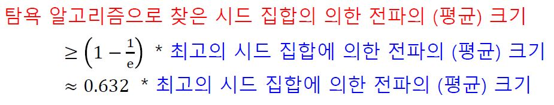
	- 다시 말해, 탐욕 알고리즘의 최저 성능은 수학적으로 보장되어 있다.
