# [Graph 5강] 그래프의 구조를 어떻게 분석할까?
### 군집 구조와 군집 탐색 문제
#### 군집의 정의
- 군집(ommunity)이란 다음 조건들을 만족하는 정점들의 집합
	- 집합에 속하는 정점 사이에는 많은 간선이 존재
	- 집합에 속하는 정점과 그렇지 않은 정점 사이에는 적은 수의 간선이 존재.
- (수학적으로 엄밀한 정의는 아니다.)
#### 실제 그래프에서의 군집들
- 온라인 소셜 네트워크의 군집들은 사회적 무리(Social Circle)을 의미하는 경우가 많다.
- 온라인 소셜 네트워크의 군집들이 부정 행위와 관련된 경우도 많다.
- 조직 내의 분란이 소셜 네트워크 상의 군집으로 표현된 경우도 있따.
- 키워드-광고주 그래프에서는 동일한 주제의 키워드들이 군집을 형성한다.
- 뉴런간 연결 그래프에서는 군집들이 뇌의 기능적 구성 단위를 의미한다.

#### 군집 탐색 문제
- 그래프를 여러 군집으로 잘 나누는 문제를 군집 탐색(Community Detection) 문제라고 한다.
	- 보통은 각 정점이 한 개의 군집에 속하도록 군집을 나눈다.
	- 비지도 기계학습 문제인 클러스터링(Clustering)과 상당히 유사하다.

### 군집 구조의 통계적 유의성과 군집성
#### 비교 대상: 배치 모형
- 성공적인 군집 탐색을 정의하기 위해 먼저 배치 모형(Configuration Model)을 소개한다
- 주어진 그래프에 대한 배치 모형은,
- 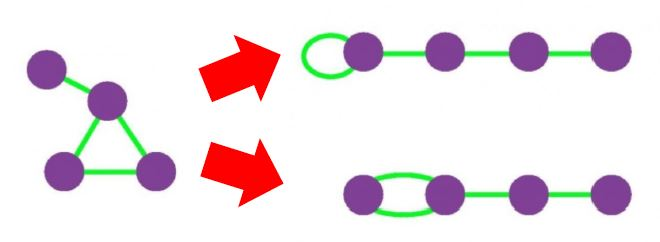
	- 각 정점의 연결성(Degree)을 보존한 상태에서
	- 간선들을 무작위로 재배치하여서 얻은 그래프를 의미
	- 배치 모형에서 임의의 두 정점 i와 j 사이에 간선이 존재할 확률은 두 정점의 연결성에 비례한다.
#### 군집성의 정의
- 군집 탐색의 성공 여부를 판단하기 위해서, 군집성(Modularity)가 사용된다.
	- 그래프와 군집들의 집합 S가 주어졌다고 하자.
	- 각 군집이 군집의 성질을 잘 만족하는지를 잘 살펴보기 위해, 군집 내부의 간선의 수를 그래프와 배치 모형에서 비교한다.
	- 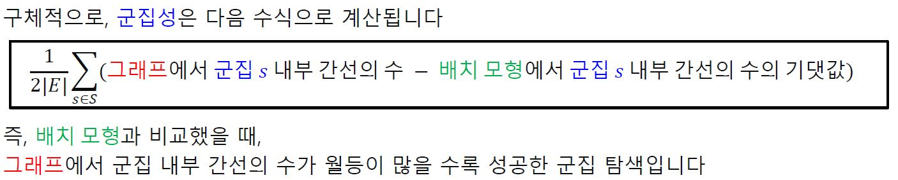
	- 즉, 배치 모형과 비교했을 때, 그래프에서 군집 내부 간선의 수가 월등이 많을 수록 성공한 군집 탐색이다.
- 군집성은 무작위로 연결된 배치 모형과의 비교를 통해 통계적 유의성을 판단한다.
- 군집성은 항상 -1과 +1 사이의 값을 갖는다.
- 보통 군집성이 0.3 ~ 0.7 정도의 값을 가질 때,
- 그래프에 존재하는 통계적으로 유의미한 군집들을 찾아냈다고 할 수 있다.
### 군집 탐색 알고리즘
#### Girvan-Newman 알고리즘
- 대표적인 하향식(Top-Down) 군집 탐색 알고리즘이다.
- Girvan-Newman 알고리즘은 전체 그래프에서 탐색을 시작한다.
- 군집들이 서로 분리되도록, 간선을 순차적으로 제거한다.
- 어떤 간선을 제거해야 군집들이 분리가 되는가?
	- 서로 다른 군집을 연결하는 다리(Bridge) 역할의 간선을 제거
- 서로 다른 군집을 연결하는 다리 역할의 간선을 어덯게 찾아낼 수 있는가?
	- 간선의 매개 중심성(Betweenness Centrality)을 사용한다.
	- 이는 해당 간선이 정점 간의 최단 경로에 놓이는 횟수를 의미한다.
- 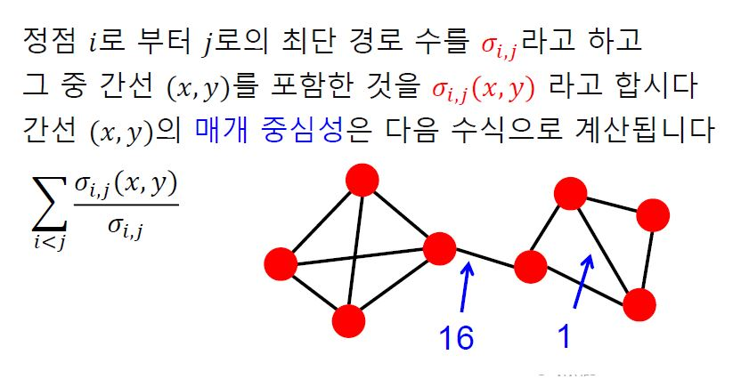
- 간선이 모두 제거될 때까지 반복
- 간선의 제거 정도에 따라서 다른 입도(Granularity)의 군집 구조가 나타난다.
- 간선을 어느 정도 제거하는 것이 가장 적합한가?
	- 앞서 정의한 군집성을 그 기준으로 군집성이 최대가 되는 지점까지 간선을 제거
- 정리
	- 전체 그래프에서 시작한다.
	- 매개 중심성이 높은 순서로 간선을 제거하면서, 군집성 변화를 기록
	- 군집성이 가장 커지는 상황을 복원
	- 이 때, 서로 연결된 정점들, 즉 연결 요소를 하나의 군집으로 간주
#### Louvain 알고리즘
- 대표적인 상향식(Bottom-Up) 군집 탐색 알고리즘이다.
- 개별 정점에서 시작해서 점점 큰 군집을 형성한다.
- 어떤 기준으로 군집을 합쳐야 하는가?
	- 군집성을 기준으로 합친다.
- 동작 과정
	- 개별 정점으로 구성된 크기 1의 군집들로부터 시작한다.
	- 각 정점 u를 기존 혹은 새로운 군집으로 이동한다. 이 때, 군집성이 최대화되도록 군집을 결정한다.
	- 더이상 군집성이 증가하지 않을 때까지 두 번째 과정을 반복한다.
	- 각 군집을 하나의 정점으로하는 군집 레벨의 그래프를 얻은 뒤 세 번째 과정을 수행한다.
	- 한 개의 정점이 남을 때까지 네 번째 단계를 반복한다.
### 중첩이 있는 군집 탐색
#### 중첩이 있는 군집 구조
- 실제 그래프의 군집들을 중첩되어 있는 경우가 많다.
	- 예를 들어 소셜 네트워크에서의 개인은 여러 사회적 역할을 수행한다. 그 결과 여러 군집에 속하게 된다.
	- 앞서 배운 Girvan-Newman 알고리즘, Louvain 알고리즘은 군집 간의 중첩이 없다고 가정합니다.
	- 그러면 중첩이 있는 군집은 어떻게 찾아낼 수 있는가?
#### 중첩 군집 모형
- 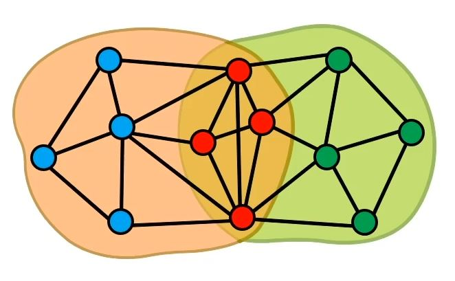
- 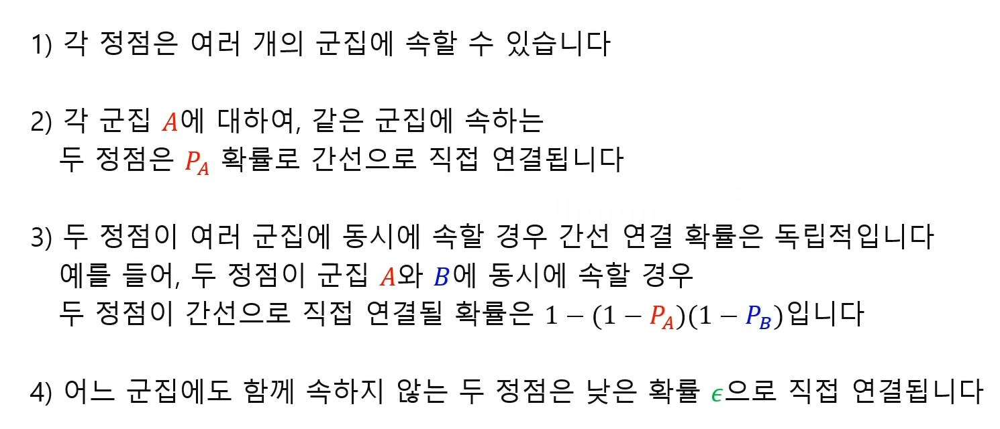
- 그래프의 확률은 다음 확률들의 곱이다.
	- 그래프의 각 간선이 두 정점이 (모형에 의해) 직접 연결될 확률
	- 그래프에서 직접 연결되지 않은 각 정점 쌍이 (모형에 의해) 직접 연결되지 않을 확률
	- 중첩 군집 탐색은 주어진 그래프의 확률을 최대화하는 중첩 군집 모형을 찾는 과정이다.
	- 통계 용어를 빌리면, 최우도 추정치(Maximum Likelihood Estimate)를 찾는 과정이다.
#### 완화된 중첩 군집 모형
- 중첩 군집 탐색을 용이하게 하기 위하여 완화된 중첩 군집 모형을 사용
- 완화된 중첩 군집 모형에서는 각 정점이 각 군집에 속해 있는 정도를 실숫값으로 표현
- 즉, 기존 모형에서는 각 군집에 속하거나 속하지 않거나 둘 중 하나였는데,  중간 상태를 표현할 수 있게 된 것이다.
- 최적화 관점에서는 모형의 매개변수들이 실수 값을 가지기 때문에  익숙한 최적화 도구(경사하강법 등)을 사용하여 모형을 탐색할 수 있다는 장점이 있다.

# [Graph 6강] 그래프를 추천시스템에 어떻게 활용할까?(기본)
### 우리 주변의 추천 시스템

#### 아마존에서의 상품 추천
- Amazone.com 메인 페이지에는 고객 맞춤형 상품 목록을 보여준다.
#### 넷플릭스에서의 영화 추천
- 넷플릭스 메인 페이지에는 고객 맞춤형 영화 목록을 보여준다.
#### 유튜브에서의 영상 추천
- 메인 페이지에는 고객 맞춤형 영상 목록을 보여준다.
- 현재 재생 중인 영상과 관련된 영상 목록을 보여준다.
#### 페이스북에서의 친구 추천
- 추천하는 친구의 목록을 보여준다.
#### 추천 시스템과 그래프
- 사용자 각각이 구매할 만한 혹은 선호할 만한 상품을 추천한다.
	- 사용자별 구매 기록은 그래프로 표현 가능하다
	- 구매 기록이라는 암시적(Implicit)인 선호만 있는 경우도 있고,
	- 평점이라는 명시적(Explicit)인 선호가 있는 경우도 있다.
- 추천 시스템의 핵심은 사용자별 구매를 예측하거나 선호를 추정하는 것이다.
- 그래프 관점에서 추천 시스템은 "미래의 간선을 예측하는 문제" 혹은 "누락된 간선의 가중치를 추정하는 문제"로 해석할 수 있다.
### 내용 기반 추천시스템
#### 내용 기반 추천시스템의 원리
- 내용 기반(Content-based) 추천은 각 사용자가 구매/만족했던 상품과 유사한 것을 추천하는 방법
- ex: 동일한 장르의 영화를 추천하는 것, etc...
- 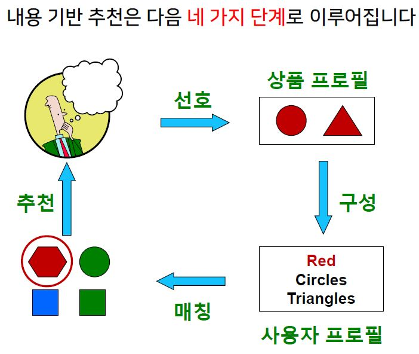
- 
- 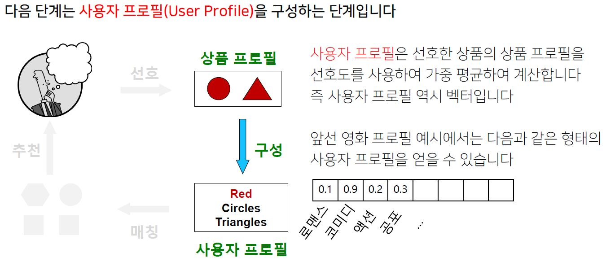
- 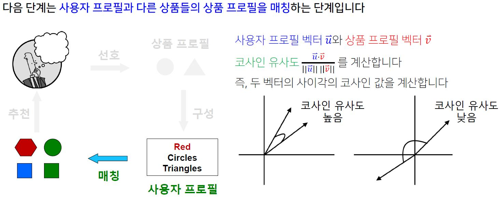
- 코사인 유사도가 높을수록, 해당 사용자가 과거 선호했던 상품들과 해당 상품이 유사함을 의미한다.
- 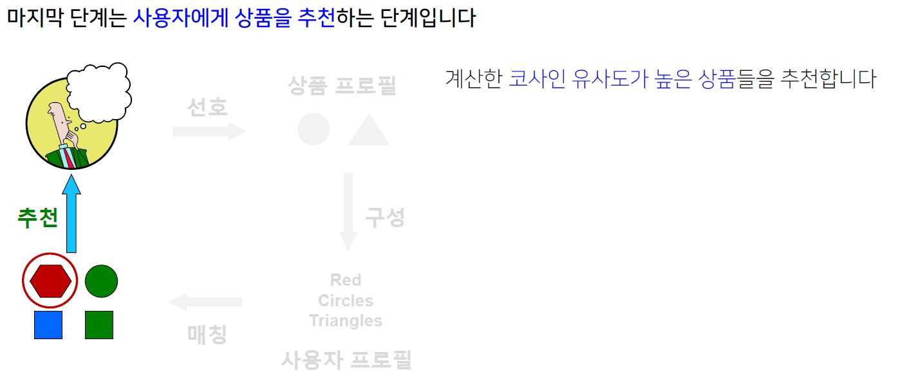
#### 내용 기반 추천시스템의 장단점
- 내용 기반 추천 시스템은 다음 장점을 갖는다
	- 다른 사용자의 구매 기록이 필요하지 않는다
	- 독특한 취향의 사용자에게도 추천이 가능하다
	- 새 상품에 대해서도 추천이 가능하다
	- 추천의 이유를 제공할 수 있다.
- 내용 기반 추천 시스템은 다음 단점을 갖는다
	- 상품에 대한 부가 정보가 없는 경우 에는 사용할 수 없다.
	- 구매 기록이 없는 사용자에게는 사용할 수 없다.
	- 과적합(Overfitting)으로 지나치게 협소한 추천을 할 위험이 있다.
### 협업 필터링
#### 협업 필터링의 원리
- 사용자-사용자 협업 필터링은 다음 세 단계로 이루어진다.
- 
- 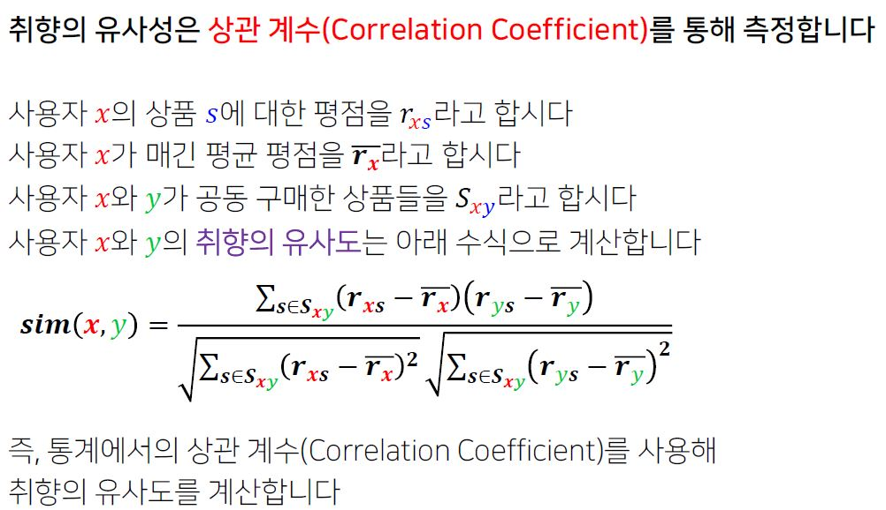
- 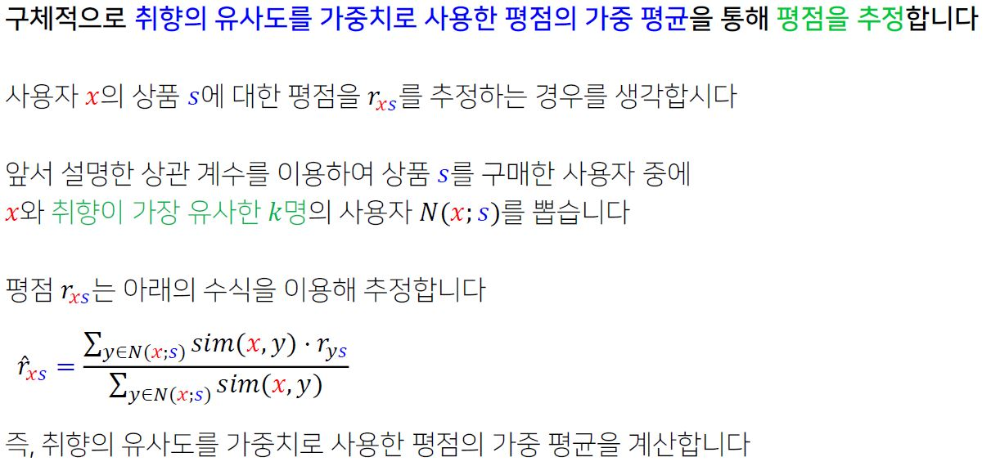
- 마지막 단계는 추정한 평점이 가장 높은 상품을 추천하는 단계이다
	- 추천의 대상 사용자를 x라고 하자.
	- 앞서 설명한 방법을 통해, x가 아직 구매하지 않은 상품 각각에 대해 평점을 추정한다.
	- 추정한 평점이 가장 높은 상품들을 x에게 추천한다.
#### 협업 필터링의 장단점
- 장점
	- 상품에 대한 부가 정보가 없는 경우에도 사용할 수 있다.
- 단점
	- 충분한 수의 평점 데이터가 누적되어야 효과적이다.
	- 새 상품, 새로운 사용자에 대한 추천이 불가능하다
	- 독특한 취향의 사용자에게 추천이 어렵다.

### 추천 시스템의 평가
#### 데이터 분리
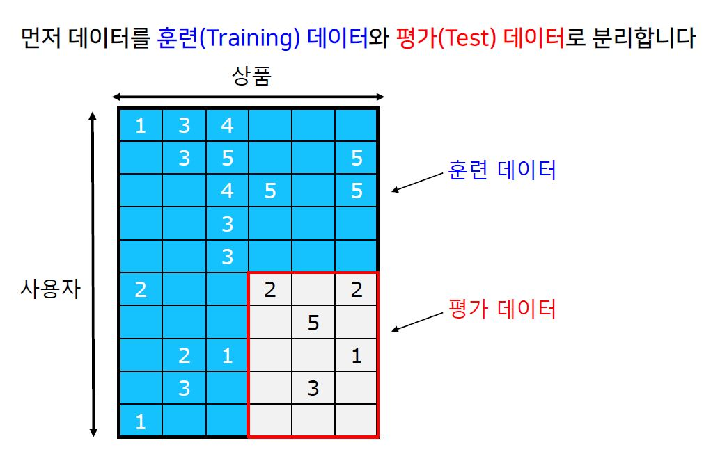 
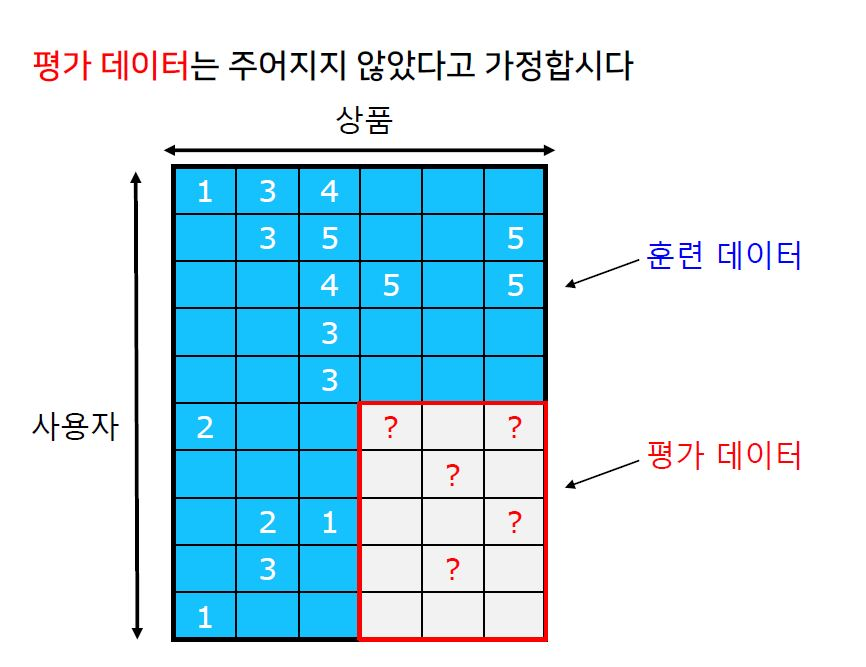 
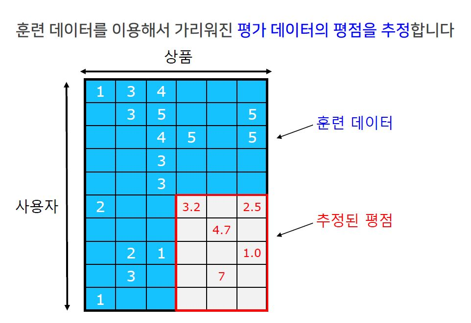 
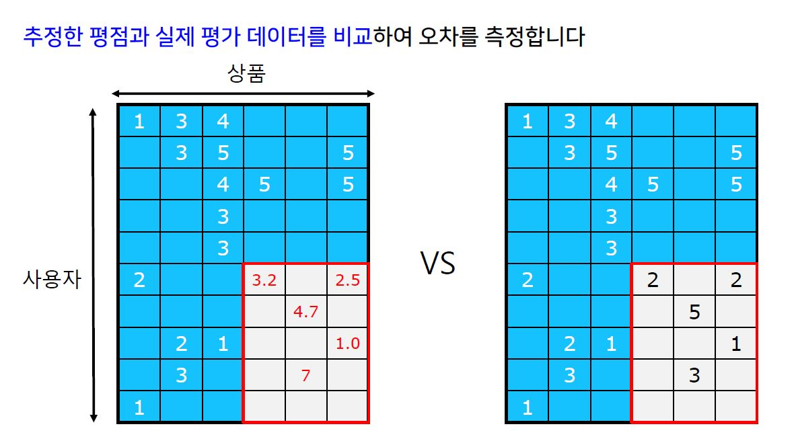 
#### 평가 지표
- 추정한 평점과 실제 데이터를 비교하여 오차를 측정한다.
- 
- 이 밖에도 다양한 지표가 사용된다.
- 추정한 평점으로 순위를 매긴 후, 실제 평점으로 매긴 순위와의 상관 계수를 계산하기도 한다.
- 추천한 상품 중 실제 구매로 이루어진 것의 비율을 측정하기도 한다.
- 추천의 순서 혹은 다양성까지 고려하는 지표들도 사용된다.

