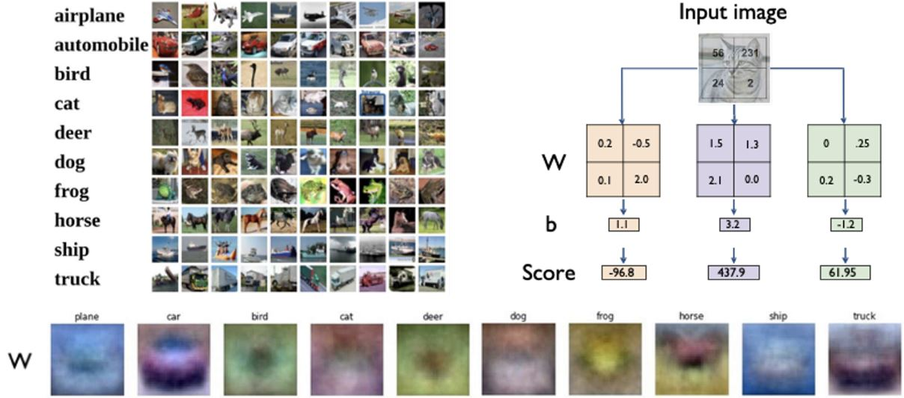
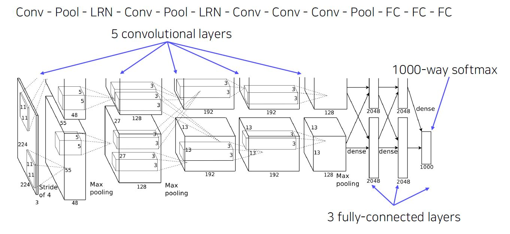
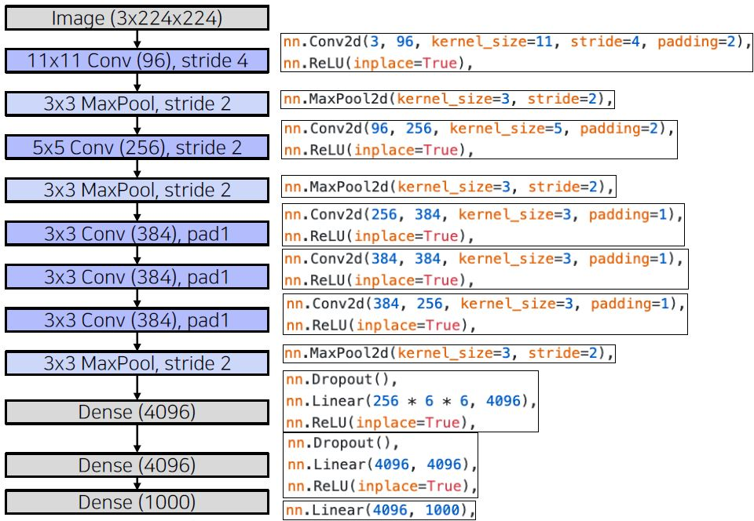
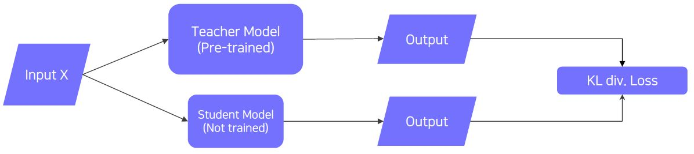
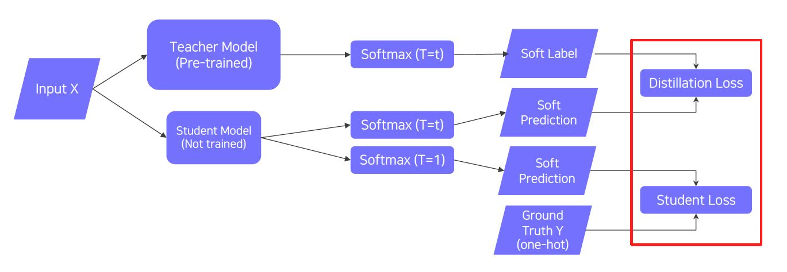
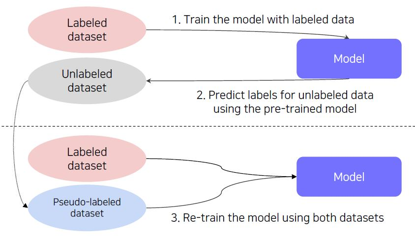
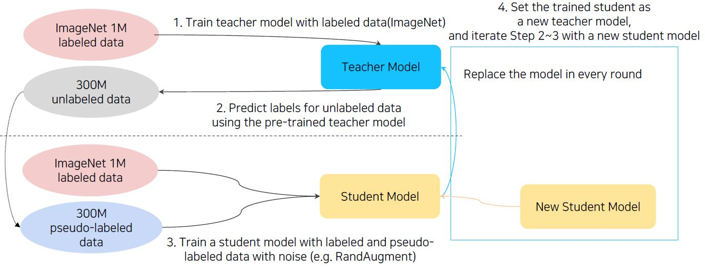

# (1강) Image classification 1
### Course overview
#### Why is visual perception important?
- Artificial Intelligence(AI)?
	- The theory and development of computer systems able to perform tasks normally requiring human intelligence,  such as visual perception, speech recognition, decision-making, and translation between languages.  --from the Oxford dictionary
- Humans learn about the world through multi-modal perception
#### What is computer vision?
- Computer vision(Inverse rendering): 하나의 사물 -> 대표적인 특징 추출
- Computer Graphics(Rendering): 대표적인 특징 -> 하나의 사물
- Visual perception & intelligence
	- Input: visual data(image or video)
- Class of visual perception
	- Color perception
	- Motion perception
	- 3D perception
	- Semantic-level perception
	- Social perception(emotion perception)
	- Visuomotor perception, etc.
- Also, computer vision includes understanding human visual perception capability!
- To develop machine visual perception,
	- We need to understand the good and bad of our visual perception.
	- We need to come up with how to compensate for the imperfection.
- How to implement?
	- Machine Learning: Input -> Feature extraction -> Classification -> Output
	- Deep Learning: Input -> Feature extraction + Classification -> Output
#### What you will learn in this course
- Fundamental image tasks
	- Semantic segmentation
	- Object detection & segmentation
	- Panoptic segmentation
- Data augmentation and knowledge distillation
- Multi-modal learning(vision + {text, sound, 3D, etc.})
- Conditional generative model
- Neural network analysis by visualization

### Image classification
#### What is classification?
- Classifier
	- A mapping f(.) that maps an image to a category level
#### An ideal approach for image recognition
- What if we could memorize all the data in the world?
- All the classification problems could be solved by k Nearest Neighbors(k-NN)!(모든 데이터(무한)를 가지고 있을 때)
- k Nearest Neighbors(k-NN)
	- Classifies a query data point according to reference points closest to the query
- Compress all the data we have into the neural network.
#### Convolutional Neural Networks(CNN)
- Let's look at a simple model, perceptron, that takes evry pixel of an image as input.(Fully connected layer)
- But, is this model suitable for solving the image classification problem?
	- Visualization of single fully connected layer networks
		- 
		- 평균 이미지 외에는 표현이 안된다.
	- 적용 시점
		- Test time에서의 문제.
		- 학습은 대표적인 특징만 보고 학습했는데, Test에서 말의 상반신만 놓았을 때 잘못된 결과를 출력한다.
		- 
- Convolution neural networks are locally connected neural networks.
	- Local feature learning
	- Parameter sharing
- CNN is used as a backbone of many CV tasks
	- Image-level classification
	- Classification + Regression
	- Pixel-level classification

### CNN architectures for image classification 1
#### AlexNet
- LeNet-5
	- A very simple CNN architecture introduced by Yann LeCun in 1998
		- Oberall architecture: conv - Pool - Conv - Pool - FC - FC
		- Convolution: 5x5 filters with stride 1
		- Pooling: 2x2 max pooling with stride 2
- AlexNet
	- Similar with LeNet-5, but
		- Bigger(7 hidden layers, 605k neurons, 60 million parameters)
		- Trained with ImageNet(large amount of data, 1.2 millions)
		- Using better activation function(ReLU) and regularization technique(dropout)
	- Architecture
	- 
	- 
	- nn.MaxPool2d에서 nn.Dropout()으로 넘어갈 때, torch.flatten(x,1)을 사용
- Local Response Normalization (LRN) (deprecated components)
	- Lateral inhibition: the capacity of an excited neuron to subdue its neighbors
	- LRN normalizaes around the local neighborhood of the excited neuron
	- Excited neuron becomes even more sensitive as compared to its neighbors
- 11x11 convolution filter
	- The filter size is increased, as the input size of the image has increased
		- LeNet: 28x28
		- AlexNet: 277x277
	- Larger size filters are used to cover a wider range of the input image
- Receptive field in CNN
	 - The region in the input space that a particular CNN feature is looking at
	 - Suppose K x K conv. filters with stride 1, and a pooling layer of size P x P,
	 	- then a value of each unit in the pooling layer depends on an input patch of size: (P+K-1) x (P+k-1)
#### VGGNet
- Deeper architecture
	- 16 and 19 layers
- Simpler architecture
	- No local response normalization
	- Only 3x3 conv filters blocks, 2x2 max pooling
- Better performance
- Better generalization
	- Final features generalizing well to other tasks even without fine-tuning
- Key design choices
	- 3x3 convolution filters with stride 1
	- 2x2 max pooling operations
- -> Using many 3x3 conv layers instead of a small number of larger conv filters
	- Keeping receptive field sizes large enough
	- Deeper with more non-linearities
	- Fewer parameters

# (2강) Annotation data efficient learning
### Data augmentation
#### Learning representation of dataset
- Neural networks learn compact features (information) of a dataset
- Dataset is (almost) always biased
	- Images taken by camera (training data) != real data
- The training dataset is sparse samples of real data
	- The training dataset contains only fractional part of real data
- The training dataset and real data always have a gap
	- Suppose a training dataset has only bright images
	- During test time, if a dark image is fed as input, the trained model may be confused
	- Problem: Datasets do not fully represent real data distribution.
- Augmenting data to fill more space and to close the gap.
#### Data augmentation
- Image data augmentation
	- Applying various image transformations to the dataset
		- Crop, Shear, Brightness, {erspective, Rotate, ...
	- OpenCV and NumPy have various methods useful for data augmentation
	- Goal: Make training dataset's distribution similar with real data distribution
#### Various data augmentation methods
- Brightness adjustment (brightening) using NumPy
- Rotate, flip
- Crop
- Affine transformation(shear)
	- Preserves 'line', 'length', and 'parallelism' in image
	- Fpr example, trasforming a rectangle into a parallelogram
- CutMix
	- 'Cut' and 'Mix' training example to help model better localize objects
	- Mixing both images and labels(라벨도 합성) 
#### Modern augmentation techniques
- RandAugment
	- Many augmentation methods exist. Hard to find best augmentations to apply
	- Automatically finding the best sequence of augmentations to apply
	- Random smaple, apply, and evaluate augmentations
	- Augmentation policy has two parameters
		- Which augmentation to apply
		- Magnitude of augementation to apply(how much to augment)

### Leveraging pre-trained information
#### Transfer learning
- The high-quality dataset is expensive and hard to obtain
	- Supervised learning requires a very large-scale dataset for training
	- Annotating data is very expensive, and its quality is not ensured
	- Transfer learning: A practival training method with a small dataset!
- Benefits when using transfer learning
	- By transfer learning, we can easily adapt to a new task by leveraging pre-trained knowledge (feature)!
	- 한 데이터셋에서 얻은 지식을 다른 데이터셋에서 활용하는 것
- Approach 1: Transfer knowledge from a pre-trained task to a new task
	- Given a model pre-trained on a 10-class dataset,
	- Chop off the final layer of the pre-trained model, add and only re-train a new FC layer
	- Extracted features preserve all the knowledge from pre-training
- Approach 2 : Fine-tuning the whole model
	- Given a model pre-trained on a dataset
	- Replace the final layer of the pre-trained model to a new one, and re-train the whole model
	- Set learning rates differently
	- 기존 convolution layer: low learning rate, 업데이트가 느리다.
	- FC layer: high learning rate, 새로운 task에 빨리 적응하도록 한다.

#### Knowledge distillation
- Passing what model learned to 'another' smaller model((Teacher-student learning)
	- 'Distillate' knowledge of a trained model into another smaller model
	- Used for model compression(Mimicking what a larger model knows)
	- Also, used for pseudo-labeling(Generating pseudo-labels for an unlabeled dataset)
- Teacher-student network structure
	- The student network learns what the teacher network knows
	- The student network mimics output of the teacher network
	- Unsupervised learning, since training can be done only with unlabeled data
	- 
	- When labeled data is available, can leverage labeled data for training(Student Loss)
	- Distillation loss to 'predict similar outputs with the teacher model'
	- 
- Hard label vs. Soft label
	- Hard label (One-hot vector)
		- Typically obtained from the dataset
		- Indicates whether a class is 'true answer' or not
	- Soft label
		- Typicall output of the model (=inference result)
		- Regard it as "knowledge". Useful to observe how the model thinks
- Softmax with temperature(T)
	- Softmax with temperature: controls difference in output between small & large input values
	- A large T smoothens large input value differences
	- Useful to synchronize the student and teacher models' outputs
	- 
- Distillation Loss
	- KLdiv(Soft label, Soft prediction)
	- Loss = difference between the teacher and student network's inference
	- Learn what teacher network knows by mimicking
- Student Loss
	- CrossEntropy(Hard label, Soft prediction)
	- Loss = difference between the student network's inference and true label
	- Learn the "right answer"
### Leveraging unlabeled dataset for training
#### Semi-supervised learning
- There are lots of unlabeled data
	- Typically, only a small portion of data is labeled
	- Is there any way to learn from unlabeled data?
	- Semi-supervised learning: Unsupervised(No label) + Fully Supervised(fully labeled)
- Semi-supervised learning with pseudo labeling
	- Pseudo-labeling unlabeled data using a pre-trained model, then use for training
	- 
#### Self-training
- Recap: Data efficient learning methods so far
- - Data Augmentation
	- Augment a dataset to make the dataset closer to real data distribution
- Knowledge distillation
	- Train a student network to imitate a teacher network
	- Transfer the teacher network's knowledge to the student network
- Semi-supervised learning(Pseudo label-based method)
	- Pseudo-label an unlabeled dataset using a pre-trained model, then use for training
	- Leveraging an unlabeled dataset for training!
- Self-training
	- Augmentation + Teacher-Student networks + semi-supervised learning
	- SOTA ImageNet classification, 2019
	- 
