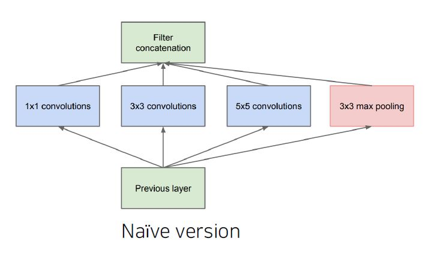
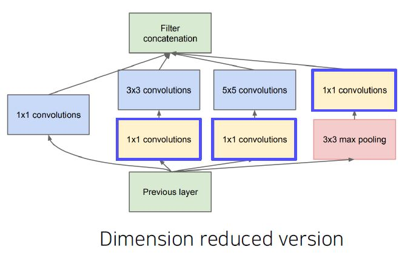
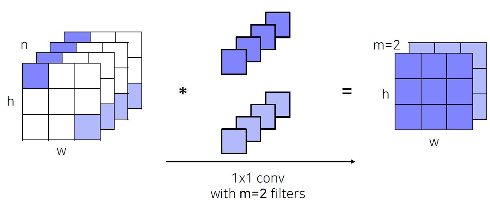
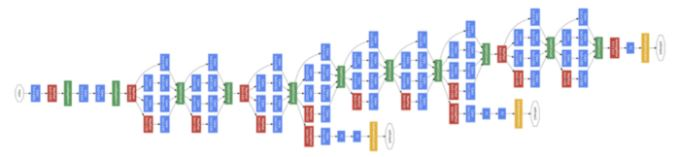
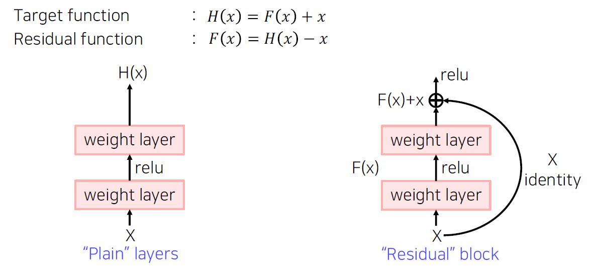

# (3강) Image classification 2
### Problems with deeper layers
#### Going deeper with convolutions
- The neural network is getting deeper and wider
	- Deeper networks learn more powerful features, because of
		- Larger receptive fields
		- More capacity and non-linearity
	- But, getting deeper and deeper always works better?
#### Hard to optimize
- Deeper networks are harder to optimize
	- Gradient vanishing / exploding
	- Computationally complex
	- Degradation problem

### CNN architectures for image classification 2
#### GoogLeNet
- Inception module
	- Apply multiple filter operations on input activation from the previous layer:
		- 1x1, 3x3, 5x5 convolution filters
		- 3x3 pooling operation
	- Concatenate all filter outputs together along the channel axis
	- 
	- The increased network size increases the use of computational resources
	- Use 1x1 convolutions!
	- Use 1x1 convolutions as "bottleneck" layers that reduce the number of channels
	- 
- 1x1 convolutions
	- 
- Overall architecture
	- Stem network: vanilla convolution networks
	- Stacked inception modules
	- Auxiliary classifiers
		- vanishing gradient 방지
		- 중간 결과로 부터 loss를 계산
	- Classifier output ( a single FC layer )
	- 
- Auxiliary classifier
	- The vanishing gradient problem is dealt with by the auxiliary classifier
	- Injecting additional gradients into lower layers
	- Used only during training, removed at testing time 
#### ResNet
- Revolutions of depth
	- Building ultra-deeper than any other networks
	- What makes it hard to build a very deep  architecture?
- Degradation problem
	- 정확도가 어느 순간부터 정체되고 레이어가 더 깊어질수록 성능이 더 나빠지는 현상을 의미한다. 
	- As the network depth increases, accuracy gets saturated ==> degrade rapidly
	- This is not caused by overfitting. The problem is optimization!
- Hypothesis
	 - Plain layer: As the layers get deeper, it is hard to learn good H(x) directly
	 - Residual block: IInstead, we learn residual
	 - 
- A solution:: shortcut connection
	- Use layers to fit a residual mapping instead of directly fitting a desired underlying mapping
	- The vanishing gradient problem is solved by shortcut connection
	- Don;t just stack layers up, instead use shortcut connection!
- Analysis of residual connection
	- During training, gradients are mainly from relatively shorter paths
	- Residual networks have O(2^n) implicit paths connecting input and output,  and adding a block doubles the number of paths.
- Overall architecture
	- 처음 layer
		- He initialization
		- Additional conv layer at the beginning
	- 중간 layer(실선)
		- Stack residual blocks
		- Every residual block has two 3x3 conv layers
		- Batch norm after every conv layer
	- 중간 layer(점선)
		- Doubling the number of filters and spatially down-sampling by stride 2 instead of spatial pooling
	- 최종 layer
		- Only a single FC layer for output classes
#### Beyond ResNet
- DenseNet
	- In ResNet, we added the input and the output of the layer element-wisely
	- In the Dense blocks, every output of each layer is concatenated along the channel axis.
		- Alleviate vanishing gradient problem
		- Strengthen feature propagation
		- Encourage the reuse of features
- SENet
	- Attention across channels
	- Recalibrates channel-wise response by modeling interdependencies between channels
	- Squeeze and excitation operations
		- Squeeze: capturing distributions of channel-wise responses by global average pooling
		- Excitation: gating channels by channel-wise attention weights obtained by a FC layer(attention score)
- EfficientNet
	- Building deep, wide, and high resolution networks in an efficient way
		- width scaling: # channels 를 많이
		- depth scaling: # layer 를 많이
		- resolution scaling: input resolution 을 크게
- Deformable convolution
	- 2D spatial offset prediction for irregular convolution
	- Irregular grid sampling with 2D spatial offsets
	- Implemented by standard CNN and grid sampling with 2D offsets
### Summary of image classification
#### Summary of image classification
- AlexNet
	- simple CNN architecture
	- Simple computation, but heavy memory size
	- Low accuracy
- VGGNet
	- simple with 3x3 convolutions
	- Highest memory, the heaviest computation
- GoogLeNet
	- inception module and auxiliary classifier
- ResNet
	- deeper layers with residual blocks
	- Moderate efficiency(depending on the model)
#### CNN backbones
- Simple but powerful backbone model
	- GoogLeNet is the most efficient CNN model out of {AlexNet, VGG, ResNet}
	- But, it is complicated to use
	- Instead, VGGNet and ResNet are typically used as a backbone model for many tasks
	- Constructed with simple 3x3 conv layers

# (4강) Semantic segmentation
### Semantic segmentation
#### What is semantic segmentation?
- Semantic segmentation
	- Classify each pixel of an image into a category
	- Don't care about instances. Only care about semantic category
#### Where can semantic segmentation be applied to?
- Applications 
	- Medical images
	- Autonomous driving
	- Computational photography
	- ...

### Semantic segmentation architectures
#### Fully Convolutional Networks (FCN)
- Fully convolutional networks
	- The first end-to-end architecture for semantic segmentation
	- Take an image of an arbitrary size as input, and output a segmentation map of the corresponding size to the input.
- Fully connected vs. Fully convolutional
	- Fully connected layer: Output a fixed dimensional vector and discard spatial coordinates
	- Fully convolutional layer: Output a classification map which has spatial coordinates
- Interpreting fully connected layers as 1x1 convolutions
	- A fully connected layer classifies a single feature vector
	- A 1x1 convolution layer classifies every feature vector of the convolutional feature map
	- Limitation: Predicted score map is in a very los-resolution
	- Why?
		- For having a large receptive field, several spatial pooling layers are deployed
	- Solution: Enlarge the score map by upsampling!
- Upsampling
	- The size of the input image is reduced to a smaller feature map
	- Upsample to the size of input image
	- Upsampling is used to resize a small activation map to the seze of the input image
		- Unpooling
		- Transposed convolution
		- Upsample and convolution
	- Transposed convolution
		- Transposed convolutions work by swapping the forward and backward passes of convolution
	- Problems with transposed convolution
		- Checkerboard artifacts due to uneven overlaps
	- Better approaches for upsampling
		- Avoid overlap issues in transposed convolution
		- Decompose into spatial upsampling and feature convolution
			- {Nearest-neighbor(NN), Bilinear} interpolation followed by convolution
- Adding skip connections for enlarging the score map
	- Integrates activations form lower layers into prediction
	- Preseves higher spatial resolution
	- captures lower-level semantics at the same time
- Features of FCN
	- Faster
		- The end-to-end architecture that does not depend on other hand-crafted components
	- Accurate
		- Feature representation and classifiers are jointly optimized
#### U-Net
- U-Net
	- Built upon "fully convolutional networks"
		- Share the same FCN property
	- Predict a dense map by concatenating feature maps from contracting path
		- Similar to skip connections in FCN
	- Yield more precise segmentations
	- Contracting Path
		- Repeatedly applying 3x3 convolutions
		- Doubling the number of feature channels
		- Being used to capture holistic context
	- Expanding Path
		- Repeatedly applying 2x2 convolutions
		- Halving the number of feature channels
		- Concatenating the corresponding feature maps from the contracting path
- Dilated convolution
	- Atrous convolution
	- Inflate the kernel by inserting spaces between the kernel element (Dilation factor)
	- Enable exponential expansion of the receptive field

