# (5강) Object detection
### Object Detection
#### What is object detection?
- Classification + Box loocalization
#### What are the applications of object detection?
- Autonomous driving
- Optical Character Recognition(OCR)

### Two-stage detector (R-CNN family)
#### Traditional methods - hand-crafted techniques
- Gradient-based detector(e.g., HOG)
	- HOG: Histogram of Oriented Gradients
	- SVM: Support Vector Machine
- Selective search
	- Over-segmentation
	- Iteratively merging similar region
	- Extracting candidate boxes from all remaining segmentations.
#### R-CNN
- Directly leverage image classification networks for object detection
- 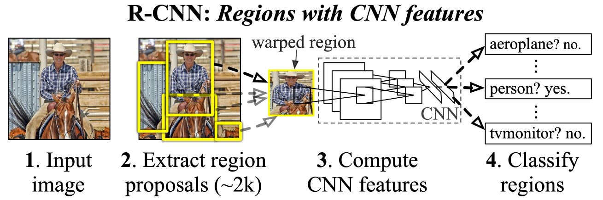
- 단점
	- region proposal 하나하나를 계산해야해서 늦는다.
#### Fast R-CNN
- Recycle a pre-computed feature for multiple object detection
- 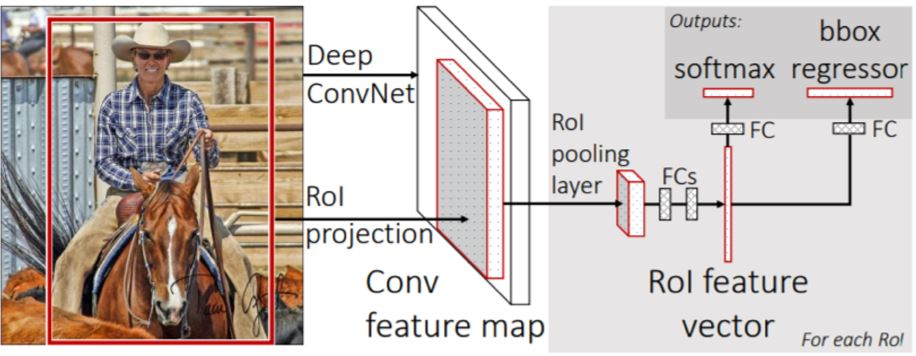
	- Conv. feature map from the original image
	- ROI feature extraction from the feature map through ROI pooling
	- Class and box prediction for each RoI
#### Faster R-CNN
- End-to-end object detection by neural region proposal
- 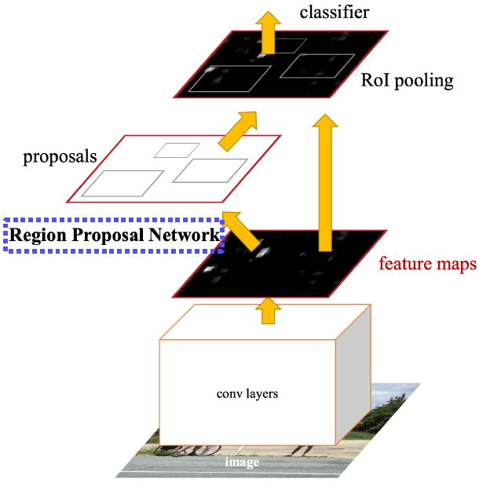
- Iou (Intersection over Union): A metric commonly used in object detection
	- IoU = Area of Overlap / Area of Union
- Anchor boxes
	- A set of pre-defined bounding boxes
	- IoU with GT > 0.7 => positive sample
	- IoU with GT < 0.3 => negative sample
- Time-consuming selective search => Region Proposal Network(RPN)
- Non-Maximum Suppression(NMS)
	- Step 1: Select the box with the highest objectiveness score
	- Step 2: Compare IoU of this box with other boxes
	- Step 3: Remove the bounding boxes with IoU >= 50%
	- Step 4: Move to the next highest objectiveness score
	- Step 5: Repeat steps 2-4
### Single-stage detector
#### YOLO
- 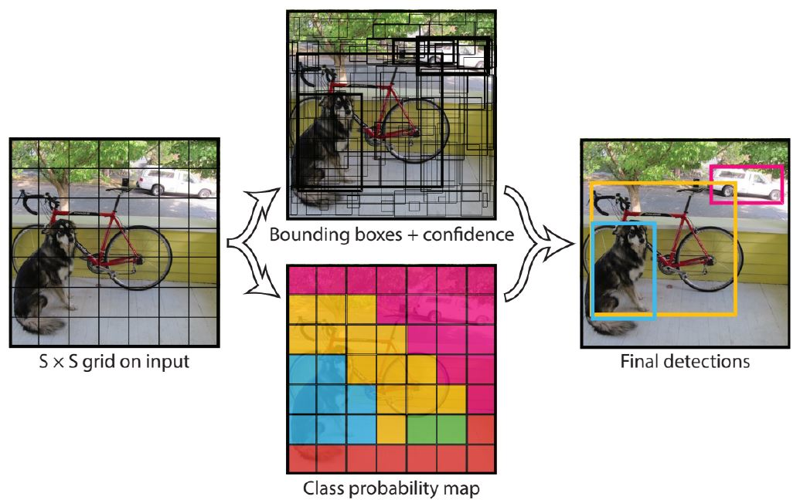
#### SSD
- The use of multi-scale outputs attached to multiple feature maps enable effectively modeling a diverse space of possible box shapes
### Single-stage detector vs. two-stage detector
#### Focal loss
- Class imbalance problem
- Improved cross entropy loss
- Deal with class imbalance
 	- Over-weights hard or misclassified examples
	- Down-weights easy examples
- 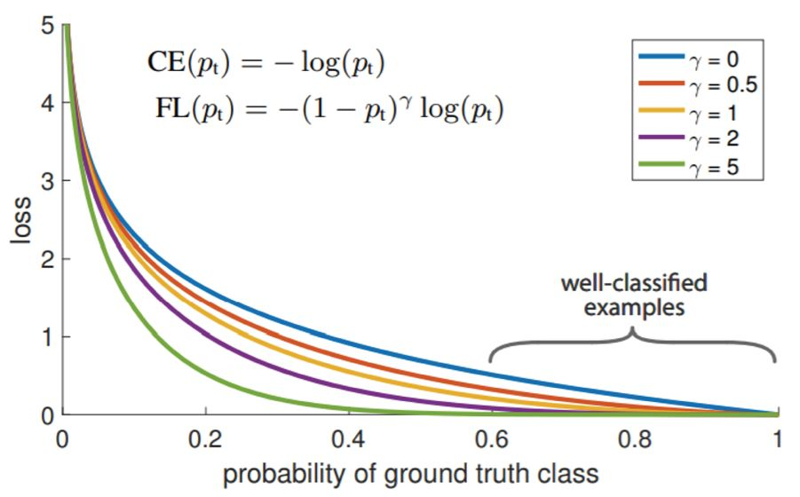
#### RetinaNet
- RetinaNet is a one-stage network
- Feature Pyramid Networks(FPN)
- 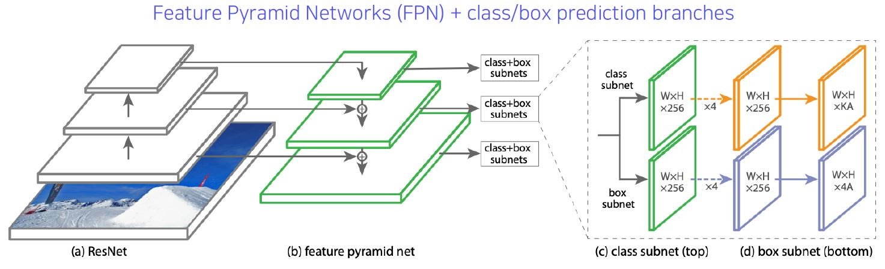
### Detection with Transformer
- Transformer
	- Transformer has shown a great success in NLP
	- Why not extending Transformer to computer vision  tasks!
	- ViT(Vision Transformer) by Google
	- DeiT(Data-efficient image Transformer) by Facebook
	- DETR(DEtection TRansformer) by Facebook
- Detecting objects as points
	- Bounding box can be represented by other ways(left-top, right-bottom, centroid &? size)
	- Idea: Let's detect objects using corresponding points!
---
# (6강) CNN visualization
### Visualizing CNN
#### What is CNN visualization?
- CNN is a black box
	- What is inside CNNs(black box)?
	- Why do they perform so well?
	- How would the be improved
#### Vanilla example: filter visualization
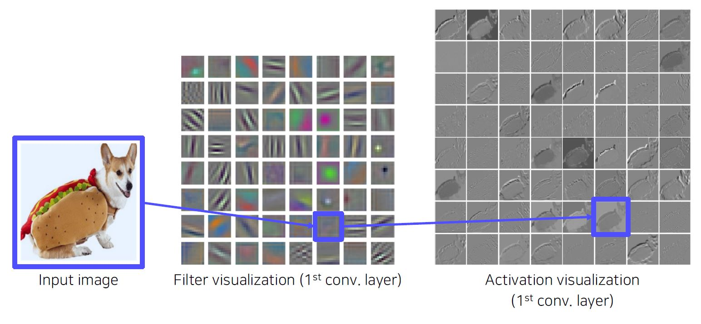
#### How to visualize neural network
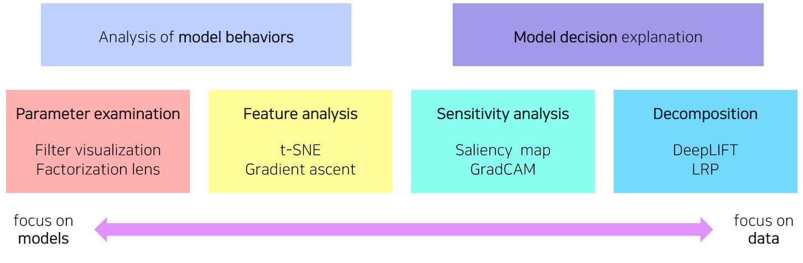
### Analysis of model behaviors
#### Embedding feature analysis
- Nearest neighbors(NN) in a feature space - Example

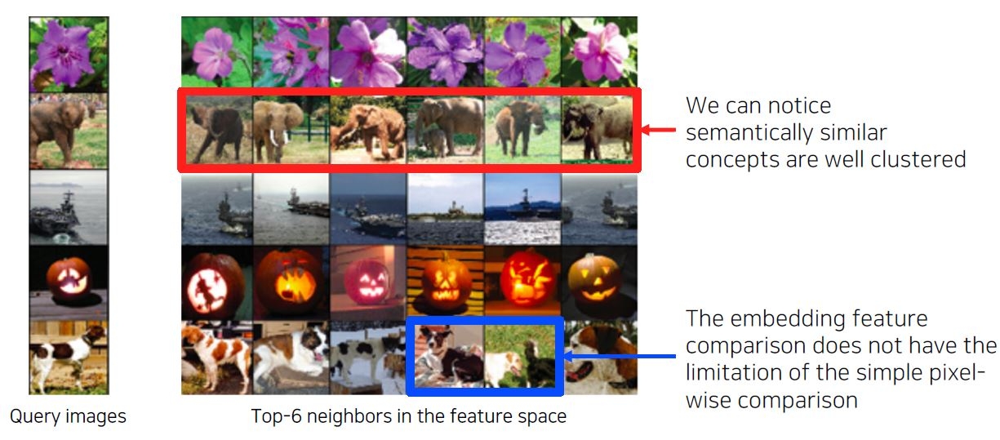

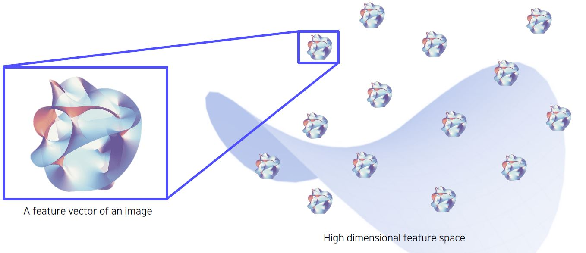

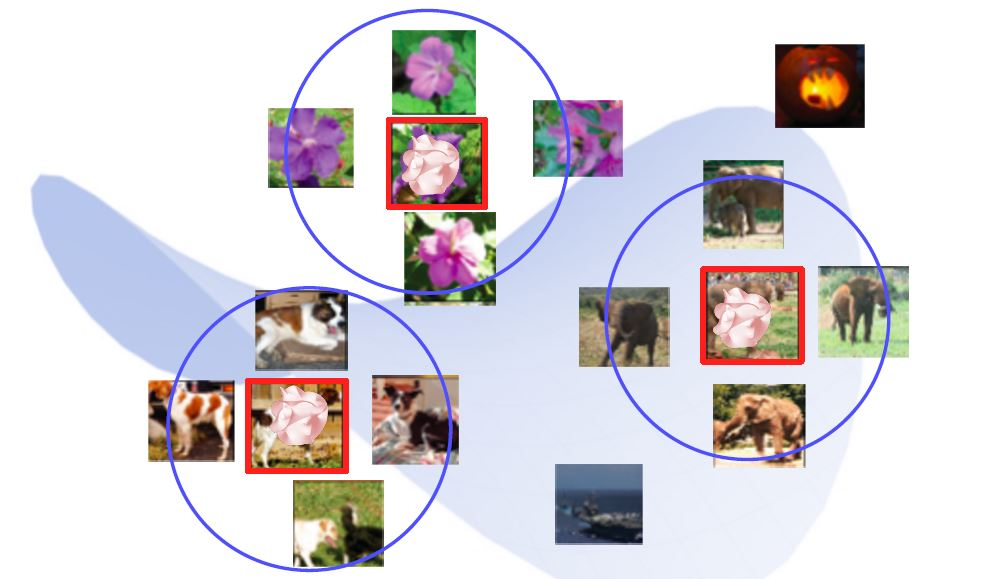

- Dimensionality reduction
	- t-distributed stochastic neighbor embedding(t-SNE)
#### Activation investigation
- Layer activation-Behaviors of mid to high-level hidden units
- Maximally activating patches
	- Pick a channel in a certain layer
	- Feed a chunk of images and record each activation value ( of the chosen channel)
	- Crop image patches around maximum activation values
- Class visualization - Gradient ascent
	- Generate a synthetic image that triggers maximal class activation
	- 1) Get a prediction score (of the target class) of a dummy image (blank or random initial)
	- 2) Backpropagate the gradient maximizing the target class score w.r.t. the input image
	- 3) Update the current image
### Model decision explanation
#### Saliency test
- Occlusion map
	- Prediction scores change according to the location of mask
	- prediction scores drop drastically around the salient parts
- via Backpropagation
	- 1) Get a class score of the target source image
	- 2) Backpropagate the gradient of the class score w.r.t. input domain
	- 3) Visualize the obtained gradient magnitude map (optionally, can be accumulated)
#### Backpropagate features
- Rectified unit(backward pass)
- Guided backpropagation
#### Class activation mapping
- Visualize which part of image contributes to the final decision
- Global average pooling(GAP) layer instead of the FC layer
- By visualizing CAM, we can interpret why the network classified the input to that class
- GAP layer enables localization without supervision
- 단점
	- Requires a modification of the network architecture and re-training
	- ResNet and GoogLeNet alread have the GAP layer
- Grad-CAM
	- Get the CAM result without modifying and re-training the original network
	- With ReLU, we focus on the positive effect only
- SCOUTER
	- Scouter tells "why the image is of a certain category" or " why the image is not of a certain category."